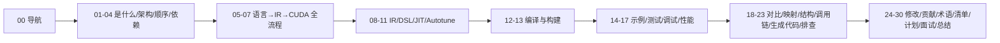

# 30 学习总结

## 1. 本文目标

- 对整套学习做复盘：我学会了什么、掌握到什么程度、还有哪些未验证。
- 提供"一句话结论"供复习与对外输出。

## 2. 一句话总结

**TileLang 是一个基于 TVM TIRX 的 tile 级 GPU 编程语言：用 Python 写分块算法，编译器自动做布局推断、软件流水线、mma/cp.async 降级，生成接近手写 CUDA 性能的 kernel。**

## 3. 知识地图（30 篇）

## 4. 核心掌握项（已确认，源于源码）

1. 编译入口：`tilelang.jit` → `JITKernel` → `KernelCache`（`tilelang/jit/kernel.py:41`、`tilelang/cache/kernel_cache.py:284`）。
2. Lowering 主流程：`engine/lower.py` 的 `lower`（:297）、`lower_to_host_device_ir`（:259）、`device_codegen`（:249）、`tilelang_callback_cuda_compile`（:101-175）。
3. Pass 注册：C++ `GlobalDef().def("tl.transform.X", X)` + Python `init_ffi_api("tl.transform", ...)`。
4. CUDA 流水线：`CUDAPassPipelineBody`（`tilelang/cuda/pipeline.py:145`）、`resolve_pipeline`（`backend/pass_pipeline/pipeline.py:57`）。
5. 后端注册：`DeviceCodegen`（`tilelang/cuda/codegen.py:16-35`）、`target.build.tilelang_cuda`（`src/cuda/codegen/rt_mod_cuda.cc:175-180`）。
6. 缓存键：源码 + 参数 + 版本（`kernel_cache.py:241` `_generate_key`）；Autotune 键（`tuner.py:448` `generate_cache_key`）。
7. DSL 核心：`T.Kernel`（`language/kernel.py:277-340`）、`T.gemm`、`T.copy`、`T.Pipelined`、`T.Parallel`。
8. 算子注册：`TVM_REGISTER_OP`（`src/op/gemm.cc:267-295`）。

## 5. 尚未验证（运行类结论）

> 按 `01` 的标注规范，以下仅"根据源码推断/文档描述"，需实际编译运行确认：
- [ ] 源码编译成功跑通 quickstart（依赖环境安装 Ninja 或换生成器）。
- [ ] `dump_ir` 目录产物的实际内容。
- [ ] 生成 CUDA 中的具体指令（cp.async/mma/wgmma）。
- [ ] 与 cuBLAS/Triton 的实际性能对比。
- [ ] autotune 实际运行结果与缓存文件。

> 更新办法：见 `12`（编译）与 `17`（性能）动手实验；完成实验后回到本文勾选。

## 6. 收获

- 理解"编译器如何把 tile 算法变成 GPU 指令"。
- 掌握 JIT/缓存/Pass/layout/autotune 的完整链路。
- 能独立阅读 TileLang 源码并定位关键代码。
- 具备扩展到其他编译器（TVM、Triton、MLIR）的能力。

## 7. 后续方向

1. 完成编译与实验验证（第 5 节清单）。
2. 深挖一个算子（如 FlashAttention）的完整 lowering。
3. 参与上游贡献（`25`）。
4. 学习配套 CUDA/Triton（`18, 19`）。

## 8. 自测题（收官）

1. 30 篇文档分别讲什么？（对着 `00` 导航默写）
2. 一条指令从 Python 到 GPU 的全路径？
3. 你最有把握的 3 个知识点与最薄弱 3 个？
4. 用一句话说服面试官"我系统学过 TileLang"？

## 9. 本文总结

学习完成 ≠ 掌握。**用编译和实验把"推断"变"确认"**，才算真正完成。保持 `项目分析状态.md` 更新。

## 10. 掌握检查

- [ ] 完成 `27` 清单 ≥80%
- [ ] 完成 `12` 编译实验（或记录替代方案）
- [ ] 生成最终学习总结（本文 + 个人复盘）

## 11. 结束语

30 篇文档是地图，不是终点。祝你在 tile-level kernel 的路上越走越顺。
