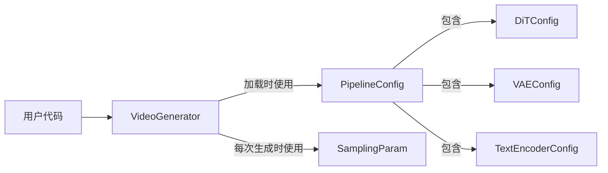

# FastVideo 项目总览

> 本笔记基于对 `/home/hpc/ghr_code/FastVideo` 的源码级解析。目标是帮助你从"能跑通"到"读懂源码实现"。

## 1. 这个项目解决什么问题

FastVideo 官方定义：

> **FastVideo is a unified post-training and real-time inference framework for accelerated video generation.**
> （一个统一的、面向加速视频生成的后训练 + 实时推理框架。）

用一句话概括：它把当前主流的**开源视频扩散大模型**（Wan、HunyuanVideo、Cosmos、LTX-2 等）统一封装到一套**可组合的 pipeline / stage 架构**里，同时提供：

- **推理加速**：序列并行、FSDP2、多种 attention 后端（FlashAttention / SageAttention / VSA 稀疏注意力）、torch.compile、FP8/FP4 量化。
- **后训练（post-training）**：全量微调、LoRA 微调、蒸馏（DMD2 / 知识蒸馏 / Self-Forcing 因果蒸馏）。
- **数据预处理**：视频/图像/文本 → Parquet latent 数据集。
- **实时应用**：`apps/dreamverse` 实时"边生成边导演"的流式视频应用。

它的定位类似"视频生成界的 vLLM"——事实上其大量基础设施（模型注册表、分布式 GroupCoordinator、TP 线性层、参数加载）直接借鉴了 vLLM 的设计。

## 2. 核心对外接口（`fastvideo/__init__.py`）

```python
# 源码位置：/home/hpc/ghr_code/FastVideo/fastvideo/__init__.py
from fastvideo.configs.pipelines import PipelineConfig
from fastvideo.api.sampling_param import SamplingParam
from fastvideo.entrypoints.video_generator import VideoGenerator
from fastvideo.version import __version__

__all__ = ["VideoGenerator", "PipelineConfig", "SamplingParam", "__version__"]
```

只导出 4 个符号，构成用户的最小心智模型：

| 符号 | 定义位置 | 角色 |
|------|---------|------|
| `VideoGenerator` | `fastvideo/entrypoints/video_generator.py` | **门面类（Facade）**。用户唯一直接操作的对象，`from_pretrained()` 加载模型，`generate_video()` / `generate()` 产出视频。 |
| `PipelineConfig` | `fastvideo/configs/pipelines/base.py` | **配置根**。聚合 DiT / VAE / TextEncoder / 精度等所有子配置。 |
| `SamplingParam` | `fastvideo/api/sampling_param.py` | **采样参数**。prompt、分辨率、帧数、步数、guidance_scale、seed 等运行时可变参数。 |

三者的关系：



**关键区分**：
- `PipelineConfig` 是"加载时"配置——决定用哪个模型、什么精度、如何并行，模型加载后基本固定。
- `SamplingParam` 是"运行时"配置——每次 `generate_video` 可以变，比如换 prompt、改分辨率、改步数。

## 3. 最小使用示例

```python
from fastvideo import VideoGenerator

generator = VideoGenerator.from_pretrained("Wan-AI/Wan2.1-T2V-1.3B-Diffusers", num_gpus=1)
video = generator.generate_video(prompt="A cat playing piano", output_path="outputs/")
generator.shutdown()
```

这三行背后的完整调用链见 [`03_core_flows/00_video_generation_flow.md`](../03_core_flows/00_video_generation_flow.md)。

## 4. 顶层目录地图

```
FastVideo/
├── fastvideo/              # 主 Python 包（861 个 .py 文件）
│   ├── __init__.py         # 对外 4 个导出
│   ├── entrypoints/        # 入口：VideoGenerator、CLI、OpenAI API、streaming
│   ├── pipelines/          # 组合式 pipeline + stages
│   ├── models/             # DiT / VAE / TextEncoder / Scheduler 具体实现
│   ├── attention/          # attention 后端选择与实现
│   ├── layers/             # TP 线性层、RMSNorm、RoPE、LoRA、量化
│   ├── distributed/        # 分布式初始化、通信、SP、FSDP
│   ├── dataset/            # 数据集、Parquet、dataloader
│   ├── train/              # 新训练框架（组合式，YAML 驱动）
│   ├── training/           # 旧训练框架（单体 pipeline）
│   ├── eval/               # 评测指标（PSNR/SSIM/LPIPS/FVD/VBench）
│   ├── configs/            # 配置体系（pipeline/model/backend）
│   ├── worker/             # 多进程/多 GPU worker + executor
│   └── platforms/          # CUDA/NPU/CPU 平台抽象
├── fastvideo-kernel/       # 独立 CUDA extension 包（VSA/STA/INT8/norm kernel）
├── apps/                   # 应用：dreamverse（实时）、fastvideo_studio、performance_dashboard
├── examples/               # 推理/训练示例脚本 + YAML 配置
├── scripts/                # 预处理/微调/蒸馏/转换/LoRA 提取脚本
├── docs/                   # mkdocs 文档
└── tests/                  # 测试
```

详细目录树见 [`02_source_by_directory/00_directory_tree.md`](../02_source_by_directory/00_directory_tree.md)。

## 5. 架构的三大设计哲学（读源码前必须理解）

1. **Facade + Executor + Worker 三级分层**：`VideoGenerator`（用户门面）→ `Executor`（多进程编排）→ `Worker`（每 GPU 加载并运行 pipeline）。用户在主进程操作 `VideoGenerator`，真正的模型跑在子进程 worker 里，通过 RPC 通信。

2. **Pipeline = Stage 列表**：每个 pipeline 不是一个巨型类，而是一串 `PipelineStage`（validate → encode → schedule → denoise → decode），每个 stage 输入输出都是同一个 `ForwardBatch`。添加新模型 = 组装已有 stages。

3. **Registry + Lazy Import**：模型 / pipeline / config / 指标全部通过注册表 + 延迟导入机制发现（`EntryClass` 约定 + AST 扫描），避免主进程过早初始化 CUDA。

## 6. 支持的模型族（截至本次解析）

DiT 模型：Wan（1.3B/5B/14B, T2V/I2V/V2V/Causal/DMD）、HunyuanVideo、Hunyuan1.5、Cosmos / Cosmos2.5、LTX-2（含 Audio+Video 双模态）、SD3.5、Flux2、LongCat、GEN3C、GameCraft、HYWorld、MatrixGame2/3、TurboDiffusion、StableAudio。

## 7. 建议阅读顺序

见 [`00_overview/02_learning_map.md`](02_learning_map.md) 和 [`05_code_reading_notes/00_reading_order.md`](../05_code_reading_notes/00_reading_order.md)。
