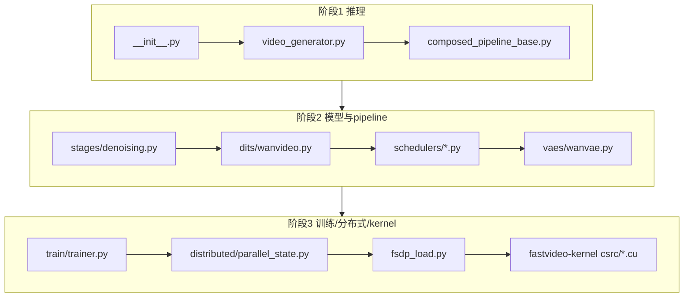

# FastVideo 学习路线图

> 三阶段渐进式学习。每阶段给出"看哪些文件、跑哪些示例、理解哪些知识点"。配合 [`05_code_reading_notes/00_reading_order.md`](../05_code_reading_notes/00_reading_order.md) 的文件优先级使用。

---

## 阶段 1：先跑通并理解推理

**目标**：能用 3 行代码生成视频，并在脑中画出"prompt → 视频"的宏观流程。

### 要跑的示例
```bash
# 最简单：examples/inference/basic/basic.py (Wan2.1 T2V 1.3B)
python examples/inference/basic/basic.py
# 或 LTX2
python examples/inference/basic/basic_ltx2.py
```

### 要看的文件（按顺序）
1. `fastvideo/__init__.py` —— 看清 4 个导出。
2. `fastvideo/entrypoints/video_generator.py` —— `VideoGenerator.from_pretrained()` 和 `generate_video()`（不用读懂全部，先抓主干）。
3. `fastvideo/api/sampling_param.py` —— `SamplingParam` 有哪些字段（分辨率、帧数、步数、guidance）。
4. `fastvideo/pipelines/composed_pipeline_base.py` —— `forward()` 里"for stage in stages"这句话是全项目的心脏。

### 要理解的知识点
- 视频扩散基础：latent diffusion、denoising loop、text-to-video。见 [`04_knowledge_expansion/00_video_diffusion_basics.md`](../04_knowledge_expansion/00_video_diffusion_basics.md)。
- VAE 为什么把 `[B,3,T,H,W]` 压成 `[B,16,T/4,H/8,W/8]`。见 [`04_knowledge_expansion/03_vae_for_video.md`](../04_knowledge_expansion/03_vae_for_video.md)。
- Facade / Executor / Worker 三级分层为什么存在。见 [`01_architecture/03_distributed_architecture.md`](../01_architecture/03_distributed_architecture.md)。

### 阶段产出
能回答：*"我调用 `generate_video` 后，prompt 是怎么一步步变成 mp4 的？scheduler 在哪调用？VAE decode 在哪？"*

---

## 阶段 2：理解模型与 pipeline

**目标**：读懂一个具体 DiT（推荐 Wan）的 forward，理解 stage 之间的数据流。

### 要看的目录
1. `fastvideo/pipelines/stages/` —— 逐个 stage 的 forward。重点：
   - `text_encoding.py`（prompt → embedding）
   - `latent_preparation.py`（初始化噪声 latent）
   - `timestep_preparation.py`（scheduler.set_timesteps）
   - `denoising.py`（**最核心**，去噪循环 + CFG + scheduler.step）
   - `decoding.py`（VAE decode）
2. `fastvideo/models/dits/wanvideo.py` —— `WanTransformer3DModel.forward`，patch embed → blocks → unpatchify。
3. `fastvideo/models/schedulers/scheduling_flow_match_euler_discrete.py` —— flow matching 的 `scale_noise` / `step`。
4. `fastvideo/models/vaes/wanvae.py` —— VAE encode/decode。

### 要重点理解的类
| 类 | 职责 |
|----|------|
| `ForwardBatch` (`pipeline_batch_info.py`) | 贯穿所有 stage 的数据载体 |
| `DenoisingStage` (`stages/denoising.py`) | 去噪循环，调用 DiT + scheduler |
| `WanTransformer3DModel` (`dits/wanvideo.py`) | DiT 主体 |
| `FlowMatchEulerDiscreteScheduler` | flow matching 采样 |

### 要画的调用链
- prompt → latent → video tensor 全链路（见 [`03_core_flows/04_prompt_to_video_tensor_flow.md`](../03_core_flows/04_prompt_to_video_tensor_flow.md)）。
- denoising loop 内部（DiT forward + CFG + scheduler.step）。

### 要理解的知识点
- DiT / MMDiT 结构、3D patch embedding、timestep embedding、cross attention。见 [`04_knowledge_expansion/01_dit_transformer_for_video.md`](../04_knowledge_expansion/01_dit_transformer_for_video.md)。
- Flow matching vs DDPM/DDIM。见 [`04_knowledge_expansion/04_scheduler_sampling_solver.md`](../04_knowledge_expansion/04_scheduler_sampling_solver.md)。
- attention 后端选择机制。见 [`04_knowledge_expansion/05_attention_acceleration.md`](../04_knowledge_expansion/05_attention_acceleration.md)。

---

## 阶段 3：深入训练、分布式与 CUDA kernel

**目标**：能读懂训练主循环、FSDP/SP 并行策略、以及 Python → CUDA 的 kernel 调用链。

### 训练
1. `fastvideo/train/entrypoint/train.py` —— `run_training_from_config`（新框架入口）。
2. `fastvideo/train/trainer.py` —— `Trainer.run`（主循环：梯度累积 + optimizer step + checkpoint）。
3. `fastvideo/train/methods/fine_tuning/finetune.py` —— 最简单的训练方法（MSE flow matching loss）。
4. `fastvideo/train/methods/distribution_matching/dmd2.py` —— DMD2 蒸馏（student/teacher/critic 三角色）。
5. `fastvideo/train/utils/lora.py` —— `enable_lora_training`（LoRA 注入）。

见 [`03_core_flows/08_lora_finetune_flow.md`](../03_core_flows/08_lora_finetune_flow.md) 和 [`03_core_flows/09_distillation_flow.md`](../03_core_flows/09_distillation_flow.md)。

### 分布式
1. `fastvideo/distributed/parallel_state.py` —— `GroupCoordinator`、`initialize_model_parallel`。
2. `fastvideo/distributed/device_communicators/base_device_communicator.py` —— `AllToAll4D`（SP 核心）。
3. `fastvideo/models/loader/fsdp_load.py` —— `maybe_load_fsdp_model`、`shard_model`。
4. `fastvideo/attention/layer.py` —— `DistributedAttention.forward`（SP 在 attention 里的体现）。

见 [`04_knowledge_expansion/07_sequence_parallelism.md`](../04_knowledge_expansion/07_sequence_parallelism.md) 和 [`04_knowledge_expansion/08_fsdp_and_distributed_training.md`](../04_knowledge_expansion/08_fsdp_and_distributed_training.md)。

### CUDA Kernel
1. `fastvideo/attention/backends/video_sparse_attn.py` —— VSA 后端（Python 侧）。
2. `fastvideo-kernel/python/fastvideo_kernel/ops.py` —— Python 封装。
3. `fastvideo-kernel/csrc/common_extension.cpp` —— pybind11 注册。
4. `fastvideo-kernel/csrc/attention/block_sparse_h100.cu` —— CUDA kernel。

见 [`03_core_flows/07_attention_backend_flow.md`](../03_core_flows/07_attention_backend_flow.md) 和 [`06_practical_guides/07_how_to_read_cuda_kernel.md`](../06_practical_guides/07_how_to_read_cuda_kernel.md)。

### 调试与性能
- torch.profiler / nsys / ncu 用法见 [`06_practical_guides/06_how_to_profile_performance.md`](../06_practical_guides/06_how_to_profile_performance.md)。

---

## 一页速查：三阶段核心文件


