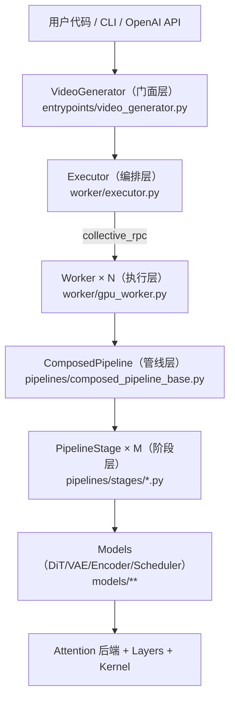
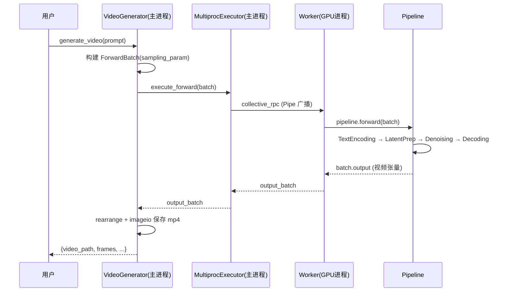
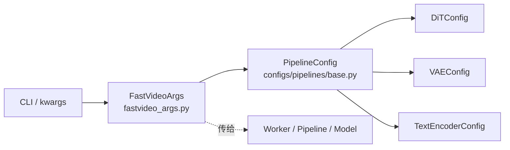

# 全局架构

> 本文回答一个问题：FastVideo 从"用户一行代码"到"GPU 上跑模型"，中间有哪些层？为什么这样分层？

## 1. 五层架构总览



### 各层职责边界

| 层 | 关键文件 | 职责 | 运行位置 |
|----|---------|------|---------|
| **门面层** | `entrypoints/video_generator.py` | 接收用户请求，规范化配置，管理输出/保存 | 主进程 |
| **编排层** | `worker/executor.py`, `worker/multiproc_executor.py` | spawn N 个 GPU 子进程，通过 Pipe 做 RPC | 主进程 |
| **执行层** | `worker/gpu_worker.py` | 初始化 CUDA + 分布式，加载 pipeline，执行 forward | 每个 GPU 子进程 |
| **管线层** | `pipelines/composed_pipeline_base.py` | 顺序执行 stages，加载模块 | GPU 子进程 |
| **阶段层** | `pipelines/stages/*.py` | 单一职责的处理步骤（编码/去噪/解码） | GPU 子进程 |
| **模型层** | `models/**` | 具体的 DiT/VAE/Encoder/Scheduler | GPU 子进程 |

## 2. 为什么要分这么多层？

### Facade + Executor + Worker：解决"多 GPU 编排"

视频扩散模型很大（14B 参数），单卡放不下，或者要用序列并行加速。FastVideo 借鉴 vLLM 的做法：

- **主进程**只持有轻量的 `VideoGenerator`（不加载模型）。
- 真正的模型加载和 forward 发生在 **N 个 GPU 子进程（Worker）** 里。
- 主进程通过 `MultiprocExecutor.collective_rpc()` 向所有 worker 广播命令（如 `execute_forward`）。

好处：
1. 主进程不初始化 CUDA，避免 fork 时的 CUDA 冲突。
2. 每个 GPU 一个进程，天然适配 NCCL / torch.distributed 的 SPMD 模型。
3. 用户 API 保持简单（就是普通方法调用），并行细节被 executor 隐藏。

```python
# worker/executor.py：所有 worker 并行执行，取 rank-0 结果
def execute_forward(self, forward_batch, fastvideo_args) -> ForwardBatch:
    outputs = self.collective_rpc("execute_forward",
        kwargs={"forward_batch": forward_batch, "fastvideo_args": fastvideo_args})
    return cast(ForwardBatch, outputs[0]["output_batch"])
```

### Pipeline = Stage 列表：解决"模型多、流程各异"

FastVideo 要支持 Wan、Hunyuan、Cosmos、LTX-2 等十几个模型族。如果每个模型写一个巨型 pipeline 类，代码会爆炸且难维护。

它的做法（见 `pipelines/AGENTS.md`）：
- 每个 pipeline 是一串 `PipelineStage`（validate → encode → schedule → denoise → decode）。
- 每个 stage 接收并返回同一个 `ForwardBatch`（数据载体）。
- 添加新模型 = 组装已有 stages；只有去噪循环结构性不同时才 fork stage。

```python
# pipelines/composed_pipeline_base.py:488 —— 全项目的心脏
@torch.no_grad()
def forward(self, batch, fastvideo_args):
    for stage in self.stages:
        batch = stage(batch, fastvideo_args)   # 每个 stage 修改 batch 字段
    return batch
```

### Registry + Lazy Import：解决"如何根据 model_path 找到对应实现"

- 用户只给一个 `model_path`（HF repo 名或本地路径）。
- `registry.py` 通过硬编码表 + AST 扫描 `EntryClass` 找到对应的 pipeline / model / config 类。
- 用 `_LazyRegisteredModel` 延迟导入，避免主进程过早 import 触发 CUDA。

## 3. 数据在架构中如何流动

以最典型的 T2V 推理为例：



## 4. 配置系统贯穿全局



- `FastVideoArgs`：全局推理参数（并行度、offload、compile、模型路径）。
- `PipelineConfig`：模型架构配置（DiT hidden dim、VAE 压缩比等）。
- 两者一起被序列化传给每个 worker。

详见 [`05_code_reading_notes/04_config_system.md`](../05_code_reading_notes/04_config_system.md)。

## 5. 训练 vs 推理的架构差异

| 维度 | 推理 | 训练 |
|------|------|------|
| 入口 | `VideoGenerator` → Executor → Worker | `torchrun` 直接启动，每 rank 一个进程 |
| 编排 | 主进程 executor spawn worker | 无 executor，SPMD 直接跑 |
| 管线 | `ComposedPipeline`（stages） | 新框架 `Trainer` + `Method` + `Model`；旧框架 `TrainingPipeline` |
| 并行 | SP 为主，FSDP 可选 | FSDP 必开，SP/DP 组合 |

推理走"主进程门面 + 子进程 worker"；训练走"torchrun SPMD"。这是两套不同的进程模型，读代码时要分清。

## 6. 相关笔记
- 推理流水线：[`01_inference_pipeline.md`](01_inference_pipeline.md)
- 训练流水线：[`02_training_pipeline.md`](02_training_pipeline.md)
- 分布式架构：[`03_distributed_architecture.md`](03_distributed_architecture.md)
- Kernel 架构：[`04_kernel_architecture.md`](04_kernel_architecture.md)
