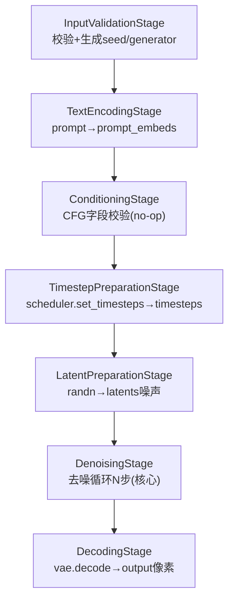
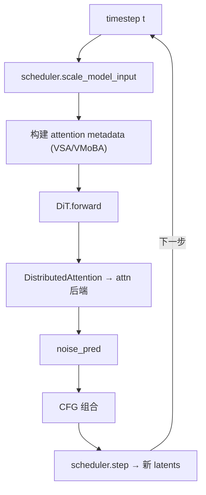
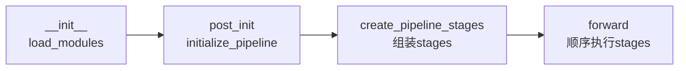

# 推理流水线架构

> 聚焦：一次推理从 `VideoGenerator` 到视频张量，经过哪些阶段（stage），每个阶段处理什么张量。

## 1. Pipeline 的组装（以 Wan T2V 为例）

源码位置：`/home/hpc/ghr_code/FastVideo/fastvideo/pipelines/basic/wan/wan_pipeline.py`

```python
class WanPipeline(LoRAPipeline, ComposedPipelineBase):
    _required_config_modules = ["text_encoder", "tokenizer", "vae", "transformer", "scheduler"]

    def create_pipeline_stages(self, fastvideo_args):
        self.add_stage("input_validation_stage",     InputValidationStage())
        self.add_stage("prompt_encoding_stage",       TextEncodingStage(...))
        self.add_stage("conditioning_stage",          ConditioningStage())
        self.add_stage("timestep_preparation_stage",  TimestepPreparationStage(scheduler))
        self.add_stage("latent_preparation_stage",    LatentPreparationStage(scheduler, transformer))
        self.add_stage("denoising_stage",             DenoisingStage(transformer, scheduler, vae=vae))
        self.add_stage("decoding_stage",              DecodingStage(vae))
```

**这段代码做了什么**：声明 pipeline 需要哪 5 个模块（会被 `load_modules` 自动加载），并按顺序注册 7 个 stage。`add_stage` 会把 stage 存进 `self._stages` 列表并设为属性。

## 2. 七个 stage 的数据流



### 每个 stage 的输入输出（张量形状以 Wan T2V 为例）

| Stage | 读取 batch 字段 | 写入 batch 字段 | 关键形状 |
|-------|----------------|----------------|---------|
| InputValidation | prompt, height, width, seed | seeds, generator, pil_image | - |
| TextEncoding | prompt, negative_prompt | prompt_embeds, negative_prompt_embeds | `[1, 512, 4096]`（T5） |
| Conditioning | guidance_scale | do_classifier_free_guidance | - |
| TimestepPreparation | num_inference_steps | timesteps | `[50]`（1000→0） |
| LatentPreparation | num_frames, height, width, generator | latents, raw_latent_shape | `[1, 16, 21, 60, 104]` |
| **Denoising** | latents, prompt_embeds, timesteps | latents（去噪后） | 同上 |
| Decoding | latents | output | `[1, 3, 81, 480, 832]` |

> latent 形状推导：`num_frames=81 → (81-1)/4+1=21`（时间压缩4×）；`height=480 → 480/8=60`，`width=832 → 832/8=104`（空间压缩8×）；latent 通道数 16。

## 3. DenoisingStage：推理的心脏

源码位置：`/home/hpc/ghr_code/FastVideo/fastvideo/pipelines/stages/denoising.py`（`DenoisingStage.forward`，约 L72-635）

去噪循环的核心结构：

```python
for i, t in enumerate(timesteps):                        # 默认 50 步
    latent_model_input = self.scheduler.scale_model_input(latents, t)
    # 条件分支：DiT 前向
    noise_pred = current_model(latent_model_input, prompt_embeds, t_expand, ...)
    # CFG：无条件分支 + 组合
    if do_classifier_free_guidance:
        noise_pred_uncond = current_model(latent_model_input, negative_embeds, ...)
        noise_pred = noise_pred_uncond + guidance_scale * (noise_pred - noise_pred_uncond)
    # scheduler 更新 latent
    latents = self.scheduler.step(noise_pred, t, latents, return_dict=False)[0]
batch.latents = latents
```

**要点**：
- `scheduler.step` 是唯一更新 latent 的地方（`denoising.py:567` 附近）。
- CFG（classifier-free guidance）需要跑两次 DiT（条件 + 无条件），是推理耗时翻倍的原因。
- Wan2.2 MoE 有专家切换（`boundary_timestep`），根据时间步选 `transformer` 或 `transformer_2`。

### 去噪循环内部（含 attention 后端调用）



## 4. 不同模型的 stage 差异

大部分模型共用同一组 stage，只有去噪结构性不同时才 fork：

| 模型 | 特殊 stage | 原因 |
|------|-----------|------|
| Cosmos | `CosmosLatentPreparationStage`, `CosmosDenoisingStage` | EDM preconditioning、condition mask |
| Wan Causal | `CausalDenoisingStage` | 自回归因果去噪（Self-Forcing） |
| Wan DMD | `DmdDenoisingStage` | 蒸馏后仅 3 步去噪 |
| LTX-2 | `LTX2DenoisingStage` | Audio+Video 双模态 |
| Hunyuan | 双 text encoder stage | text_encoder + text_encoder_2 |

## 5. Pipeline 生命周期



- `__init__`：读 `model_index.json`，调用 `load_modules` 加载 5 个模块（`composed_pipeline_base.py:357`）。
- `post_init`：推理模式下调用 `initialize_pipeline`（设置 scheduler 等）+ `create_pipeline_stages` + 可选 torch.compile。
- `forward`：`for stage in stages: batch = stage(batch, args)`。

## 6. 相关笔记
- 完整推理调用链：[`03_core_flows/00_video_generation_flow.md`](../03_core_flows/00_video_generation_flow.md)
- pipeline 源码详解：[`02_source_by_directory/03_pipelines.md`](../02_source_by_directory/03_pipelines.md)
- 去噪与采样：[`03_core_flows/05_scheduler_and_sampling_flow.md`](../03_core_flows/05_scheduler_and_sampling_flow.md)
