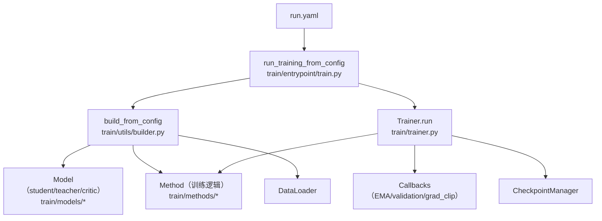
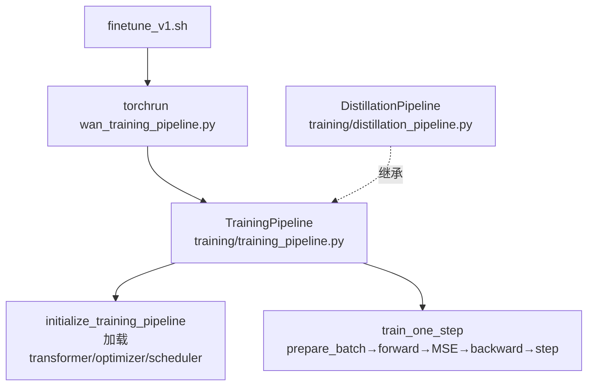

# 训练流水线架构

> FastVideo 有**两套并存的训练栈**。读训练代码前必须先分清用的是哪一套。

## 1. 双栈并存（关键认知）

| 维度 | `fastvideo/train/`（新栈，推荐） | `fastvideo/training/`（旧栈，维护模式） |
|------|-------------------------------|--------------------------------------|
| 范式 | 组合式：Method × Model × Callback | 单体：一个文件一个 pipeline |
| 配置 | 层级 YAML + 虚线 CLI override | 扁平 argparse（`TrainingArgs`） |
| 入口 | `torchrun -m fastvideo.train.entrypoint.train --config run.yaml` | `torchrun fastvideo/training/wan_training_pipeline.py --flag ...` |
| 配置类 | `TrainingConfig`（dataclass 层次） | `TrainingArgs`（继承 `FastVideoArgs`） |
| 典型脚本 | `examples/train/run.sh` | `scripts/finetune/finetune_v1.sh` |

两栈**互不引用**。新栈用于新代码，旧栈保留已发布模型的复现能力。

## 2. 新栈架构（组合式）



### 三大抽象

1. **Model**（`train/models/base.py` 的 `ModelBase`）：包装一个 DiT，提供 `prepare_batch`、`add_noise`、`predict_noise`、`backward`。例如 `WanModel`（`train/models/wan/wan.py`）。
2. **Method**（`train/methods/base.py` 的 `TrainingMethod`）：定义训练算法。核心方法 `single_train_step(batch, iteration) → (loss_map, outputs, metrics)`。子类：`FineTuneMethod`、`DMD2Method`、`SelfForcingMethod`、`KDMethod`。
3. **Callback**（`train/callbacks/callback.py`）：钩子系统。`GradNormClipCallback`、`EMACallback`、`ValidationCallback`。

### 主训练循环（`train/trainer.py:101` `Trainer.run`）

```python
for step in progress:
    for accum_iter in range(grad_accum):              # 梯度累积
        batch = next(data_stream)
        loss_map, outputs, metrics = method.single_train_step(batch, step)
        method.backward(loss_map, outputs, grad_accum_rounds=grad_accum)
    self.callbacks.on_before_optimizer_step(method, step)   # grad clip
    method.optimizers_schedulers_step(step)                 # optimizer.step + scheduler.step
    method.optimizers_zero_grad(step)
    self.tracker.log(metrics, step)
    checkpoint_manager.maybe_save(step)
    self._run_method_validation(method, step)
```

## 3. 旧栈架构（单体 pipeline）



- `TrainingPipeline`（`training/training_pipeline.py`，继承 `LoRAPipeline`）：全量/LoRA 微调。
- `DistillationPipeline`（`training/distillation_pipeline.py`，1514 行）：DMD/DMD2 蒸馏，加载 `real_score_transformer`（teacher）和 `fake_score_transformer`（critic）。

## 4. Loss 的数学统一基础：Flow Matching

无论哪种 method，loss 都建立在 **Rectified Flow / Flow Matching** 参数化上：

```python
# train/methods/fine_tuning/finetune.py:97
target = noise - clean_latents            # v-prediction target
loss = F.mse_loss(pred, target)
# 或 precondition_outputs=True 时
pred_x0 = noisy_latents - pred * sigmas
loss = F.mse_loss(pred_x0, clean_latents)
```

- 加噪：`x_t = (1 - σ)·x_0 + σ·ε`（`scale_noise`）。
- 目标速度：`v = ε - x_0`。

各 method 的 loss 差异见 [`03_core_flows/09_distillation_flow.md`](../03_core_flows/09_distillation_flow.md)。

## 5. 并行策略：训练默认开 FSDP

```yaml
# examples/train/configs/fine_tuning/wan/t2v.yaml
training:
  distributed:
    num_gpus: 8
    sp_size: 1              # 不做序列并行
    tp_size: 1              # 不做张量并行
    hsdp_replicate_dim: 8   # 8 副本数据并行
    hsdp_shard_dim: 1       # 不分片（每 GPU 全量模型）
```

- 训练时 `training_mode=True` → `use_fsdp=True`（`fsdp_load.py`）。
- FSDP2 用 `DeviceMesh(replicate, shard)` 2D 网格。
- 大模型（如 VSA 训练）会用 `sp_size=2, hsdp_shard_dim=2` 组合。

详见 [`04_knowledge_expansion/08_fsdp_and_distributed_training.md`](../04_knowledge_expansion/08_fsdp_and_distributed_training.md)。

## 6. Checkpoint：基于 DCP（Distributed Checkpoint）

新栈 `CheckpointManager`（`train/utils/checkpoint.py`）：
```
output_dir/checkpoint-1000/
├── metadata.json          # {"step": 1000, "config": {...}}
├── dcp/                   # torch.distributed.checkpoint 分片数据
└── rng_state_rank0.pt     # per-rank RNG 快照
```

旧栈 `save_checkpoint`（`training/training_utils.py:109`）：DCP + rank0 导出 diffusers 格式 safetensors。

## 7. 相关笔记
- 训练目录详解：[`02_source_by_directory/08_training.md`](../02_source_by_directory/08_training.md)
- LoRA 微调流程：[`03_core_flows/08_lora_finetune_flow.md`](../03_core_flows/08_lora_finetune_flow.md)
- 蒸馏流程：[`03_core_flows/09_distillation_flow.md`](../03_core_flows/09_distillation_flow.md)
