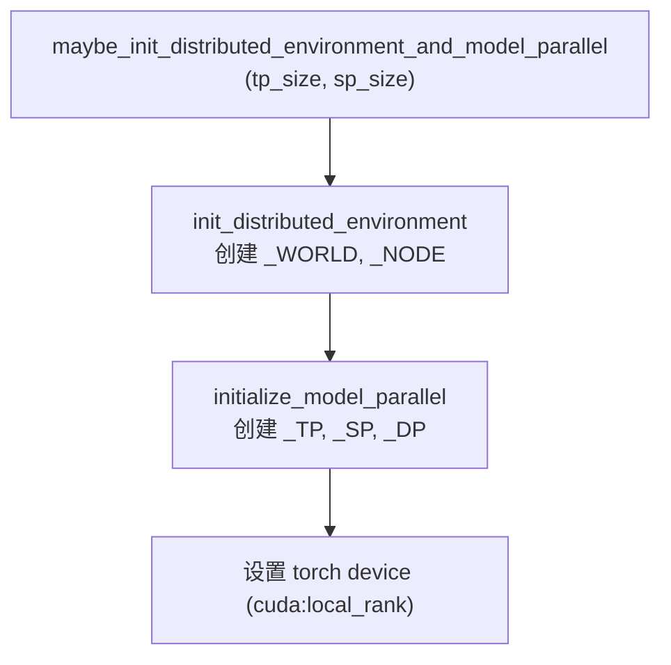
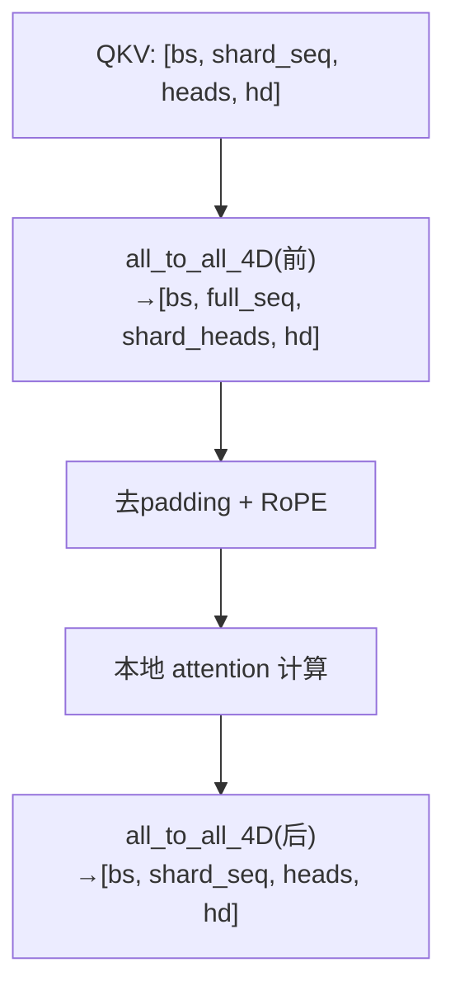
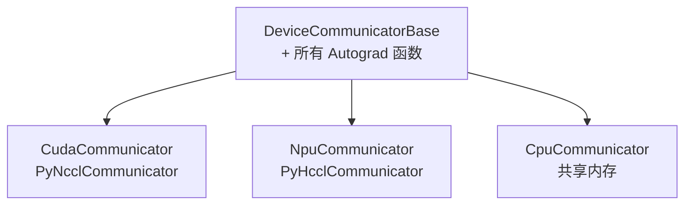

# 分布式架构

> FastVideo 的并行有三个正交维度：**Tensor Parallel (TP)**、**Sequence Parallel (SP)**、**FSDP（数据/模型分片）**。本文讲它们如何初始化、如何管理通信组。

## 1. 通信组管理：GroupCoordinator 模式

源码位置：`/home/hpc/ghr_code/FastVideo/fastvideo/distributed/parallel_state.py`

FastVideo 不用 PyTorch 全局 init，而是用**模块级全局变量**存储各组的 `GroupCoordinator`：

```python
_WORLD  # 全局组（所有 rank）
_TP     # Tensor Parallel 组
_SP     # Sequence Parallel 组
_DP     # Data Parallel 组
_NODE   # 节点组
```

`GroupCoordinator`（`parallel_state.py:117`）是核心抽象，封装一个 PyTorch ProcessGroup，同时管理 CPU 组（gloo）和设备组（NCCL/HCCL），暴露 `all_reduce` / `all_gather` / `all_to_all_4D` / `shard` / `broadcast` 等原语。

## 2. 初始化流程



`initialize_model_parallel`（`parallel_state.py:789`）的分组逻辑（以 world_size=8 为例）：

| 组 | 分组方式 | 例（sp_size=4） |
|----|---------|----------------|
| TP | 连续 rank | `[[0,1,2,3],[4,5,6,7]]` |
| SP | 连续 rank | `[[0,1,2,3],[4,5,6,7]]` |
| DP | 交错 rank | `[[0,4],[1,5],[2,6],[3,7]]` |

**幂等设计**：`maybe_init_*` 若已初始化则校验 tp/sp 一致后直接返回，允许多次安全调用。

## 3. Sequence Parallelism（SP）：核心机制

SP 把**序列维度（token 数）**切分到多个 GPU，是视频生成的关键加速手段（视频 token 数巨大，单卡 attention 内存吃不消）。

### AllToAll4D：SP 的心脏

源码位置：`/home/hpc/ghr_code/FastVideo/fastvideo/distributed/device_communicators/base_device_communicator.py`（`DistributedAutograd.AllToAll4D`，L123）

在 attention 前后各做一次 all-to-all，实现"序列切分 ↔ head 切分"的转换：

```
attention 前（scatter_dim=2, gather_dim=1）:
  输入 [bs, shard_seqlen, hn, hd]     # 每 rank 持有部分序列、全部 head
  输出 [bs, seqlen, shard_hn, hd]     # 每 rank 持有全部序列、部分 head
  → 这样每个 rank 能对完整序列做 attention，只是 head 少

attention 后（scatter_dim=1, gather_dim=2）:
  反向操作，恢复"部分序列、全部 head"
```

### 在 attention 层的体现

源码位置：`/home/hpc/ghr_code/FastVideo/fastvideo/attention/layer.py`（`DistributedAttention.forward`）



详见 [`04_knowledge_expansion/07_sequence_parallelism.md`](../04_knowledge_expansion/07_sequence_parallelism.md)。

## 4. FSDP2：参数分片

源码位置：`/home/hpc/ghr_code/FastVideo/fastvideo/models/loader/fsdp_load.py`

- `maybe_load_fsdp_model`（L100）：在 meta 设备上建模型 → 用 `DeviceMesh(replicate, shard)` 分片 → 从 safetensors 加载权重并 `distribute_tensor` 分发。
- `shard_model`（L219）：反向遍历模块树，对满足 `_fsdp_shard_conditions` 的模块调用 `fully_shard`（FSDP2 API）。

```python
device_mesh = init_device_mesh("cuda",
    mesh_shape=(hsdp_replicate_dim, hsdp_shard_dim),
    mesh_dim_names=("replicate", "shard"))
```

- `hsdp_replicate_dim`：数据并行度（多份数据，相同模型）。
- `hsdp_shard_dim`：模型分片度（一份模型跨多 GPU）。
- `world_size = hsdp_replicate_dim × hsdp_shard_dim`。

## 5. Tensor Parallelism（TP）：线性层切分

源码位置：`/home/hpc/ghr_code/FastVideo/fastvideo/layers/linear.py`

| 类 | 切分方式 | 用途 |
|----|---------|------|
| `ColumnParallelLinear` | 输出维切分 | QKV projection 的 Q/K/V |
| `RowParallelLinear` | 输入维切分 + all-reduce | attention output projection |
| `QKVParallelLinear` | QKV 融合切分，支持 GQA | attention QKV |
| `MergedColumnParallelLinear` | 多输出打包切分 | MLP gate_up |
| `ReplicatedLinear` | 不切分（复制） | DiT/VAE 热路径 |

**注意**：DiT 主体通常不用 TP（`tp_size=1`），TP 主要留给大 language encoder。视频模型的并行主力是 SP + FSDP。

## 6. 推理 vs 训练的并行策略

源码位置：`/home/hpc/ghr_code/FastVideo/fastvideo/fastvideo_args.py`（`check_fastvideo_args`，L731+）

| 维度 | 推理默认 | 训练 |
|------|---------|------|
| FSDP | 可选（`fsdp_inference`） | 必开 |
| SP | `sp_size=num_gpus`（全部 GPU） | YAML 显式指定 |
| TP | `tp_size=1` | 通常 1 |
| HSDP mesh | `replicate=1, shard=num_gpus`（全分片） | 常 `replicate=8, shard=1`（全复制） |
| CPU offload | 默认开 | 关 |

## 7. 设备通信器层次



**PyNcclCommunicator**（`device_communicators/pynccl.py`）：纯 Python + ctypes 封装 NCCL，绕过 PyTorch。理由：torch.distributed 的 all_reduce 在 CUDA graph 捕获时不被允许，且可通过 `FASTVIDEO_NCCL_SO_PATH` 灵活切换 NCCL 版本。

## 8. 相关笔记
- 分布式源码详解：[`02_source_by_directory/07_distributed.md`](../02_source_by_directory/07_distributed.md)
- 序列并行深入：[`04_knowledge_expansion/07_sequence_parallelism.md`](../04_knowledge_expansion/07_sequence_parallelism.md)
- FSDP 深入：[`04_knowledge_expansion/08_fsdp_and_distributed_training.md`](../04_knowledge_expansion/08_fsdp_and_distributed_training.md)
