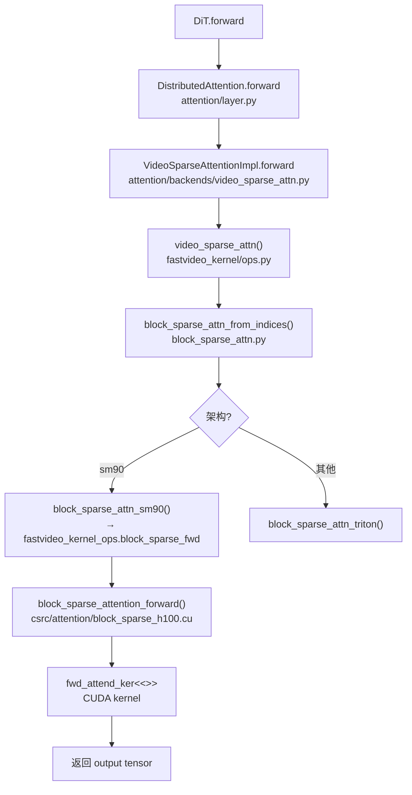
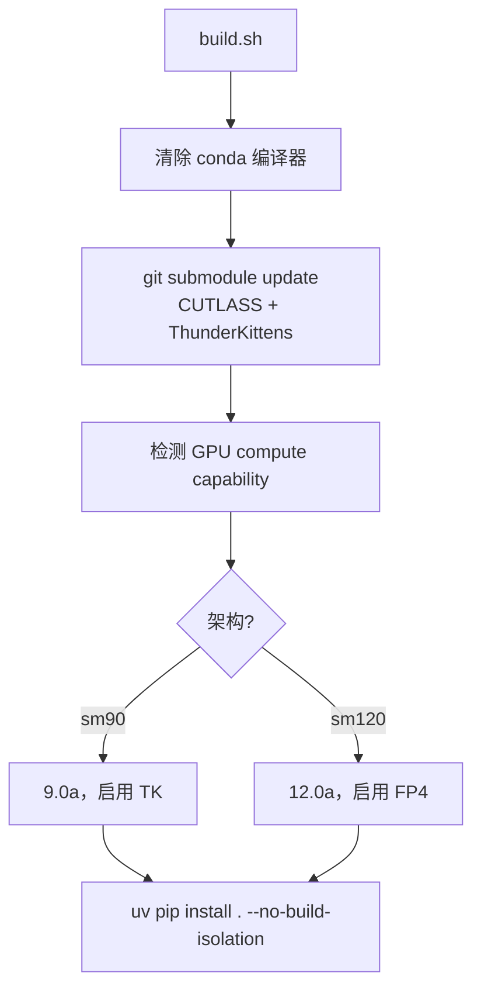

# Kernel 架构

> `fastvideo-kernel/` 是一个**独立的 CUDA extension 包**，为 attention 稀疏化和量化提供高性能 kernel。本文讲它的整体结构与 Python→CUDA 调用链。

## 1. 目录结构

源码位置：`/home/hpc/ghr_code/FastVideo/fastvideo-kernel/`

```
fastvideo-kernel/
├── CMakeLists.txt              # 主构建配置（scikit-build-core + CMake）
├── pyproject.toml              # scikit-build-core 后端
├── build.sh                    # 便捷构建脚本
├── include/
│   ├── cutlass/                # CUTLASS submodule（模板库）
│   └── tk/                     # ThunderKittens submodule（Hopper DSL）
├── csrc/                       # C++/CUDA 源码
│   ├── common_extension.cpp    # pybind11 模块入口（注册所有 kernel）
│   ├── attention/
│   │   ├── st_attn_h100.cu     # Sliding Tile Attention（sm_90a）
│   │   └── block_sparse_h100.cu# Block Sparse Attention（sm_90a）
│   └── turbodiffusion/
│       ├── gemm/gemm.cu        # INT8 GEMM
│       ├── norm/rmsnorm.cu     # RMSNorm
│       ├── norm/layernorm.cu   # LayerNorm
│       └── quant/quant.cu      # INT8 量化
├── python/fastvideo_kernel/    # Python 封装层
│   ├── ops.py                  # VSA / STA 入口
│   ├── turbodiffusion_ops.py   # Int8Linear / FastRMSNorm / FastLayerNorm
│   ├── vmoba.py                # Video-MoBA 完整实现
│   └── triton_kernels/         # Triton fallback kernel
└── attn_qat_infer/             # Blackwell FP4 推理 kernel（独立编译，sm_120a）
```

## 2. 三类 kernel

| 类别 | 文件 | 目标架构 | 用途 |
|------|------|---------|------|
| **Attention（TK）** | `st_attn_h100.cu`, `block_sparse_h100.cu` | sm_90a (Hopper) | 稀疏/滑窗注意力，用 ThunderKittens |
| **TurboDiffusion** | `quant.cu`, `gemm.cu`, `rmsnorm.cu`, `layernorm.cu` | 通用 | INT8 量化推理 |
| **FP4 Attention** | `attn_qat_infer/blackwell/*.cu` | sm_120a (Blackwell) | FP4 量化注意力，CuTe DSL |

## 3. PyTorch Extension 注册（pybind11）

源码位置：`/home/hpc/ghr_code/FastVideo/fastvideo-kernel/csrc/common_extension.cpp`

**用 pybind11（不是 TORCH_LIBRARY）**：

```cpp
PYBIND11_MODULE(TORCH_EXTENSION_NAME, m) {
    // ThunderKittens kernels（条件编译）
    m.def("sta_fwd", torch::wrap_pybind_function(sta_forward), "...");
    m.def("block_sparse_fwd", torch::wrap_pybind_function(block_sparse_attention_forward), "...");
    // TurboDiffusion kernels（总是编译）
    register_quant(m);       // m.def("quant_cuda", ...)
    register_rms_norm(m);    // m.def("rms_norm_cuda", ...)
    register_gemm(m);        // m.def("gemm_cuda", ...)
}
```

Python 侧加载：
```python
from fastvideo_kernel._C import fastvideo_kernel_ops
sta_fwd = getattr(fastvideo_kernel_ops, "sta_fwd", None)  # None 表示未编译，回退 Triton
```

## 4. Python → CUDA 完整调用链

以 VSA（Video Sparse Attention）为例：



**关键设计**：每个 kernel 都有 Triton fallback。当 TK kernel 未编译（非 Hopper GPU）时，`ops.py` 检测 `sta_fwd is None` 自动回退到 Triton 实现，保证跨架构可用。

## 5. 编译流程

源码位置：`build.sh` + `CMakeLists.txt`



- 自动检测：`FASTVIDEO_KERNEL_BUILD_TK=AUTO` 检查 arch 列表含 sm_90a。
- 编译选项：`-O3 -std=c++20 --use_fast_math -DKITTENS_HOPPER`。
- FP4 扩展单独编译成 `fp4attn_cuda.so` / `fp4quant_cuda.so`（避免混合 arch 失败）。

## 6. 为什么需要自定义 kernel？

视频扩散的 attention 序列极长（十万级 token），标准 attention 的 O(L²) 复杂度不可接受。FastVideo 的 kernel 解决：

1. **稀疏化**（VSA / STA / block sparse）：只计算 top-k 相关的 block，降到近似 O(L·k)。
2. **量化**（INT8 / FP4）：降低访存和计算精度需求，配合 Blackwell/Hopper 硬件。

这些 kernel 用 ThunderKittens（Hopper 的 tile 抽象 DSL）和 CuTe DSL 写，利用 TMA 异步加载 + wgmma + warp specialization。

## 7. 相关笔记
- kernel 源码详解：[`02_source_by_directory/11_fastvideo_kernel.md`](../02_source_by_directory/11_fastvideo_kernel.md)
- attention 加速知识：[`04_knowledge_expansion/05_attention_acceleration.md`](../04_knowledge_expansion/05_attention_acceleration.md)
- CUDA/PyTorch extension 知识：[`04_knowledge_expansion/11_cuda_kernel_and_pytorch_extension.md`](../04_knowledge_expansion/11_cuda_kernel_and_pytorch_extension.md)
- 如何读 kernel：[`06_practical_guides/07_how_to_read_cuda_kernel.md`](../06_practical_guides/07_how_to_read_cuda_kernel.md)
