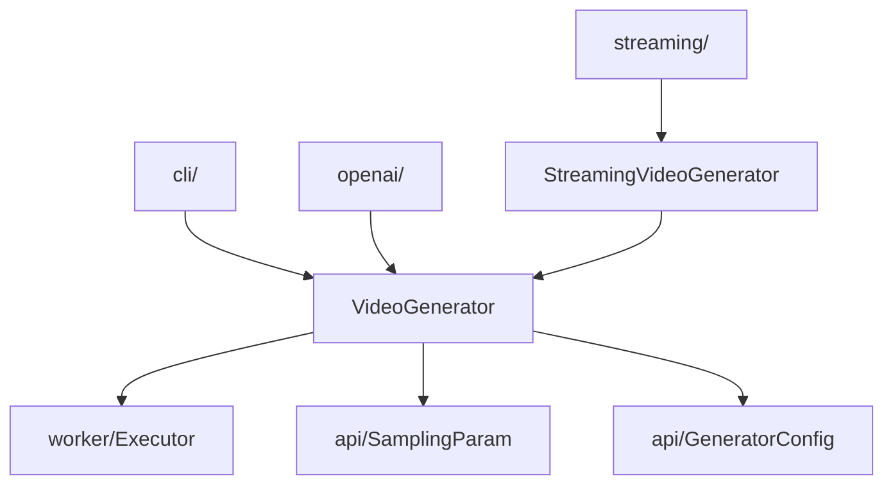

# entrypoints —— 入口层

> 模块作用：一切用户请求的入口。包含 `VideoGenerator`（核心）、CLI、OpenAI API、streaming 四种入口。

## 1. 模块作用

`fastvideo/entrypoints/` 把不同形态的用户请求（Python API、CLI、REST、WebSocket）统一收束到 `VideoGenerator`。

```
entrypoints/
├── video_generator.py       # VideoGenerator 核心门面（1308 行）
├── streaming_generator.py   # StreamingVideoGenerator 流式增量
├── cli/                     # fastvideo generate/serve/bench/eval
├── openai/                  # OpenAI 兼容 REST API
└── streaming/               # WebSocket 流式服务（14 文件）
```

## 2. VideoGenerator（核心）

```
源码位置：/home/hpc/ghr_code/FastVideo/fastvideo/entrypoints/video_generator.py
关键类：VideoGenerator (L115)
```

### 2.1 from_pretrained() —— 主工厂方法（L144）

```python
@classmethod
def from_pretrained(cls, model_path, **kwargs) -> "VideoGenerator":
    # 三条路线，最终都汇到 from_config
    return cls.from_config(legacy_from_pretrained_to_config(model_path, kwargs), ...)
```

**做了什么**：把 model_path + kwargs 规范化为 `GeneratorConfig`，再调 `from_config`。
**输入**：model_path（HF repo 名或本地路径）+ 便捷 kwargs（`num_gpus`、`tp_size`、`dit_cpu_offload` 等）。
**输出**：一个 `VideoGenerator` 实例（此时 worker 已 spawn，模型已加载）。

调用链：
```
from_pretrained → from_config → normalize_generator_config
  → generator_config_to_fastvideo_args → from_fastvideo_args
    → Executor.get_class(args)              # 选 MultiprocExecutor/Ray
    → __init__(args, executor_class)
      → executor_class(args)                # spawn N 个 worker，每个加载 pipeline
```

### 2.2 generate() / generate_video() —— 生成入口

- `generate(request)`（L258）：新 typed API，接收 `GenerationRequest`。
- `generate_video(prompt, sampling_param, ...)`（L359）：**legacy API**，已弃用但示例仍大量使用。
- `generate_async(request)`（L289）：异步流式，yield `VideoProgressEvent` + `VideoFinalEvent`。

三者最终都进入 `_generate_video_impl`（L488）→ `_generate_single_video`（L658）。

### 2.3 _generate_single_video() —— 单视频实现（L658）

关键步骤：
1. 校验输入、对齐尺寸（`align_to(height, 16)`）。
2. 计算 latent 形状：`[(num_frames-1)//4+1, height//8, width//8]`。
3. 构建 `ForwardBatch(**shallow_asdict(sampling_param))`。
4. **在独立线程**执行 `executor.execute_forward(batch, args)`，主线程预分配 pin_memory CPU 缓冲。
5. 后处理：`rearrange("b c t h w -> t b c h w")` → `make_grid` → uint8 → `imageio.mimsave`。
6. 返回 dict：`{prompts, samples, frames, video_path, generation_time, peak_memory_mb, ...}`。

**为什么用独立线程**：让 GPU worker 的 forward 与主线程的 CPU 缓冲分配/保存重叠，减少端到端延迟。

## 3. CLI 入口

```
源码位置：/home/hpc/ghr_code/FastVideo/fastvideo/entrypoints/cli/main.py
```

```python
def main():
    parser = FlexibleArgumentParser(...)
    for cmd in cmd_init():   # generate + serve + bench + eval
        cmd.subparser_init(subparsers).set_defaults(dispatch_function=cmd.cmd)
    args.dispatch_function(args)
```

子命令：
| 命令 | 文件 | 作用 |
|------|------|------|
| `fastvideo generate` | `cli/generate.py` | 从 YAML 配置生成视频 |
| `fastvideo serve` | `cli/serve.py` | 启动 OpenAI REST 或 streaming 服务 |
| `fastvideo bench` | `cli/bench.py` | 性能基准 |
| `fastvideo eval` | `cli/eval.py` | 评测 |

`generate` 用法：`fastvideo generate --config scripts/inference/inference_wan.yaml`，YAML 结构 `{generator: {...}, request: {...}}`。

## 4. OpenAI 兼容 API

```
源码位置：/home/hpc/ghr_code/FastVideo/fastvideo/entrypoints/openai/api_server.py
关键函数：run_server (L134), lifespan (L51)
```

```python
@asynccontextmanager
async def lifespan(app):
    generator = VideoGenerator.from_fastvideo_args(args)   # 启动加载模型
    set_state(generator, args, output_dir)
    yield
    generator.shutdown()                                   # 关闭释放
```

路由：`/v1/models`（common_api）、`/v1/videos`（video_api）、`/v1/images`（image_api）。`/v1/videos` 接收 `VideoGenerationsRequest` → 调 `generator.generate_video`。

## 5. Streaming

```
源码位置：/home/hpc/ghr_code/FastVideo/fastvideo/entrypoints/streaming_generator.py
关键类：StreamingVideoGenerator (L73) 继承 VideoGenerator
```

- `reset(prompt, ...)`（L102）：初始化流式管线。
- `step(keyboard_cond, mouse_cond)`（L161）：增量生成一步/一帧（用于交互式/游戏场景）。
- `finalize(output_path, fps)`（L217）：保存累积帧为 MP4。
- `IncrementalVideoWriter`（L23）：后台线程写帧，不阻塞生成。

`streaming/` 子目录是 WebSocket 服务（`server.py`、`session.py`、`router/`、`gpu_pool.py`），被 `apps/dreamverse` 使用。

## 6. 与其他模块的关系



## 7. 源码阅读重点
- `from_pretrained → from_config → from_fastvideo_args` 这条链（配置如何变成 executor + worker）。
- `_generate_single_video` 的后处理部分（张量如何变成 mp4）。

## 8. 调试入口
```python
from fastvideo.entrypoints.video_generator import VideoGenerator
g = VideoGenerator.from_pretrained("Wan-AI/Wan2.1-T2V-1.3B-Diffusers", num_gpus=1)
# 在 _generate_single_video 打断点观察 batch / samples 形状
g.generate_video(prompt="test", num_frames=17, height=256, width=256)
```
