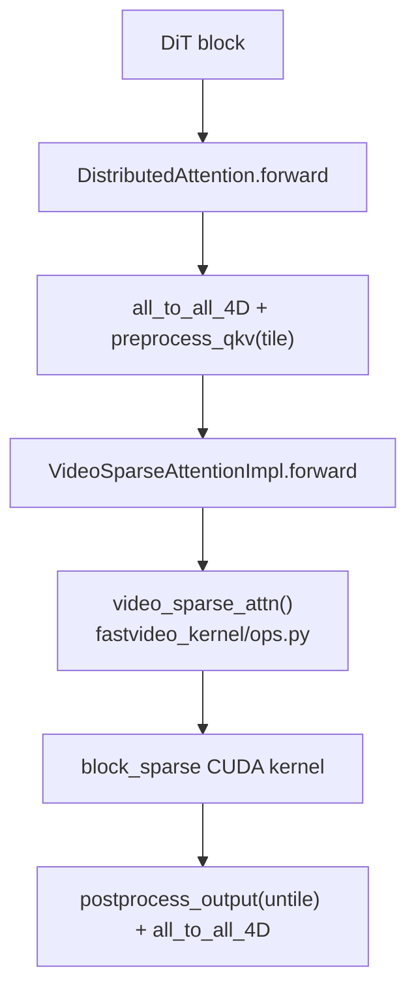

# attention —— 注意力层

> 模块作用：为 DiT 提供可插拔的 attention 后端。视频序列极长，attention 是性能瓶颈，所以有大量稀疏/量化后端。

## 1. 模块结构

```
attention/
├── selector.py       # 后端选择逻辑
├── layer.py          # DistributedAttention / LocalAttention（SP 封装）
├── backends/         # 各后端实现
│   ├── abstract.py         # AttentionBackend / AttentionImpl / AttentionMetadata
│   ├── flash_attn.py       # FlashAttention v2/v3/v4（含 FP4）
│   ├── sage_attn.py        # SageAttention v1（INT8）
│   ├── sage_attn3.py       # SageAttention v3（Blackwell）
│   ├── sdpa.py             # torch SDPA fallback
│   ├── bsa_attn.py         # Bidirectional Sparse Attention
│   ├── video_sparse_attn.py# Video Sparse Attention (VSA)
│   ├── sla.py              # Sparse-Linear Attention
│   ├── vmoba.py            # Video-MoBA
│   ├── attn_qat_infer.py   # QAT 推理（FP4 Blackwell）
│   └── attn_qat_train.py   # QAT 训练（Triton）
└── utils/            # flash_attn_cute / flash_attn_no_pad
```

## 2. 后端选择（selector.py）

```
源码位置：/home/hpc/ghr_code/FastVideo/fastvideo/attention/selector.py
关键函数：_cached_get_attn_backend (L92)
```

优先级链：
```
1. global_force_attn_backend()        # 测试用，最高
2. 环境变量 FASTVIDEO_ATTENTION_BACKEND
3. 平台默认 current_platform.get_attn_backend_cls
4. 不支持 → 回退 SDPA
```

用 `@cache` 按 `(head_size, dtype, supported_backends)` 缓存选择结果。

## 3. 抽象接口（backends/abstract.py）

| 类 | 作用 |
|----|------|
| `AttentionBackend` | 工厂：`get_impl_cls`/`get_metadata_cls`/`get_builder_cls` |
| `AttentionMetadata` | 运行时元数据（`current_timestep`, `VSA_sparsity`） |
| `AttentionImpl` | 核心：`preprocess_qkv` → `forward` → `postprocess_output` |

三个 hook 的用途：
- `preprocess_qkv`：all_to_all 之后、切分 QKV 之前（reshape/tiling）。
- `forward`：实际计算。
- `postprocess_output`：all_to_all 之前（untiling/恢复格式）。

## 4. Layer 封装（layer.py）

```
源码位置：/home/hpc/ghr_code/FastVideo/fastvideo/attention/layer.py
```

| 类 | 用途 |
|----|------|
| `DistributedAttention` (L38) | SP 注意力，QKV all_to_all_4D + attn + all_to_all_4D |
| `DistributedAttention_VSA` (L167) | 额外接收 `gate_compress`（VSA 双分支） |
| `LocalAttention` (L243) | 单 rank，直接调 `attn_impl.forward` |

`_maybe_compiler_disable`（L31）：默认对 attention forward 禁用 torch.compile（避免 flash-attn 的 CUDA graph 捕获问题）。

## 5. Dense vs Sparse

| 类型 | 后端 | 复杂度 |
|------|------|--------|
| **Dense** | flash_attn, sage_attn, sdpa, qat | O(L²)，全 token-to-token |
| **Sparse** | vsa, bsa, sla, vmoba | 近似 O(L·k)，只算 top-k block |

Dense 接口简单（`[B,L,H,D]` 进出）；Sparse 需要 `AttentionMetadata` 携带 tile 划分、稀疏度等，且需 `preprocess_qkv`/`postprocess_output` 做 tiling。

```python
# Sparse 稀疏度控制（video_sparse_attn.py）
cur_topk = (1 - VSA_sparsity) * num_kv_blocks   # VSA_sparsity=0.9 → 只保留 10% block
```

## 6. 各后端速览

| 后端 | 原理 | 适用 | 底层 |
|------|------|------|------|
| **flash_attn** | tiling + online softmax，I/O 最优 exact | 通用 | Dao-AILab flash-attn v2/v3/v4 |
| **sage_attn** | INT8 量化 Q/K | 加速 | sageattention 包 |
| **sage_attn3** | v3 Blackwell 优化 | Blackwell | sageattn3 包 |
| **sdpa** | torch 内置 | fallback | cuDNN/MemEfficient |
| **VSA** | 双分支：压缩(block mean+full)+稀疏(top-k block) | 视频 | fastvideo-kernel block_sparse |
| **BSA** | query 剪枝 + KV block 动态选择 | 训练无关加速 | flash-attn varlen |
| **SLA** | 稀疏 + 线性 attention 混合 | - | Triton + sage kernel |
| **VMoBA** | chunk 化 + per-head top-k chunk | - | fastvideo-kernel vmoba |
| **attn_qat_infer** | FP4 NVFP4 量化 | Blackwell sm120a | CuTe DSL kernel |

## 7. FlashAttention 的 torch.compile 兼容

```
源码位置：flash_attn.py L65-131
```
FA2/FA3 默认不是 traceable op，会导致 dynamo graph break。FastVideo 用 `torch.library.custom_op("fastvideo::_flash_attn_default_forward")` 包装成可追踪算子；训练（grad enabled）走原始 autograd.Function。

## 8. 调用链（VSA 为例）



## 9. 源码阅读重点
1. `selector.py` 的选择优先级。
2. `abstract.py` 的三个 hook。
3. `sdpa.py`（最简单的后端，先读它理解接口）。
4. `video_sparse_attn.py`（稀疏后端如何 tile）。

## 10. 调试入口
```bash
FASTVIDEO_ATTENTION_BACKEND=SDPA python examples/inference/basic/basic.py  # 强制 SDPA
```
在 `AttentionImpl.forward` 打印 q/k/v 形状，理解各后端布局差异（NHD vs BHSD）。

## 11. 相关笔记
- attention 加速知识：[`04_knowledge_expansion/05_attention_acceleration.md`](../04_knowledge_expansion/05_attention_acceleration.md)
- 稀疏注意力：[`04_knowledge_expansion/06_sparse_attention.md`](../04_knowledge_expansion/06_sparse_attention.md)
- 后端调用链：[`03_core_flows/07_attention_backend_flow.md`](../03_core_flows/07_attention_backend_flow.md)
