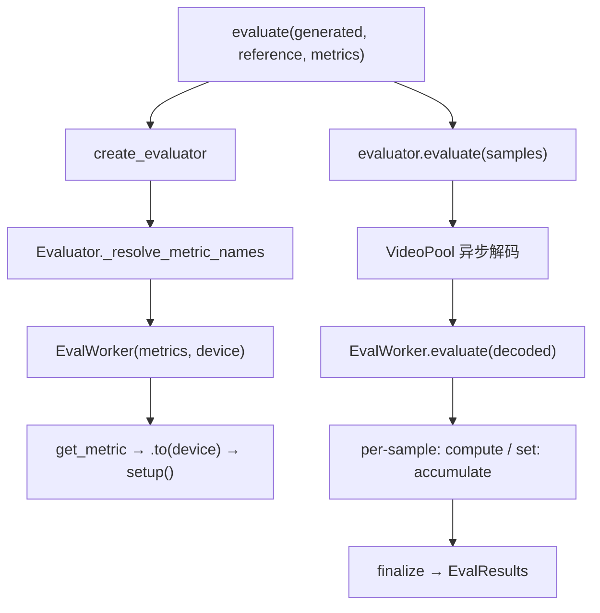

# eval —— 评测层

> 模块作用：视频生成质量评测。提供 PSNR/SSIM/LPIPS/FVD/VBench 等指标，统一注册 + 异步解码 + 多 GPU。

## 1. 模块结构

```
eval/
├── api.py              # evaluate() 一次性入口
├── evaluator.py        # Evaluator 类
├── registry.py         # @register + get_metric
├── types.py            # Video / MetricResult / EvalResults
├── worker.py           # EvalWorker（单 GPU 指标持有者）
├── pool.py             # VideoPool（异步解码）
├── io/                 # 视频解码 / 输入标准化
├── datasets/           # VBench prompt 数据集
└── metrics/            # 各指标实现
    ├── base.py         #   BaseMetric
    ├── common/         #   psnr/ssim/lpips/fvd
    ├── vbench/         #   16 个 VBench 子指标
    ├── optical_flow/ videoscore2/ judge/ physics_iq/ audio/
```

## 2. 指标注册与自动发现

```
源码位置：/home/hpc/ghr_code/FastVideo/fastvideo/eval/metrics/__init__.py
```
递归 walk `metrics/` 下所有子目录，导入每个 `metric.py` 触发 `@register` 装饰器。新增指标只需建 `metrics/<group>/<name>/metric.py`。

`get_metric(name)`（registry.py L29）：查 `_REGISTRY` + 检查依赖（`importlib.util.find_spec`）。

## 3. 两种指标模式（base.py）

| 模式 | 方法 | 例 |
|------|------|-----|
| Per-sample | `compute(sample) → MetricResult` | PSNR, SSIM, LPIPS, VBench |
| Set-vs-set | `accumulate(sample)` + `finalize()` | FVD（需 ≥256 视频） |

生命周期：`__init__` → `to(device)` → `setup()`（加载模型）→ `compute/accumulate` → `finalize`。

## 4. 各指标详解

### PSNR（common.psnr）
```
源码：metrics/common/psnr/metric.py L25
```
`MSE = (gen-ref)².mean`，`PSNR = 10·log10(max²/MSE)`。输入 `(T,C,H,W)` [0,1]，需 reference。逐帧计算。

### SSIM（common.ssim）
```
源码：metrics/common/ssim/metric.py L11
```
标准 SSIM，高斯核 depthwise conv 求 `mu/sigma`。逐帧 mean。需 reference。

### LPIPS（common.lpips）
```
源码：metrics/common/lpips/metric.py，依赖 lpips 库
```
`setup`: `LPIPS(net="alex")`。预处理到 [-1,1]。感知距离，越低越相似。需 reference。

### FVD（common.fvd）
```
源码：metrics/common/fvd/metric.py L145，set-vs-set
```
三个特征提取器（extractors.py）：`i3d`（Kinetics-400, dim 400，文献标准）、`clip`（ViT-B/32, dim 512）、`videomae`（dim 768）。

`finalize`（L277）：`FVD = ||μ1-μ2||² + tr(Σ1+Σ2-2√(Σ1Σ2))`。参考特征缓存到 `${FASTVIDEO_EVAL_CACHE}/fvd/`。多 GPU `merge_from` 合并 buffer。

### VBench（16 子指标）
如 `vbench.motion_smoothness`（用 AMT-S 光流插值）、`vbench.aesthetic_quality`、`vbench.subject_consistency`、`vbench.dynamic_degree`、`vbench.color`。多数无需 reference（评单视频质量）。

### 其他
`optical_flow.*`、`videoscore2`（Qwen2.5-VL）、`judge.*`（VLM pairwise）、`physics_iq.*`、`audio.*`。

各指标适用场景对比见 [`04_knowledge_expansion/15_evaluation_metrics.md`](../04_knowledge_expansion/15_evaluation_metrics.md)。

## 5. 评测调用链



## 6. 异步解码（VideoPool, pool.py）
后台线程解码视频（`task_q` → loader → `ready_q`），隐藏 I/O 延迟。`load_video`（io/video.py）多解码器回退：decord > PyAV > torchvision。

## 7. 使用方式

```python
from fastvideo.eval import create_evaluator, evaluate, samples_from

# 一次性
scores = evaluate(generated=tensor, reference=tensor, metrics=["common.ssim"])

# 可复用
ev = create_evaluator(metrics=["common.ssim", "common.fvd", "vbench.motion_smoothness"], device="cuda:0")
results = ev.evaluate(samples=samples_from(video="gen/", reference="ref/", fps=24))
```

CLI：`fastvideo eval list` / `fastvideo eval run --videos clip.mp4 --metrics vbench.aesthetic_quality`。

## 8. 源码阅读重点
1. `base.py` 的 per-sample vs set-vs-set 模式。
2. `common/fvd/metric.py` 的 `accumulate`/`finalize`/`merge_from`。
3. `metrics/__init__.py` 的自动发现。

## 9. 调试入口
`fastvideo eval list` 看所有已注册指标。在 `EvalWorker.evaluate` 打印 sample 形状。
