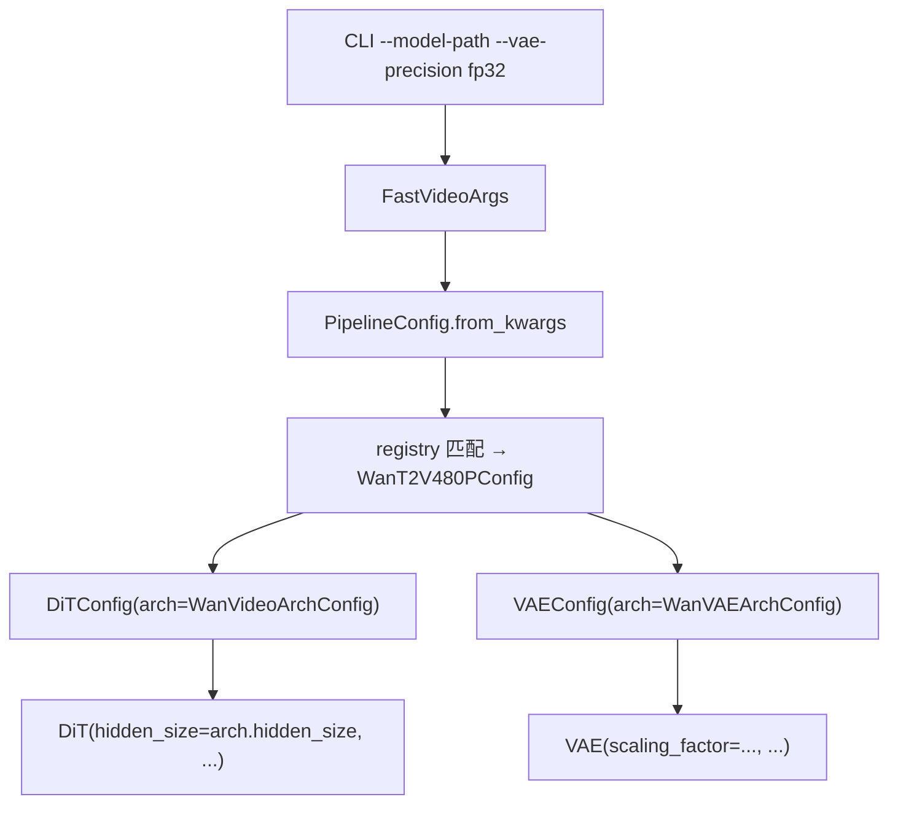

# configs + layers —— 配置层与基础层

> 模块作用：configs 定义配置体系（如何从 CLI 传到模型）；layers 提供 DiT/VAE 的基础构件（TP 线性层、norm、RoPE、LoRA、量化）。

## 1. 配置体系三层架构

```
CLI / kwargs
  → FastVideoArgs
    → PipelineConfig（configs/pipelines/base.py）
      ├── dit_config: DiTConfig（configs/models/dits/base.py）
      ├── vae_config: VAEConfig（configs/models/vaes/base.py）
      ├── text_encoder_configs: tuple[TextEncoderConfig, ...]
      └── image_encoder_config
```

## 2. configs 目录结构

```
configs/
├── pipelines/    # PipelineConfig + 各模型 config（WanT2V480PConfig 等）
├── models/       # DiTConfig/VAEConfig/EncoderConfig + arch config
└── backend/      # 后端配置
```

## 3. PipelineConfig（configs/pipelines/base.py L28）

关键字段：
```python
model_path: str
embedded_cfg_scale: float = 6.0
flow_shift: float | None = None
dit_config: DiTConfig
vae_config: VAEConfig
text_encoder_configs: tuple[EncoderConfig, ...]
text_encoder_precisions: tuple[str, ...]
preprocess_text_funcs / postprocess_text_funcs
```

`from_kwargs`（L219）流程：
```
1. get_pipeline_config_cls_from_name(model_path)  # registry 匹配
2. pipeline_config_cls() 实例化（如 WanT2V480PConfig，__post_init__ 覆盖默认）
3. load_from_json 可选 JSON 覆盖
4. update_config_from_dict(kwargs)  # CLI 前缀匹配 setattr
```

## 4. ModelConfig / ArchConfig（configs/models/base.py）

设计巧妙：`ModelConfig` 用 `__getattr__` 代理到 `arch_config`，使 `dit_config.hidden_size` == `dit_config.arch_config.hidden_size`。

- `DiTConfig`/`DiTArchConfig`（dits/base.py L44/L11）：`param_names_mapping`（HF→FastVideo regex）、`hidden_size`、`num_attention_heads`、`num_channels_latents`、`_supported_attention_backends`。
- `VAEConfig`/`VAEArchConfig`（vaes/base.py L22/L14）：`scaling_factor`、`temporal_compression_ratio=4`、`spatial_compression_ratio=8`、tiling 配置。
- `TextEncoderConfig`（encoders/base.py L77）：`vocab_size`、`hidden_size`、`text_len=512`。

## 5. 配置注册（registry.py）

```
源码位置：/home/hpc/ghr_code/FastVideo/fastvideo/registry.py
```
```python
register_configs(
    pipeline_config_cls=WanT2V480PConfig,
    workload_types=(WorkloadType.T2V,),
    hf_model_paths=["Wan-AI/Wan2.1-T2V-1.3B-Diffusers"],
    model_detectors=[lambda p: "wanpipeline" in p.lower()],
    default_preset="wan_t2v_1_3b",
)
```
匹配策略：exact match → partial name → detector 函数。

已注册 60+ 模型配置（Wan 13+、LTX2、Hunyuan、Cosmos、Flux2、SD35 等）。

## 6. layers 目录（基础层）

```
layers/
├── linear.py              # TP 线性层全家桶（1066 行）
├── layernorm.py           # RMSNorm / FP32LayerNorm / ScaleResidual（273 行）
├── rotary_embedding.py    # RoPE
├── rotary_embedding_3d.py # 3D RoPE（视频时空）
├── mlp.py                 # DiT MLP
├── activation.py          # get_act_fn
├── visual_embedding.py    # patch embedding
├── vocab_parallel_embedding.py  # TP 词嵌入
├── fp8linear.py fp4linear.py    # 量化线性层
├── lora/                  # LoRA 层
└── quantization/          # FP8/FP4/NVFP4 配置
```

### 关键类
- `linear.py`：`ReplicatedLinear`/`ColumnParallelLinear`/`RowParallelLinear`/`QKVParallelLinear`/`MergedColumnParallelLinear`（见 [`07_distributed.md`](07_distributed.md)）。
- `layernorm.py`：`RMSNorm`（支持 FSDP2 fully_shard）、`FP32LayerNorm`、`ScaleResidual`（AdaLN 残差）。
- `rotary_embedding_3d.py`：视频的 3D RoPE（时间+高+宽三轴）。

### 量化（quantization/）
`base_config.py` + `fp8_config.py` / `nvfp4_config.py` / `nvfp4_qat_train_config.py` 等。量化方法工厂模式：`quant_config.get_quant_method(layer)` 返回 `LinearMethodBase`，层无感知切换到量化实现。

## 7. 配置传递完整链路



## 8. 源码阅读重点
1. `configs/models/base.py` 的 `__getattr__` 代理设计。
2. `registry.py` 的 `register_configs` + 匹配策略。
3. `layers/linear.py` 的 TP 切分。

## 9. 相关笔记
- 配置系统深入：[`05_code_reading_notes/04_config_system.md`](../05_code_reading_notes/04_config_system.md)
