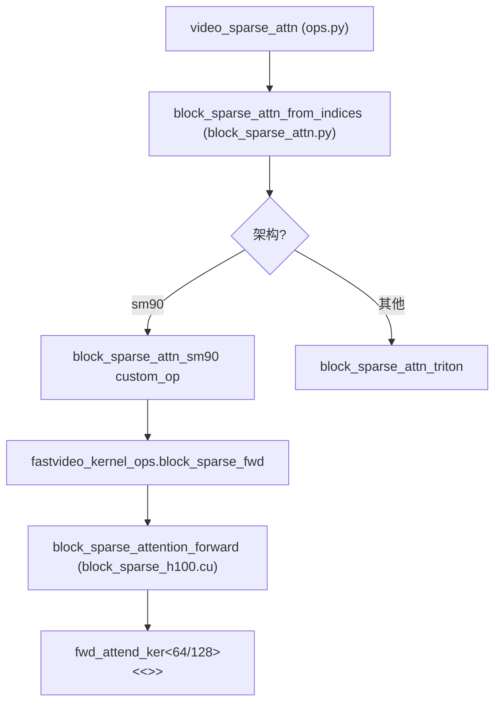
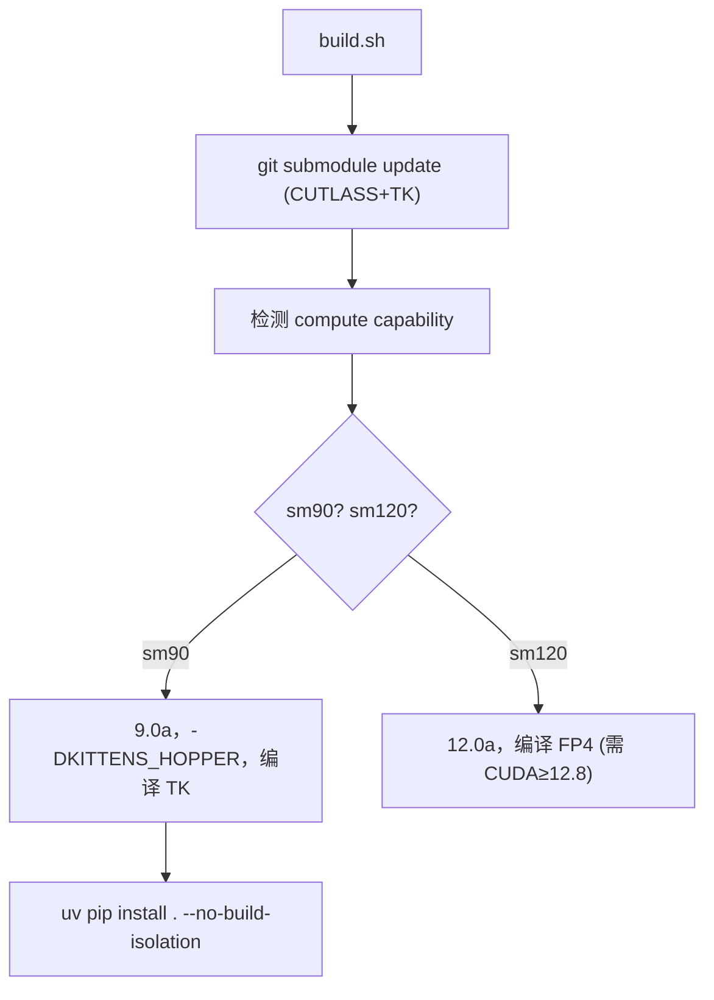

# fastvideo-kernel —— CUDA 扩展包

> 模块作用：独立的 CUDA extension 包，提供 attention 稀疏化和量化的高性能 kernel。

## 1. 目录结构

```
fastvideo-kernel/
├── CMakeLists.txt / pyproject.toml / build.sh   # 构建
├── include/{cutlass,tk}/                        # submodule
├── csrc/                                        # C++/CUDA 源
│   ├── common_extension.cpp                     #   pybind11 入口
│   ├── attention/{st_attn_h100,block_sparse_h100}.cu  # sm_90a
│   └── turbodiffusion/{gemm,norm,quant}/*.cu    # 通用
├── python/fastvideo_kernel/                     # Python 封装 + Triton fallback
├── attn_qat_infer/                              # Blackwell FP4（sm_120a）
├── benchmarks/ tests/
```

## 2. 三类 kernel

| 类别 | 文件 | 架构 | 用途 |
|------|------|------|------|
| Attention (TK) | `st_attn_h100.cu`, `block_sparse_h100.cu` | sm_90a | 滑窗/稀疏注意力 |
| TurboDiffusion | `quant.cu`, `gemm.cu`, `rmsnorm.cu`, `layernorm.cu` | 通用 | INT8 量化推理 |
| FP4 Attention | `attn_qat_infer/blackwell/*.cu` | sm_120a | FP4 量化注意力 |

## 3. kernel 详解

### Sliding Tile Attention（st_attn_h100.cu）
- 用途：视频 3D 滑动窗口（时空邻域）attention。
- 核心 kernel：`fwd_attend_ker<D, is_causal, ...>`（L78），ThunderKittens DSL（Hopper wgmma/TMA）。
- 4 warpgroup：1 producer（TMA 加载）+ 3 consumer（wgmma 计算）。
- host 函数 `sta_forward`（L383）：输入 q/k/v `[B,H,S,D]` BF16，输出 o 就地修改。

### Block Sparse Attention（block_sparse_h100.cu）
- 用途：对给定稀疏索引（哪些 KV block 对应哪些 Q block）做 exact attention。
- Forward `fwd_attend_ker<D>`（L66）：TMA 加载 Q → 遍历稀疏 KV block → wgmma QKᵀ → online softmax → wgmma PV。
- Backward（L426）：`tma::store_add_async` 原子累加（多 Q block 贡献同一 KV block）。

### TurboDiffusion（INT8 量化）
| kernel | 算法 | pybind 名 |
|--------|------|-----------|
| `quant.cu` | `quant=round(x·127/amax)`, per-block scale | `quant_cuda` |
| `gemm.cu` | `C = A_int8 × B_int8ᵀ` 后 dequant | `gemm_cuda` |
| `rmsnorm.cu` | `y = w·x/√(mean(x²)+eps)` | `rms_norm_cuda` |
| `layernorm.cu` | `y = w·(x-μ)/√(var+eps)+b` | `layer_norm_cuda` |

## 4. PyTorch Extension 注册（pybind11）

```
源码位置：csrc/common_extension.cpp
```
```cpp
PYBIND11_MODULE(TORCH_EXTENSION_NAME, m) {
    m.def("sta_fwd", torch::wrap_pybind_function(sta_forward), "...");
    m.def("block_sparse_fwd", torch::wrap_pybind_function(block_sparse_attention_forward), "...");
    register_quant(m);       // quant_cuda
    register_rms_norm(m);    // rms_norm_cuda
    register_gemm(m);        // gemm_cuda
}
```

Python 加载：
```python
from fastvideo_kernel._C import fastvideo_kernel_ops
sta_fwd = getattr(fastvideo_kernel_ops, "sta_fwd", None)  # None → 回退 Triton
```

## 5. Python 封装层

| 文件 | 关键函数 |
|------|---------|
| `ops.py` | `sliding_tile_attention()`, `video_sparse_attn()`, `video_sparse_attn_bshd()` |
| `turbodiffusion_ops.py` | `Int8Linear`, `FastRMSNorm`, `FastLayerNorm` + Triton fallback |
| `block_sparse_attn.py` | `block_sparse_attn_from_indices()`（SM90 TK + Triton 双后端） |
| `vmoba.py` | `moba_attn_varlen()`, `MixedAttention`（1035 行完整实现） |
| `vsa_utils.py` | `get_tile_partition_indices()`, `build_vsa_metadata()` |

## 6. Python → CUDA 调用链（block sparse）



## 7. 编译（build.sh + CMakeLists.txt）



- 编译选项：`-O3 -std=c++20 --use_fast_math`。
- FP4 单独编成 `fp4attn_cuda.so` / `fp4quant_cuda.so`（避免混合 arch 失败）。
- 自动检测：`FASTVIDEO_KERNEL_BUILD_TK=AUTO`（检查 arch 含 sm_90a）。
- 后端：scikit-build-core（`pyproject.toml`）。

## 8. Custom Op（torch.compile 兼容）

Python 侧用 `@torch.library.custom_op` 注册可追踪算子：
```python
@torch.library.custom_op("fastvideo_kernel::block_sparse_attn_triton", mutates_args=(), device_types="cuda")
def block_sparse_attn_triton(q, k, v, ...): ...
```

## 9. 源码阅读重点
1. `common_extension.cpp` 的注册（Python 如何找到 C++ 函数）。
2. `ops.py` 的 fallback 逻辑（`sta_fwd is None`）。
3. `turbodiffusion/norm/rmsnorm.cu`（最简单的 kernel，先读它）。
4. `block_sparse_h100.cu` 的 online softmax（进阶）。

## 10. 调试入口
```bash
cd fastvideo-kernel && python tests/test_turbodiffusion.py   # 测 INT8/norm
python benchmarks/bench_vsa.py                                # VSA 性能
```

## 11. 相关笔记
- kernel 架构：[`01_architecture/04_kernel_architecture.md`](../01_architecture/04_kernel_architecture.md)
- CUDA/extension 知识：[`04_knowledge_expansion/11_cuda_kernel_and_pytorch_extension.md`](../04_knowledge_expansion/11_cuda_kernel_and_pytorch_extension.md)
- 如何读 kernel：[`06_practical_guides/07_how_to_read_cuda_kernel.md`](../06_practical_guides/07_how_to_read_cuda_kernel.md)
