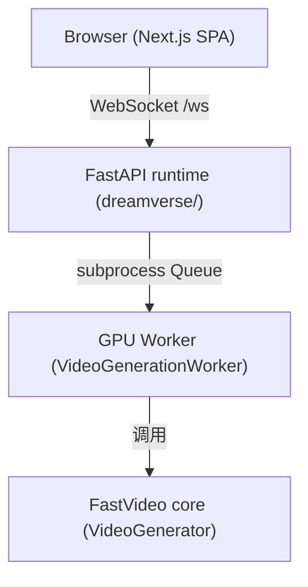
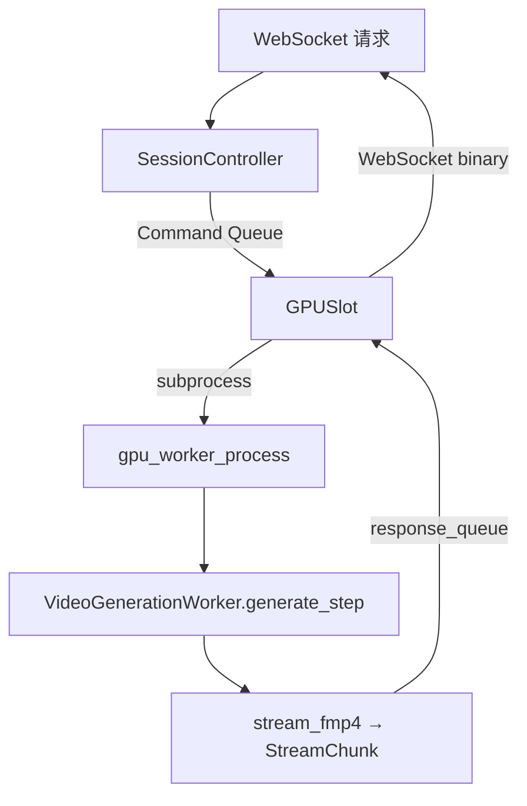

# apps/dreamverse —— 实时视频应用

> 模块作用：`apps/dreamverse` 是实时"边生成边导演"的流式视频应用，展示如何在生产中调用 FastVideo 核心接口。

## 1. 整体架构

来源：`apps/dreamverse/README.md`, `arch.md`, `design.md`



当前是两层（前端 + 后端）；规划中加 controller 层（凭证/资源供应/反向代理）。

## 2. 后端核心文件（dreamverse/dreamverse/）

| 文件 | 职责 |
|------|------|
| `main.py` | FastAPI app、`/ws` WebSocket 端点、REST 路由、`cli()` 启动 |
| `gpu_pool.py` | `GPUPool` 管理多 GPU 子进程（acquire/release FIFO 队列），`GPUSlot` 单 GPU 封装 |
| `video_generation.py` | `VideoGenerationWorker` 封装 `VideoGenerator`，跨 segment continuation |
| `av_streaming.py` | ffmpeg fMP4 流式编码（RGB frames + audio → 分片 chunk） |
| `config.py` | 模型注册表、生成参数、prompt provider、LoRA 注册表 |
| `prompt_enhancer.py` | LLM prompt 增强/重写（Cerebras/Groq） |
| `prompt_safety.py` | fastText NSFW/hate 分类过滤 |
| `session/controller.py` | WebSocket 会话主循环（状态机、prompt 队列，~1900 行） |
| `worker_ipc.py` | 类型化 IPC 事件（Command / WorkerEvent） |

## 3. 如何调用 FastVideo 核心接口

关键在 `video_generation.py` 的 `VideoGenerationWorker`：

```python
from fastvideo.api.schema import GeneratorConfig, CompileConfig, OffloadConfig, QuantizationConfig
from fastvideo.entrypoints.video_generator import VideoGenerator

def initialize(self):
    self.generator = VideoGenerator.from_pretrained(config=generator_config)

def generate_step(self, prompt, segment_idx, ...):
    self.continuation.apply_video(request_kwargs, segment_idx)   # 注入上段 conditioning
    result = self.generator.generate_video(**request_kwargs)      # 核心推理
    self.continuation.save_video(frames)                          # 保存尾帧供下段
    return StepResult(frames, audio, ...)
```

**关键设计——ContinuationState**：跨 segment 保持 video+audio conditioning，实现"连续流式生成"（不是每段独立生成）。

## 4. GPU Pool 调度



命令协议（`multiprocessing.Queue`）：`INIT/WARMUP/USER_JOIN/USER_STEP/USER_LEAVE/RELOAD_MODEL/APPLY_LORA`。

**warmup**：启动跑 3 个合成 segment，触发 `torch.compile` 缓存，避免首次请求卡顿。

## 5. 前端（web/）

Next.js + React + TypeScript。stores（session/promptWindow/rewrite/stream/ui）驱动，reducer 归一化 WebSocket 事件。视频用 fMP4 MSE 播放管道。

## 6. 其他 apps

- `apps/fastvideo_studio/`：SvelteKit + FastAPI，推理/微调/蒸馏/数据集管理的 Web UI。核心：`server.py`（jobs API）、`job_runner.py`（执行进程）。
- `apps/performance_dashboard/`：FastAPI + React，读 HF `FastVideo/performance-tracking` dataset，可视化延迟/吞吐 + regression 检测。

## 7. 源码阅读重点
1. `video_generation.py` 的 `VideoGenerationWorker`——学习生产环境如何封装 `VideoGenerator`。
2. `ContinuationState`——流式连续生成的状态管理。
3. `gpu_pool.py`——多用户 GPU 调度。

## 8. 学习价值
dreamverse 是理解"如何把 FastVideo 用到实时产品"的最佳范例：多 GPU 池化、流式编码、prompt engineering、模型热切换、LoRA 动态应用。
