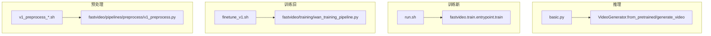

# examples 与 scripts

> 模块作用：examples 是可运行的示例，scripts 是预处理/微调/蒸馏/转换工具脚本。它们是理解"如何用 FastVideo"的最快入口。

## 1. examples/ 结构

```
examples/
├── inference/
│   ├── basic/          # 50+ 各模型基础推理脚本
│   ├── eval/           # 评估脚本
│   ├── gradio/         # Gradio 前端
│   ├── lora/           # LoRA 推理
│   └── optimizations/  # FP8/FP4/compile 优化示例
├── train/
│   ├── configs/        # 新框架 YAML（fine_tuning/distribution_matching/knowledge_distillation/rl）
│   ├── scenario/       # 多步骤训练场景
│   └── run.sh / run_slurm.sh
├── training/           # 旧框架微调脚本
├── distill/ dataset/ serving/
```

## 2. 典型推理示例

### basic.py（Wan2.1 T2V）
```
源码位置：examples/inference/basic/basic.py
```
```python
from fastvideo import VideoGenerator
generator = VideoGenerator.from_pretrained(
    "Wan-AI/Wan2.1-T2V-1.3B-Diffusers", num_gpus=1,
    dit_cpu_offload=False, text_encoder_cpu_offload=True)
video = generator.generate_video(prompt, output_path=OUTPUT_PATH, save_video=True)
video2 = generator.generate_video(prompt2, output_path=OUTPUT_PATH)  # 复用 generator
```
特点：同一 generator 生成多个视频，不重新加载模型。

### basic_ltx2.py（LTX2）
```python
generator = VideoGenerator.from_pretrained("Davids048/LTX2-Base-Diffusers", num_gpus=1)
generator.generate_video(prompt=PROMPT, num_frames=121, height=1088, width=1920)
generator.shutdown()
```

所有推理示例的统一模式：`from_pretrained` → `generate_video` → `shutdown`。调用链见 [`03_core_flows/00_video_generation_flow.md`](../03_core_flows/00_video_generation_flow.md)。

## 3. 典型训练示例

### 新框架（YAML 驱动）
```bash
bash examples/train/run.sh examples/train/configs/fine_tuning/wan/t2v.yaml
```
`run.sh` → `torchrun -m fastvideo.train.entrypoint.train --config x.yaml`。

YAML 结构：
```yaml
models:
  student:
    _target_: fastvideo.train.models.wan.WanModel
    init_from: Wan-AI/Wan2.1-T2V-1.3B-Diffusers
method:
  _target_: fastvideo.train.methods.fine_tuning.finetune.FineTuneMethod
training:
  distributed: {num_gpus: 8, sp_size: 1, hsdp_replicate_dim: 8, hsdp_shard_dim: 1}
  data: {data_path, train_batch_size, num_frames}
  optimizer: {learning_rate, betas, weight_decay}
callbacks:
  grad_clip / validation
```

## 4. scripts/ 结构

```
scripts/
├── inference/            # 配置驱动推理（YAML + run.sh）
├── finetune/             # finetune_v1.sh（旧框架微调）
├── distill/              # v1_distill_dmd_wan.sh
├── preprocess/           # 数据预处理
├── dataset_preparation/  # resize_videos/prepare_json_file
├── checkpoint_conversion/# 18+ 权重转换脚本
├── lora_extraction/      # extract/merge/verify LoRA
└── huggingface/          # upload/download HF
```

## 5. 典型 scripts 详解

### 配置驱动推理（scripts/inference/）
```bash
fastvideo generate --config scripts/inference/inference_wan.yaml
# 或
bash scripts/inference/run.sh scripts/inference/inference_wan.yaml --request.sampling.seed 42
```
YAML：`{generator: {model_path, engine, pipeline}, request: {inputs, sampling, output}}`。

### 旧框架微调（scripts/finetune/finetune_v1.sh）
```bash
torchrun --nproc_per_node $NUM_GPUS fastvideo/training/wan_training_pipeline.py \
    --model_path Wan-AI/Wan2.1-T2V-1.3B-Diffusers --train_batch_size=4 --sp_size 4 \
    --max_train_steps=5000 --learning_rate=1e-6 --enable_gradient_checkpointing_type "full"
```

### DMD 蒸馏（scripts/distill/v1_distill_dmd_wan.sh）
```bash
torchrun ... fastvideo/training/wan_distillation_pipeline.py \
    --real_score_model_path ... --fake_score_model_path ... \
    --dmd_denoising_steps '1000,757,522' --generator_update_interval 5
```

### 数据预处理（scripts/preprocess/）
```bash
torchrun ... fastvideo/pipelines/preprocess/v1_preprocess.py \
    --model_path $MODEL --data_merge_path $DATA --preprocess_task "t2v" --num_frames 81 --train_fps 16
```

### 权重转换（scripts/checkpoint_conversion/）
`wan_to_diffusers.py` 等 18+ 脚本，用 `_param_names_mapping` regex 把官方权重名映射到 FastVideo/diffusers 命名。

### LoRA 提取（scripts/lora_extraction/extract_lora.py）
```bash
python scripts/lora_extraction/extract_lora.py \
    --base Wan-AI/Wan2.1-T2V-1.3B-Diffusers \
    --ft FastVideo/FastWan2.1-T2V-1.3B-Diffusers --out adapter.safetensors --rank 32
```
算法：`delta = FT - base`，逐层 SVD 取 top-r 作为 LoRA A/B。

## 6. 示例 → 源码调用链总览



## 7. 学习建议
1. 先跑 `examples/inference/basic/basic.py` 理解推理。
2. 再看 `examples/train/configs/fine_tuning/wan/t2v.yaml` 理解新训练配置。
3. 想复现已发布模型，看 `scripts/finetune/` 和 `scripts/distill/`（旧框架）。
