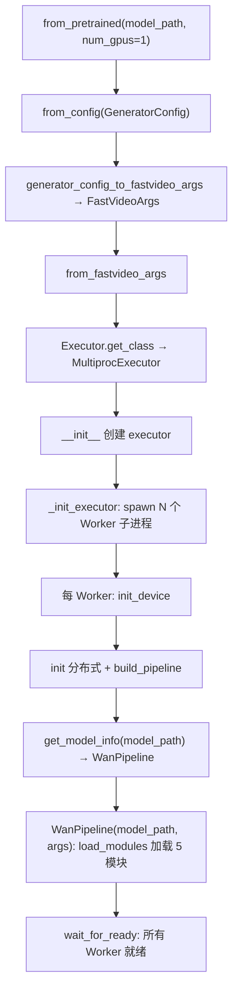
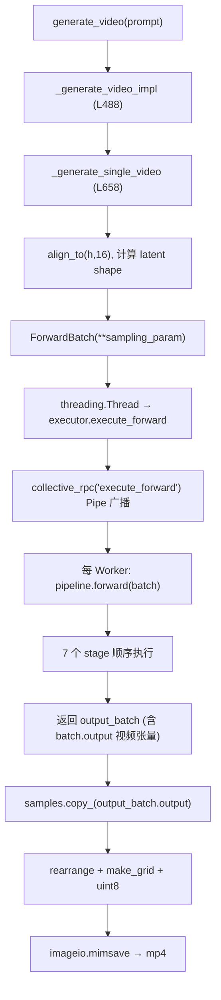

# 视频生成完整流程

> 这是全项目最重要的调用链。从用户 3 行代码，到 mp4 落盘，逐层展开。

## 用户代码

```python
from fastvideo import VideoGenerator
generator = VideoGenerator.from_pretrained("Wan-AI/Wan2.1-T2V-1.3B-Diffusers", num_gpus=1)
video = generator.generate_video(prompt="A cat playing piano", output_path="outputs/")
```

## 阶段 1：加载（from_pretrained）



关键文件：
- `entrypoints/video_generator.py`：`from_pretrained`(L144) → `from_config`(L204) → `from_fastvideo_args`(L230)。
- `worker/multiproc_executor.py`：`_init_executor`(L78) spawn worker。
- `worker/gpu_worker.py`：`init_device`(L35) → `build_pipeline`。
- `pipelines/__init__.py`：`build_pipeline`(L27) → registry 查找 → `WanPipeline(...)`。

**此时**：模型已加载到每个 GPU 子进程，主进程的 `generator` 只是门面。

## 阶段 2：生成（generate_video）



## 阶段 3：pipeline.forward 内部（7 stage）


张量在各 stage 的形状变化（Wan T2V, num_frames=81, 480×832）：
```
prompt (str)
  → TextEncoding → prompt_embeds [1, 512, 4096]
  → LatentPrep   → latents [1, 16, 21, 60, 104]  (噪声)
  → TimestepPrep → timesteps [50]
  → Denoising    → latents [1, 16, 21, 60, 104]  (去噪后)
  → Decoding     → output [1, 3, 81, 480, 832]   (像素 [0,1])
```

## 完整调用链（文本版）

```
VideoGenerator.from_pretrained
 └─ from_config → from_fastvideo_args
     └─ MultiprocExecutor._init_executor
         └─ Worker.init_device → build_pipeline → WanPipeline(load_modules)

generator.generate_video
 └─ _generate_single_video
     ├─ ForwardBatch(sampling_param)
     ├─ executor.execute_forward → collective_rpc
     │   └─ Worker.execute_forward → pipeline.forward
     │       └─ for stage in stages: batch = stage(batch)
     │           InputValidation → TextEncoding → Conditioning
     │           → TimestepPrep → LatentPrep → Denoising → Decoding
     └─ rearrange → make_grid → imageio.mimsave → mp4
```

## 各子流程深入

- 加载细节：[`01_from_pretrained_flow.md`](01_from_pretrained_flow.md)
- 生成细节：[`02_generate_video_flow.md`](02_generate_video_flow.md)
- 模型加载：[`03_model_loading_flow.md`](03_model_loading_flow.md)
- prompt→张量：[`04_prompt_to_video_tensor_flow.md`](04_prompt_to_video_tensor_flow.md)
- 采样：[`05_scheduler_and_sampling_flow.md`](05_scheduler_and_sampling_flow.md)
- VAE decode：[`06_vae_decode_flow.md`](06_vae_decode_flow.md)
- attention 后端：[`07_attention_backend_flow.md`](07_attention_backend_flow.md)
