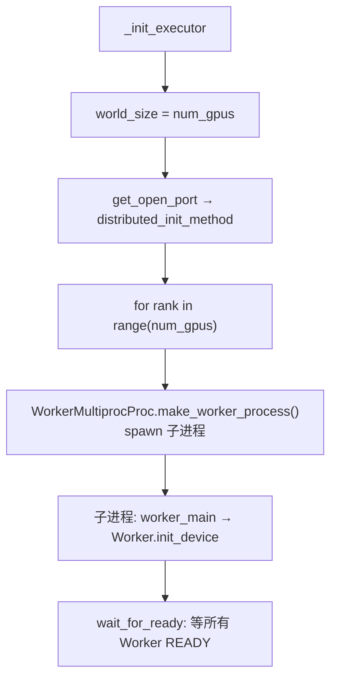
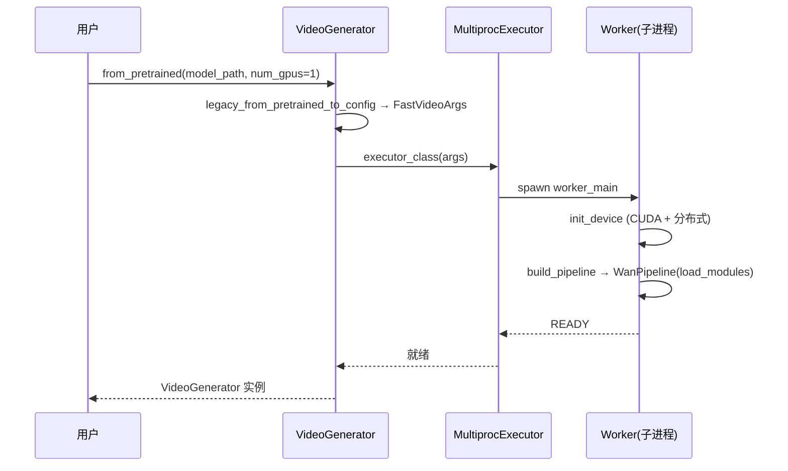

# from_pretrained 流程

> 深入：`VideoGenerator.from_pretrained` 如何从一个字符串 model_path 变成 N 个加载好模型的 GPU worker。

## 1. 入口（video_generator.py L144）

```python
@classmethod
def from_pretrained(cls, model_path, **kwargs) -> "VideoGenerator":
    # 三条路线判断
    if typed_config is not None:
        return cls.from_config(typed_config)
    if isinstance(model_path, GeneratorConfig | Mapping):
        return cls.from_config(model_path)
    # legacy 风格
    return cls.from_config(legacy_from_pretrained_to_config(model_path, kwargs))
```

**输入**：model_path（HF repo 名/本地路径）+ 便捷 kwargs（`num_gpus`, `tp_size`, `sp_size`, `dit_cpu_offload`, `enable_torch_compile` 等）。
**输出**：`VideoGenerator` 实例。

## 2. 配置规范化链

```
legacy_from_pretrained_to_config(model_path, kwargs)   # api/compat.py:80
  → GeneratorConfig
from_config(config)                                     # L204
  → normalize_generator_config(config)                  # api/compat.py:53
  → generator_config_to_fastvideo_args(config)          # → FastVideoArgs
  → from_fastvideo_args(args)                            # L230
```

**为什么多层转换**：FastVideo 有历史包袱——旧的 kwargs 风格和新的 `GeneratorConfig` typed 风格并存。`api/compat.py` 负责兼容转换，最终统一成 `FastVideoArgs`。

## 3. 创建 Executor + spawn Worker

```python
# from_fastvideo_args (L230)
executor_class = Executor.get_class(fastvideo_args)   # worker/executor.py:33
return cls(fastvideo_args, executor_class)            # __init__ (L123)

# __init__ 中
self.executor = executor_class(fastvideo_args)         # 触发 _init_executor
```

`Executor.get_class`：根据 `distributed_executor_backend`（"mp"/"ray"）返回 `MultiprocExecutor` 或 `RayDistributedExecutor`。

## 4. MultiprocExecutor._init_executor（L78）



每个子进程：
```python
# Worker.init_device (gpu_worker.py:35)
torch.cuda.set_device(cuda:local_rank)
maybe_init_distributed_environment_and_model_parallel(tp_size, sp_size, init_method)
self.pipeline = build_pipeline(fastvideo_args)
```

## 5. build_pipeline（pipelines/__init__.py L27）

```python
def build_pipeline(fastvideo_args, pipeline_type=Basic):
    model_path = maybe_download_model(fastvideo_args.model_path)   # HF 下载
    model_info = get_model_info(model_path, pipeline_type, workload_type)  # registry 查找
    pipeline_cls = model_info.pipeline_cls   # e.g. WanPipeline
    return pipeline_cls(model_path, fastvideo_args)
```

`get_model_info` 通过 registry（`fastvideo/registry.py`）匹配 model_path → `ConfigInfo(pipeline_cls, sampling_param_cls, pipeline_config_cls)`。

## 6. Pipeline 构造 → 加载模块

```python
# WanPipeline.__init__ → ComposedPipelineBase.__init__ (L52)
maybe_init_distributed_environment_and_model_parallel(...)
self.modules = self.load_modules(fastvideo_args, loaded_modules)   # L87
```

`load_modules`（L357）读 `model_index.json`，对 `_required_config_modules`（text_encoder/tokenizer/vae/transformer/scheduler）逐个 `PipelineComponentLoader.load_module`。详见 [`03_model_loading_flow.md`](03_model_loading_flow.md)。

## 7. 完整时序



## 8. 阅读重点
- `api/compat.py` 的配置转换（不必细读，知道有这层即可）。
- `multiproc_executor.py:_init_executor` 的 spawn 逻辑。
- `pipelines/__init__.py:build_pipeline` 的 registry 查找。

## 9. 调试
在 `build_pipeline` 打印 `pipeline_cls.__name__` 确认选对了 pipeline。在 `Worker.init_device` 打印 rank/device 确认分布式设置。
