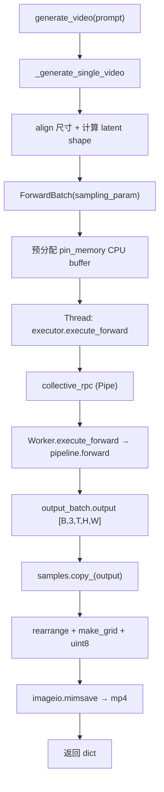

# generate_video 流程

> 深入：`generate_video` 如何把 prompt + 参数变成视频文件。

## 1. 入口链

```
generate_video(prompt, sampling_param, ...)   # L359 (legacy API)
  → _generate_video_impl(...)                  # L488
    → _generate_single_video(...)              # L658（单视频核心）
```

新 API `generate(request)`（L258）也最终汇到 `_generate_video_impl`。

## 2. _generate_single_video 关键步骤（L658-919）

### Step 1：校验 + 尺寸对齐
```python
height = align_to(height, 16)   # 对齐到 16 的倍数
width = align_to(width, 16)
```

### Step 2：计算 latent 形状
```python
latents_size = [(num_frames - 1) // 4 + 1, height // 8, width // 8]
# num_frames=81 → 21; height=480 → 60; width=832 → 104
# 4 = VAE 时间压缩比, 8 = VAE 空间压缩比
```

### Step 3：构建 ForwardBatch
```python
batch = ForwardBatch(
    **shallow_asdict(sampling_param),   # prompt/num_frames/steps/guidance...
    eta=0.0, n_tokens=n_tokens, VSA_sparsity=fastvideo_args.VSA_sparsity)
```

### Step 4：独立线程执行 forward（L731-783）
```python
samples = torch.empty((B, 3, num_frames, height, width),
                      device='cpu', pin_memory=fastvideo_args.pin_cpu_memory)
def execute_forward_thread():
    output_batch = self.executor.execute_forward(batch, fastvideo_args)
thread = threading.Thread(target=execute_forward_thread)
thread.start(); thread.join()
samples.copy_(output_batch.output)
```

**为什么独立线程 + 预分配 pin_memory**：让 GPU forward 与 CPU 缓冲分配/GPU→CPU 拷贝重叠，减少端到端延迟。

### Step 5：后处理（L802-917）
```python
if output_type == "latent":
    return latents          # 跳过 VAE decode
# 像素视频
videos = rearrange(samples, "b c t h w -> t b c h w")
for x in videos:
    x = torchvision.utils.make_grid(x, nrow=...)
    frames.append((x * 255).to(torch.uint8).cpu().numpy())
imageio.mimsave(output_path, frames, fps=batch.fps)   # L883
```

### Step 6：返回
```python
return {"prompts": ..., "samples": samples, "frames": frames,
        "video_path": ..., "generation_time": ..., "peak_memory_mb": ...}
```

## 3. executor.execute_forward（跨进程）

```python
# worker/executor.py:44
def execute_forward(self, forward_batch, fastvideo_args):
    outputs = self.collective_rpc("execute_forward",
        kwargs={"forward_batch": forward_batch, "fastvideo_args": fastvideo_args})
    return outputs[0]["output_batch"]
```

`collective_rpc`（multiproc_executor.py L273）通过 `multiprocessing.Pipe` 向所有 worker 广播，取 rank-0 结果。

Worker 侧：
```python
# gpu_worker.py:74
def execute_forward(self, forward_batch, fastvideo_args):
    return self.pipeline.forward(forward_batch, self.fastvideo_args)
```

## 4. 完整流程图



## 5. 阅读重点
- Step 2 的 latent 形状推导（理解 VAE 压缩比）。
- Step 4 的独立线程设计。
- Step 5 的张量→帧转换。

## 6. 调试
```python
result = generator.generate_video(prompt="test", num_frames=17, height=256, width=256)
print(result["samples"].shape)  # [1, 3, 17, 256, 256]
print(result["video_path"], result["generation_time"])
```
在 `_generate_single_video` 的后处理段打断点观察 `samples` / `frames`。
