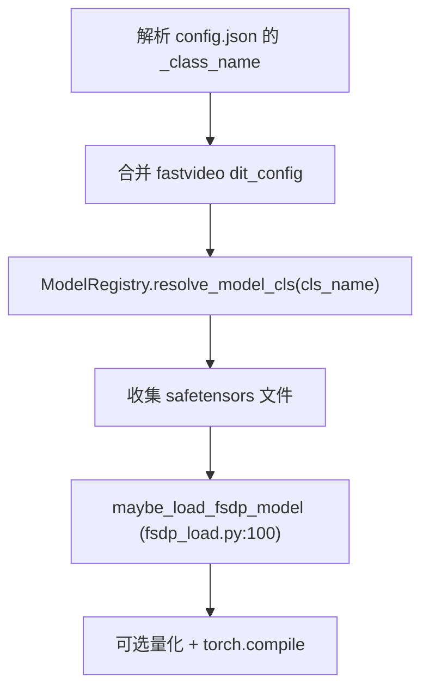

# 模型加载流程

> 深入：pipeline 如何加载 transformer / vae / text_encoder / scheduler，权重如何分片到 GPU。

## 1. 入口：load_modules

```
源码位置：pipelines/composed_pipeline_base.py L357
```
```python
def load_modules(self, fastvideo_args, loaded_modules):
    # 读 model_index.json，对每个 _required_config_modules
    for load_module_name in required:
        component_model_path = os.path.join(self.model_path, load_module_name)
        module = PipelineComponentLoader.load_module(
            module_name=load_module_name,
            component_model_path=component_model_path,
            transformers_or_diffusers=...,
            fastvideo_args=fastvideo_args)
        self.modules[load_module_name] = module
```

`model_index.json`（diffusers 格式）声明每个组件用哪个库（transformers/diffusers）加载。

## 2. Loader 分发（component_loader.py L63）

```python
ComponentLoader.for_module_type(module_type):
    "transformer"  → TransformerLoader   (diffusers)
    "vae"          → VAELoader           (diffusers)
    "text_encoder" → TextEncoderLoader   (transformers)
    "tokenizer"    → TokenizerLoader
    "scheduler"    → SchedulerLoader
```

## 3. TransformerLoader.load（L919）—— DiT 加载



`maybe_load_fsdp_model`（fsdp_load.py L100）：
```python
with torch.device("meta"):              # meta 设备建模型（不分配真实参数）
    model = model_cls(**init_params)
device_mesh = init_device_mesh("cuda", (hsdp_replicate_dim, hsdp_shard_dim), ...)
shard_model(model, mp_policy=..., mesh=device_mesh, ...)   # FSDP2 fully_shard
weight_iterator = safetensors_weights_iterator(weight_dir_list, to_cpu=True)
load_model_from_full_model_state_dict(model, weight_iterator, ...)  # distribute_tensor 分发
```

**为什么 meta 设备**：不预分配真实内存，先建结构，再由 FSDP 按分片计划分配。避免加载 14B 模型时先在单卡塞满。

## 4. ModelRegistry.resolve_model_cls（registry.py L448）

```python
# 延迟导入，避免过早 CUDA init
for arch in architectures:
    model_cls = _LazyRegisteredModel.load_model_cls()  # importlib.import_module
    return model_cls, arch
```

## 5. VAELoader.load（L670）

处理各模型特殊 config：
- GEN3C：加载 tokenizer-backed VAE（.jit/.pth）。
- Cosmos2.5：加载 Wan VAE 的 tokenizer.safetensors。
- LTX-2：CausalVideoAutoencoder 嵌套 "vae" config + per_channel_statistics remap。
- 通用：`resolve_model_cls → vae_cls(config) → load_state_dict`。

## 6. SchedulerLoader.load（L1076）

```python
config = get_diffusers_config(model_path)
scheduler_cls = resolve_model_cls(config.pop("_class_name"))
scheduler = scheduler_cls(**config)
if flow_shift is not None:
    scheduler.set_shift(flow_shift)
```

## 7. 权重迭代（weight_utils.py）

- `safetensors_weights_iterator`（L163）：遍历 safetensors，可 `dist.broadcast` 到各 node rank。
- `filter_files_not_needed_for_inference`（L127）：排除 optimizer/scheduler 权重。
- `default_weight_loader`（L259）：`param.data.copy_(loaded_weight)`。

## 8. 完整调用链

```
ComposedPipelineBase.load_modules
 └─ PipelineComponentLoader.load_module
     └─ ComponentLoader.for_module_type
         ├─ TransformerLoader.load
         │   └─ resolve_model_cls → maybe_load_fsdp_model
         │       └─ shard_model (FSDP2) + load_model_from_full_model_state_dict
         ├─ VAELoader.load → vae_cls(config).load_state_dict
         ├─ TextEncoderLoader.load → model.load_weights
         └─ SchedulerLoader.load → scheduler_cls(**config)
```

## 9. 阅读重点
- `fsdp_load.py:maybe_load_fsdp_model` 的 meta 设备 + FSDP 分片。
- `registry.py` 的 lazy import。

## 10. 调试
在 `TransformerLoader.load` 打印 `cls_name`、weight 文件列表。在 `maybe_load_fsdp_model` 打印 `use_fsdp`、device_mesh 形状。
