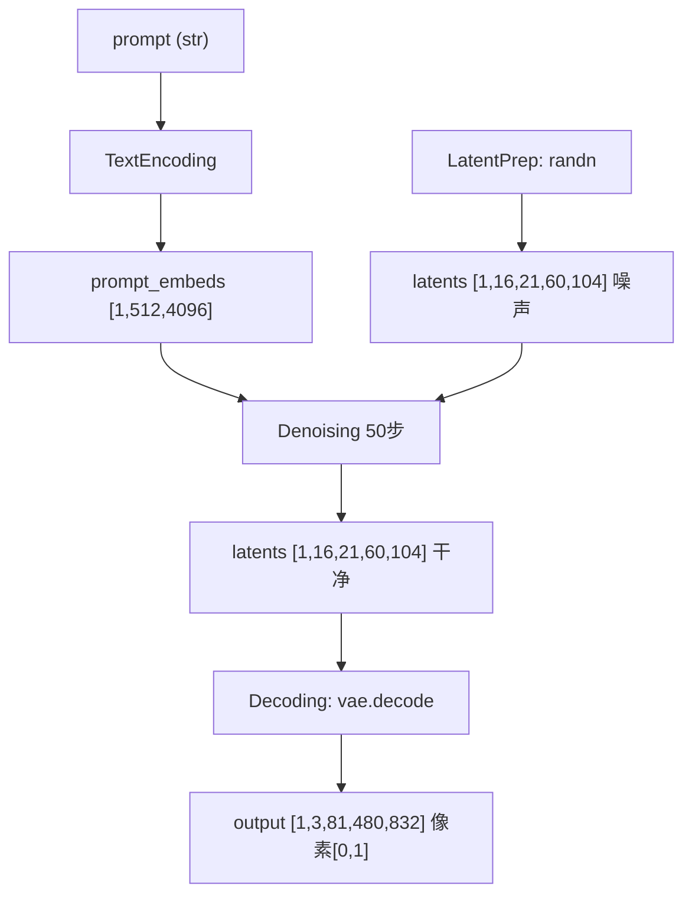

# prompt → 视频张量流程

> 深入：文本 prompt 一步步变成视频像素张量，每步的张量形状。以 Wan T2V（81 帧, 480×832）为例。

## 1. 全链路概览



## 2. Step 1：TextEncoding

```
源码位置：pipelines/stages/text_encoding.py，encode_text (L117)
```
```python
processed_text = preprocess_func(prompt)          # prompt template
text_inputs = tokenizer(processed_text)            # → input_ids [1, 512]
outputs = text_encoder(input_ids, attention_mask)  # T5 forward
prompt_embeds = postprocess_func(outputs)          # → [1, 512, 4096]
```
- 输入：`prompt` (str)。
- 输出：`prompt_embeds` `[B, seq_len, hidden_dim]` = `[1, 512, 4096]`（Wan 用 UMT5，4096 维）。
- 同时编码 negative_prompt 供 CFG。

## 3. Step 2：LatentPreparation

```
源码位置：pipelines/stages/latent_preparation.py，forward (L104)
```
```python
shape = (batch_size, transformer.num_channels_latents, num_frames_latent,
         height // 8, width // 8)   # (1, 16, 21, 60, 104)
latents = randn_tensor(shape, generator=generator, device=device, dtype=dtype)
latents = latents * scheduler.init_noise_sigma
batch.latents = latents
```
- 输出：纯高斯噪声 `[1, 16, 21, 60, 104]`。
- 时间轴 `(81-1)/4+1=21`，空间轴 `480/8=60, 832/8=104`，通道 16。

## 4. Step 3：TimestepPreparation

```
源码位置：pipelines/stages/timestep_preparation.py，forward (L49)
```
```python
scheduler.set_timesteps(num_inference_steps)   # 50
batch.timesteps = scheduler.timesteps           # [50]，值 1000 → 0
```

## 5. Step 4：Denoising（核心，50 步循环）

```
源码位置：pipelines/stages/denoising.py，forward (L72)
```
```python
for i, t in enumerate(timesteps):                          # 50 步
    latent_model_input = scheduler.scale_model_input(latents, t)
    # DiT forward（条件）
    noise_pred = transformer(latent_model_input,           # [1,16,21,60,104]
                             prompt_embeds,                 # [1,512,4096]
                             t_expand, ...)                 # → [1,16,21,60,104]
    # CFG
    if do_cfg:
        noise_pred_uncond = transformer(..., negative_embeds, ...)
        noise_pred = uncond + guidance_scale * (noise_pred - uncond)
    # scheduler 更新
    latents = scheduler.step(noise_pred, t, latents)[0]
```

DiT 内部（`WanTransformer3DModel.forward`）：
```
latents [1,16,21,60,104]
  → patch_embedding → flatten → [1, L_img, inner_dim]   L_img=21×30×52=32760
  → SP shard（序列切分）
  → condition_embedder(t, text) → temb, timestep_proj
  → 40 blocks: Self-Attn → Cross-Attn(text) → FFN
  → norm_out + proj_out + unpatchify → [1,16,21,60,104]
```

## 6. Step 5：Decoding（VAE decode）

```
源码位置：pipelines/stages/decoding.py，decode (L122)
```
```python
latents = _denormalize_latents(latents)     # 逆 scaling/shift
image = vae.decode(latents)                  # [1,16,21,60,104] → [1,3,81,480,832]
image = (image / 2 + 0.5).clamp(0, 1)        # → [0,1]
batch.output = image
```

## 7. 张量形状对照表

| 阶段 | 张量 | 形状 |
|------|------|------|
| prompt | str | - |
| 文本编码 | prompt_embeds | `[1, 512, 4096]` |
| latent 初始化 | latents | `[1, 16, 21, 60, 104]` |
| DiT patchify | hidden_states | `[1, 32760, inner_dim]` |
| 去噪输出 | latents | `[1, 16, 21, 60, 104]` |
| VAE decode | output | `[1, 3, 81, 480, 832]` |
| rearrange | frames | `[81, 1, 3, 480, 832]` → uint8 numpy |

## 8. 关键理解
- **latent 空间做扩散**：DiT 全程在 `[1,16,21,60,104]` 的压缩空间操作，只在最后一步 VAE decode 才回到像素空间。这是 latent diffusion 的核心，省显存省算力。
- **CFG 翻倍**：guidance_scale>1 时每步跑 2 次 DiT，是主要耗时。
- **序列长度**：patchify 后 token 数 32760，attention 是 O(L²)，所以需要 SP + 稀疏 attention。

## 9. 相关笔记
- DiT 内部：[`04_knowledge_expansion/01_dit_transformer_for_video.md`](../04_knowledge_expansion/01_dit_transformer_for_video.md)
- 采样：[`05_scheduler_and_sampling_flow.md`](05_scheduler_and_sampling_flow.md)
- VAE：[`06_vae_decode_flow.md`](06_vae_decode_flow.md)
