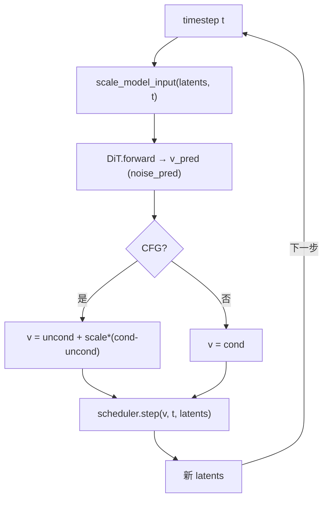

# Scheduler 与采样流程

> 深入：flow matching 的加噪、时间步生成、去噪一步。这是扩散模型的数学核心。

## 1. FastVideo 用的是 Flow Matching

主力 scheduler：`FlowMatchEulerDiscreteScheduler`（`models/schedulers/scheduling_flow_match_euler_discrete.py`）。Wan 默认用 `FlowUniPCMultistepScheduler`。

Flow Matching（Rectified Flow）核心思想：学习一个从噪声到数据的"直线"速度场。
- 加噪：`x_t = (1 - σ)·x_0 + σ·ε`（σ 从 0 到 1）。
- 目标速度：`v = ε - x_0`。
- 去噪：沿速度场积分 `x_{t-1} = x_t + dt·v`。

## 2. scale_noise（加噪，训练用，L198）

```python
def scale_noise(self, sample, timestep, noise=None):
    sigma = sigmas[step_indices]
    return sigma * noise + (1.0 - sigma) * sample
```
把干净 latent `x_0` 加噪到 `x_t`。训练时用（`train/models/wan/wan.py:add_noise`）。

## 3. set_timesteps（时间步生成，L285）

```python
def set_timesteps(self, num_inference_steps):
    # 1. 生成均匀 sigma: t_max → t_min
    # 2. 可选动态 shifting（基于分辨率 mu）
    # 3. 可选 Karras/exponential/beta schedule
    # 4. 追加 terminal sigma
    self.timesteps = sigmas * num_train_timesteps
```
- `num_inference_steps=50` → `timesteps` 形状 `[50]`，值从 1000 递减到 0。
- **flow_shift**：调整 sigma 分布，高分辨率视频常用较大 shift（如 Wan 用 8.0），让采样更关注高噪声区。

## 4. step（去噪一步，L450）

```python
def step(self, model_output, timestep, sample):
    # model_output = 预测速度 v
    # 确定性 Euler
    prev_sample = sample + dt * model_output
    # 或随机采样 (stochastic_sampling)
    # x0 = sample - sigma * v; prev = (1-next_sigma)*x0 + next_sigma*noise
    return FlowMatchEulerDiscreteSchedulerOutput(prev_sample=prev_sample)
```

## 5. 去噪循环中的调用（denoising.py L72）



调用位置：`denoising.py:567`
```python
latents = self.scheduler.step(noise_pred, t, latents, return_dict=False)[0]
```

## 6. 各 scheduler 对比

| Scheduler | 阶数 | 特点 |
|-----------|------|------|
| `FlowMatchEulerDiscreteScheduler` | 1（Euler） | 简单，需较多步数 |
| `FlowUniPCMultistepScheduler` | 高阶多步 | Wan 默认，少步数高质量 |
| `SelfForcingFlowMatchScheduler` | - | 因果流式 |

## 7. 步数 vs 质量/速度

- 步数越多质量越好但越慢。标准扩散 50 步。
- 蒸馏后（DMD）可 1-4 步（`DmdDenoisingStage` 用 3 步）。这是 FastVideo 加速的核心手段之一。

## 8. CFG（Classifier-Free Guidance）

```python
noise_pred = uncond + guidance_scale * (cond - uncond)
```
- `guidance_scale=1`：无 CFG，只跑条件分支（省一半算力）。
- `guidance_scale>1`：跑条件+无条件两次 DiT，增强 prompt 遵循度但翻倍耗时。
- `ForwardBatch.__post_init__` 根据 `guidance_scale>1` 自动设 `do_classifier_free_guidance`。

## 9. Cosmos 的特殊性

`CosmosDenoisingStage` 用 EDM preconditioning（不同的噪声参数化），scheduler 也不同。DMD 用 `FlowMatchEulerDiscreteScheduler(shift=8.0)` 只走 3 步。

## 10. 阅读重点
- `scale_noise` / `step` 的 flow matching 公式。
- `denoising.py` 里 CFG + scheduler.step 的配合。

## 11. 相关知识
- 采样求解器深入：[`04_knowledge_expansion/04_scheduler_sampling_solver.md`](../04_knowledge_expansion/04_scheduler_sampling_solver.md)
