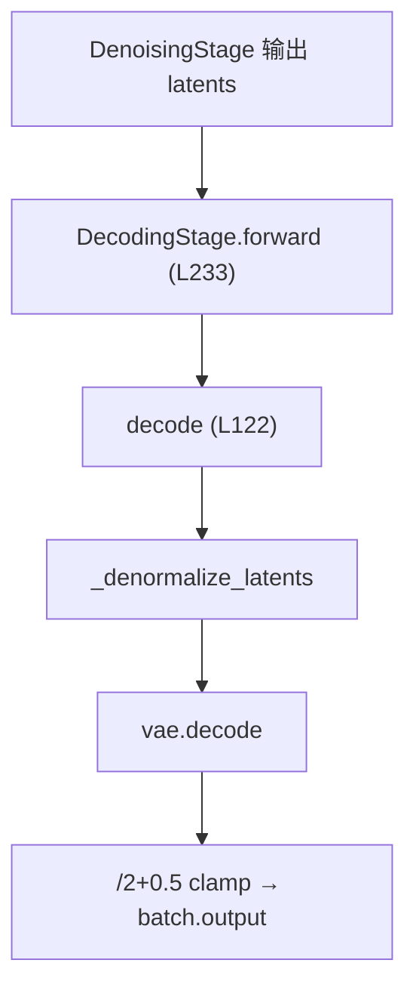

# VAE Decode 流程

> 深入：去噪后的 latent 如何变回像素视频。以及为什么视频扩散要在 latent 空间做。

## 1. 为什么在 latent 空间做扩散

原始视频 `[1,3,81,480,832]` 有约 9700 万个像素值。直接在像素空间跑 DiT 不现实。

VAE 把它压缩到 `[1,16,21,60,104]`（约 200 万值，压缩 ~48 倍）：
- 时间压缩 4×（`temporal_compression_ratio`）。
- 空间压缩 8×（`spatial_compression_ratio`）。
- 通道 3 → 16。

DiT 在这个压缩空间做扩散，最后 VAE decode 回像素。这就是 **Latent Diffusion**。

## 2. Decode 入口（decoding.py L122）

```python
@torch.no_grad()
def decode(self, latents, fastvideo_args):
    latents = self._denormalize_latents(latents)        # 逆归一化
    with torch.autocast(device_type="cuda", dtype=vae_dtype):
        image = self.vae.decode(latents)                # VAE decoder
    image = (image / 2 + 0.5).clamp(0, 1)               # → [0,1]
    return image
```

## 3. _denormalize_latents（L68）

DiT 输出的 latent 是归一化的，decode 前要还原。三种格式：
```python
# 1. mean/std 方式
z = z * latents_std + latents_mean
# 2. scaling/shift 方式
z = z / scaling_factor + shift_factor
# 3. Flux2 packed 方式：BN denorm + unpatchify
```
**为什么归一化**：让 latent 分布接近标准正态，扩散更稳定。不同 VAE 用不同统计量（存在 config 里）。

## 4. VAE decode 内部（wanvae.py）

```python
# AutoencoderKLWan._decode
x = self.post_quant_conv(z)
return self.decoder(x)   # WanDecoder3d，clamp 到 [-1,1]
```

Wan Decoder 结构：
```
conv_in → mid_block → up_blocks(ResNet+Attention, upsample3d/2d) → norm_out → conv_out
```
用 `WanCausalConv3d`（因果卷积，时间方向只向后看）+ feature cache（时序解码跨帧缓存）。

## 5. Tiling（大视频省显存）

```
源码位置：models/vaes/common.py 的 ParallelTiledVAE
```
`decode` 自动选择：
- `_decode`：小视频直接解。
- `tiled_decode`：时间维分块。
- `spatial_tiled_decode`：空间维分块。
- `parallel_tiled_decode`：多 GPU 并行。

分块间用 `blend_v/blend_h/blend_t` 混合重叠区，避免拼接痕迹。VAE decode 是显存峰值点，tiling 是关键优化。

## 6. 形状变化

```
latents [1, 16, 21, 60, 104]
  → _denormalize
  → vae.decode
  → image [1, 3, 81, 480, 832]  (值 [-1,1])
  → /2+0.5 clamp
  → output [1, 3, 81, 480, 832]  (值 [0,1])
```
时间 `21 → 81`（×4-3），空间 `60→480, 104→832`（×8）。

## 7. 调用位置



之后回到 `video_generator._generate_single_video` 的后处理：`rearrange → make_grid → imageio.mimsave`。

## 8. output_type == "latent"

如果 `sampling_param.output_type == "latent"`，跳过 VAE decode，直接返回 latent（用于 debug 或后续处理）。

## 9. 阅读重点
- `_denormalize_latents` 的三种格式。
- `common.py` 的 tiling 逻辑（省显存）。
- `WanCausalConv3d` 的因果性。

## 10. 相关知识
- VAE 深入：[`04_knowledge_expansion/03_vae_for_video.md`](../04_knowledge_expansion/03_vae_for_video.md)
- 显存优化：[`04_knowledge_expansion/13_memory_optimization.md`](../04_knowledge_expansion/13_memory_optimization.md)
