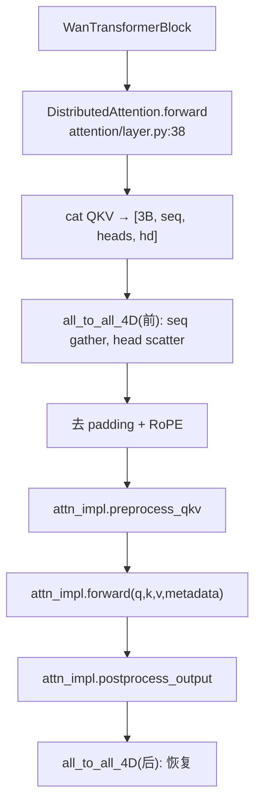
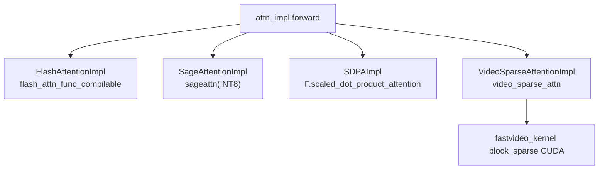
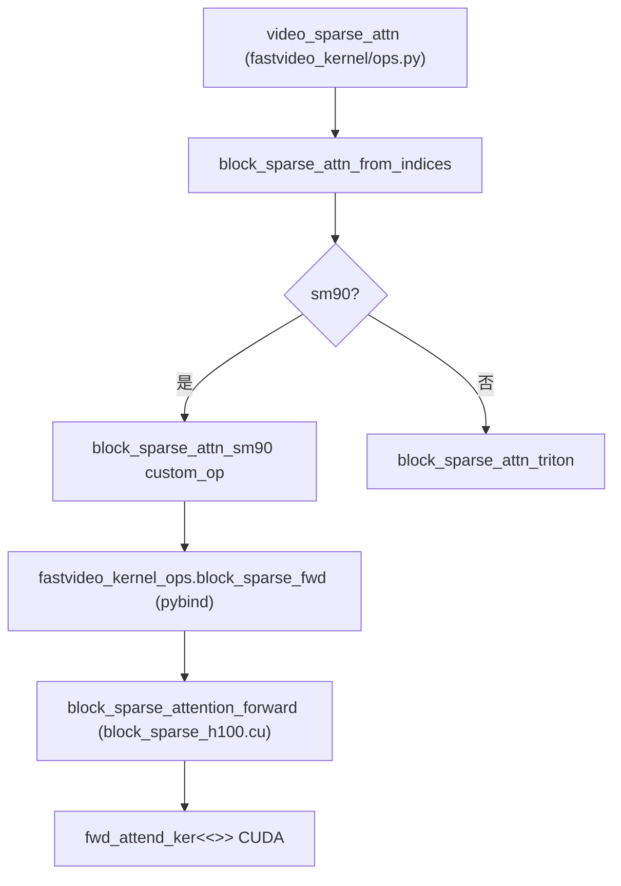

# Attention 后端调用流程

> 深入：从 DiT block 里的一次 attention 调用，到具体后端（含 CUDA kernel）的完整路径。

## 1. 后端选择（发生在加载/首次调用时）

```
源码位置：attention/selector.py，_cached_get_attn_backend (L92)
```
优先级：`global_force` > 环境变量 `FASTVIDEO_ATTENTION_BACKEND` > 平台默认 > SDPA fallback。

```python
@cache
def _cached_get_attn_backend(head_size, dtype, supported_backends):
    selected = global_forced or env_var or platform_default
    attention_cls = current_platform.get_attn_backend_cls(selected, head_size, dtype)
    return resolve_obj_by_qualname(attention_cls)
```

`@cache` 保证同 `(head_size, dtype)` 只选一次。

## 2. DiT 中的调用（以 Wan Self-Attention 为例）



## 3. attn_impl.forward 分派到具体后端



## 4. Dense 后端示例：SDPA（最简单）

```python
# backends/sdpa.py L71
def forward(self, q, k, v, attn_metadata):
    query = q.transpose(1, 2)   # [B,L,H,D] → [B,H,L,D]
    output = F.scaled_dot_product_attention(query, key, value, ...)
    return output.transpose(1, 2)   # 转回 [B,L,H,D]
```

## 5. Sparse 后端示例：VSA

```python
# backends/video_sparse_attn.py
def preprocess_qkv(self, qkv, metadata):
    return self.tile(qkv, metadata)          # token → 3D tile 重排

def forward(self, q, k, v, gate_compress, metadata):
    cur_topk = (1 - VSA_sparsity) * num_kv_blocks   # 稀疏度控制
    return video_sparse_attn(q, k, v, ..., cur_topk)  # 调 kernel

def postprocess_output(self, output, metadata):
    return self.untile(output, ...)
```

## 6. VSA → CUDA 完整链



## 7. torch.compile 兼容

FlashAttention 用 `torch.library.custom_op` 包装成可追踪算子（`flash_attn.py:65`），避免 dynamo graph break。推理走 custom op，训练走原始 autograd.Function。

## 8. 关键理解
- attention 层有两个抽象层次：`DistributedAttention`（管 SP 通信）+ `AttentionImpl`（管具体计算）。
- Dense 后端接口简单；Sparse 后端需要 `preprocess/postprocess` 做 tile 重排 + metadata。
- 稀疏度 `VSA_sparsity` 从 `FastVideoArgs` 传入，控制保留多少 block。

## 9. 阅读重点
- `selector.py` 选择逻辑。
- `layer.py:DistributedAttention.forward` 的 all_to_all + impl 调用。
- `video_sparse_attn.py` 的 tile/untile。

## 10. 调试
```bash
FASTVIDEO_ATTENTION_BACKEND=SDPA python examples/inference/basic/basic.py
FASTVIDEO_ATTENTION_BACKEND=VIDEO_SPARSE_ATTN python ...  # 需装 kernel
```

## 11. 相关知识
- attention 加速：[`04_knowledge_expansion/05_attention_acceleration.md`](../04_knowledge_expansion/05_attention_acceleration.md)
- 稀疏注意力：[`04_knowledge_expansion/06_sparse_attention.md`](../04_knowledge_expansion/06_sparse_attention.md)
