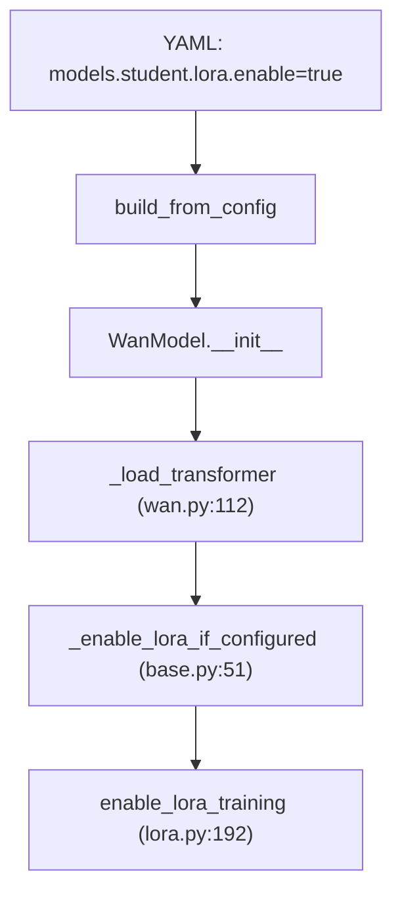

# LoRA 微调流程

> 深入：LoRA 如何注入 DiT、如何只训练 LoRA 参数、如何与 FSDP 配合。

## 1. LoRA 是什么（一句话）

LoRA（Low-Rank Adaptation）冻结原权重 `W`，只训练两个低秩矩阵 `A (d×r)` 和 `B (r×d)`，前向变为 `W·x + (B·A)·x`。参数量从 `d²` 降到 `2dr`（r≪d），训练更省显存。

## 2. 新栈 LoRA 注入链



YAML 配置：
```yaml
models:
  student:
    _target_: fastvideo.train.models.wan.WanModel
    lora:
      enable: true
      rank: 16
      alpha: 32
      target_modules: [to_q, to_k, to_v, to_out]
```

## 3. enable_lora_training（train/utils/lora.py L192）

```python
def enable_lora_training(transformer, lora_rank, lora_alpha, lora_target_modules):
    transformer.requires_grad_(False)                       # 1. 冻结全部
    for name, module in transformer.named_modules():         # 2. 找目标层
        if _is_target_layer(name, target_modules):
            lora_layer = get_lora_layer(module, lora_rank, lora_alpha)
            replacements.append((name, lora_layer))
    for name, lora_layer in replacements:                    # 3. 替换
        replace_submodule(transformer, name, lora_layer)
    _replicate_lora_parameters(transformer)                  # 4. DTensor 包装
    transformer.train()
```

四步：冻结 → 找目标层 → 替换为 LoRA 层 → DTensor Replicate 包装。

默认目标层（`DEFAULT_LORA_TARGET_MODULES`）：`q_proj/k_proj/v_proj/o_proj/to_q/to_k/to_v/to_out/to_qkv/to_gate_compress`。

## 4. _replicate_lora_parameters（L128）—— 与 FSDP 配合

```python
# 从基础层 DTensor 获取 mesh，将新 LoRA 参数包装为 Replicate DTensor
DTensor.from_local(param, device_mesh=mesh, placements=[Replicate()]*mesh.ndim)
```
**为什么 Replicate 而非 Shard**：LoRA 参数很小，不需要分片；用 Replicate 保证与 FSDP 拓扑兼容，梯度在各 rank 一致。

## 5. 只训练 LoRA 参数

optimizer 构建时筛选：
```python
student_params = [p for p in transformer.parameters() if p.requires_grad]
# 只有 lora_A, lora_B 的 requires_grad=True，被传入 AdamW
```
基础层 `requires_grad_(False)`，所以不进 optimizer。

## 6. 训练循环（与全量微调相同）

LoRA 微调用 `FineTuneMethod`（`train/methods/fine_tuning/finetune.py`）：
```python
pred = student.predict_noise(noisy_latents, timesteps, batch)
target = noise - clean_latents          # flow matching
loss = F.mse_loss(pred, target)
loss.backward()   # 梯度只流到 LoRA 参数
```

只是模型里多数参数冻结，loss 和循环结构与全量一样。

## 7. 全量微调对比（wan.py:142）

```python
if self._enable_lora_if_configured(transformer):
    return transformer                    # LoRA 路径，基础层已冻结
transformer = apply_trainable(transformer, trainable=True)   # 全量路径，全部 requires_grad
```

## 8. 旧栈 LoRA

通过 `TrainingArgs.lora_training=True` + `lora_rank`/`lora_alpha`，在 `TrainingPipeline.set_trainable()` 调用相同的 `enable_lora_training`。

## 9. LoRA 提取（从全量微调模型反推 LoRA）

`scripts/lora_extraction/extract_lora.py`：`delta = FT_weights - base_weights`，逐层 SVD 取 top-r 作为 LoRA A/B。用于把已有的全量微调模型转成轻量 LoRA。

## 10. 完整调用链

```
build_from_config → WanModel.__init__ → _load_transformer
  → _enable_lora_if_configured → enable_lora_training
      requires_grad_(False) → replace_submodule(LoRA) → _replicate_lora_parameters
FineTuneMethod.single_train_step
  → student.predict_noise → MSE loss → backward（梯度只到 LoRA）
  → optimizer.step（只更新 LoRA 参数）
```

## 11. 阅读重点
- `lora.py:enable_lora_training` 四步。
- `_replicate_lora_parameters` 与 FSDP 的配合。

## 12. 实践
见 [`06_practical_guides/05_how_to_train_lora.md`](../06_practical_guides/05_how_to_train_lora.md) 和 [`04_knowledge_expansion/09_lora_finetuning.md`](../04_knowledge_expansion/09_lora_finetuning.md)。
