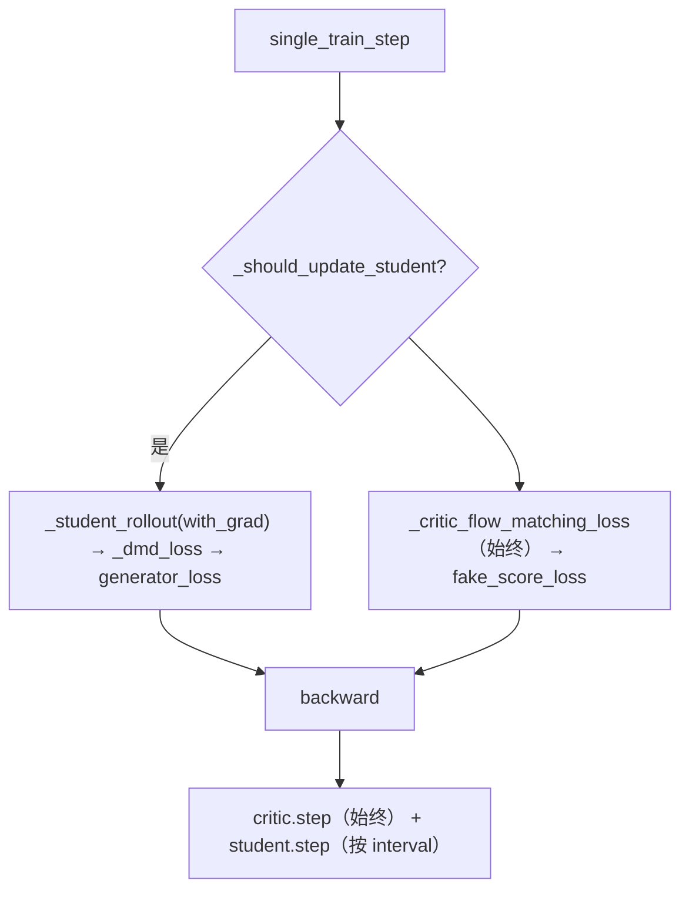

# 蒸馏流程

> 深入：FastVideo 三种蒸馏（DMD2 分布匹配 / 知识蒸馏 / Self-Forcing 因果），teacher/student/critic 结构与 loss。

## 1. 为什么蒸馏

标准扩散需 50 步去噪，太慢。蒸馏让 student 用 1-4 步达到接近 50 步的质量，是 FastVideo（FastWan）实现"5s 视频 1.8s 生成"的核心。

## 2. 三种蒸馏对比

| 方法 | 文件 | 核心思想 | 角色 |
|------|------|---------|------|
| **DMD2** | `train/methods/distribution_matching/dmd2.py` | 分布匹配（学生分布逼近教师分布） | student/teacher/critic |
| **知识蒸馏 (KD)** | `train/methods/knowledge_distillation/kd.py` | 缓存教师 ODE 轨迹，学生 MSE 学习 | student/teacher |
| **Self-Forcing** | `train/methods/distribution_matching/self_forcing.py` | 继承 DMD2 + 因果流式 rollout | 同 DMD2 |

## 3. DMD2（分布匹配蒸馏）

```
源码位置：train/methods/distribution_matching/dmd2.py (L22)
```

三个角色：
| 角色 | 属性 | trainable | 职责 |
|------|------|-----------|------|
| Student（Generator） | `self.student` | ✓ | 生成 x0 预测 |
| Teacher（Real score） | `self.teacher` | ✗ | 真实分布 score |
| Critic（Fake score） | `self.critic` | ✓ | 学生分布 score |

### DMD loss（_dmd_loss L600）

```python
# 1. Teacher 计算 CFG x0
real_cond = teacher.predict_x0(noisy, t, cond=True)
real_uncond = teacher.predict_x0(noisy, t, cond=False)
real_cfg_x0 = real_uncond + w * (real_cond - real_uncond)
# 2. Critic 计算分布匹配梯度
faker_x0 = critic.predict_x0(noisy, t, cond=True)
grad = (faker_x0 - real_cfg_x0) / denom
# 3. Generator loss
loss = 0.5 * MSE(gen_x0, (gen_x0 - grad).detach())
```

### Critic loss（_critic_flow_matching_loss）

```python
gen_x0 = student_rollout(no_grad)      # 学生生成
add_noise(gen_x0, random_t)
loss = MSE(critic_noise_pred, noise - gen_x0)   # flow matching
```

### 训练节奏



student 和 critic 各有独立 optimizer/学习率（`fake_score_learning_rate`）。

## 4. 知识蒸馏（KD）

```
源码位置：train/methods/knowledge_distillation/kd.py (L267)
```

两阶段：
```
Phase 1（on_train_start）：teacher 48 步 ODE rollout，全部中间状态存磁盘 cache，然后释放 teacher
Phase 2（single_train_step）：加载 cache 轨迹 → 随机选步 → student 前向 → 0.5*MSE(pred_x0, real)
```

`_KDPathCache`（L72）：磁盘布局 `cache_dir/samples/*.pt`，每个含 `trajectory_latents [S,T,C,H,W]` + `real` + `text_embedding`。

**优点**：teacher 只跑一次并可释放，student 训练只读文件，省显存。

## 5. Self-Forcing（因果流式蒸馏）

```
源码位置：train/methods/distribution_matching/self_forcing.py (L41)，继承 DMD2Method
```

用于因果/流式模型（如 CausalWan）。逐块（chunk）去噪，KV cache 传播上下文：
```python
for block_idx in range(num_blocks):
    for step_idx, t in enumerate(denoising_steps):
        if step_idx == exit_idx:
            pred = student.predict_noise_streaming(..., enable_grad=True)  # 带梯度
            break
        else:
            pred = student.predict_noise_streaming(...)  # no_grad
    # 用去噪块作为下一块 context（更新 KV cache）
```

## 6. 旧栈蒸馏

`DistillationPipeline`（`training/distillation_pipeline.py`，1514 行）：加载 `real_score_transformer`（teacher）+ `fake_score_transformer`（critic），支持 MoE 双模型（transformer_2）。脚本：`scripts/distill/v1_distill_dmd_wan.sh`。

## 7. loss 汇总

| 方法 | loss |
|------|------|
| DMD2 generator | `0.5·MSE(gen_x0, (gen_x0 - grad).detach())` |
| DMD2 critic | `MSE(critic_pred, noise - gen_x0)` |
| KD | `0.5·MSE(pred_x0, real)` |
| Self-Forcing | 同 DMD2 + 流式 rollout |

## 8. 阅读重点
- `dmd2.py:_dmd_loss` 的分布匹配梯度。
- `kd.py` 的两阶段缓存设计。
- `self_forcing.py` 的块级 rollout。

## 9. 相关知识
- 蒸馏原理深入：[`04_knowledge_expansion/10_distillation_dmd_sparse_distill.md`](../04_knowledge_expansion/10_distillation_dmd_sparse_distill.md)
