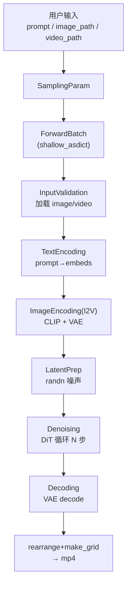

# 数据输入、模型内流动、输出（完整张量流）

> 本文回答三个问题：**数据如何输入？在模型中如何流动？最终输出什么？** 以 Wan 为主线，覆盖 T2V/I2V/V2V，标注每一步的精确张量形状。

## 1. 总览图



## 2. 输入构建：用户输入 → ForwardBatch

源码：`entrypoints/video_generator.py:_generate_single_video`(L658) → L716

```python
batch = ForwardBatch(
    **shallow_asdict(sampling_param),   # 展开 SamplingParam 所有字段
    eta=0.0, n_tokens=n_tokens, VSA_sparsity=fastvideo_args.VSA_sparsity)
```

`shallow_asdict`（`utils.py:754`）把 dataclass 字段展平成 dict 注入。关键输入字段：

| 字段 | 类型 | 来源 |
|------|------|------|
| `prompt` | str | 用户 |
| `negative_prompt` | str | 默认含质量降级词 |
| `image_path` | str/None | I2V |
| `video_path` | str/None | V2V |
| `num_frames` / `height` / `width` | int | 默认 125/720/1280 |
| `seed` | int | 默认 1024 |
| `guidance_scale` | float | 默认 1.0 |
| `num_inference_steps` | int | 默认 50 |

`do_classifier_free_guidance` 由 `__post_init__` 根据 `guidance_scale>1` 自动推导。

## 3. InputValidationStage：加载 image/video

源码：`pipelines/stages/input_validation.py`

**image_path**（L88-129）：
```python
image = load_image(batch.image_path)      # PIL.Image
batch.pil_image = image
```

**video_path**（L132-169）：
```python
pil_images, fps = load_video(batch.video_path, return_fps=True)
# FPS 重采样 → 帧裁剪 → resize → normalize
input_video = video_tensor.permute(1,0,2,3).unsqueeze(0)   # [1, 3, T, H, W]（[-1,1]）
batch.video_latent = input_video   # 原始像素，后续 VAE encode
```

同时生成 seed → `torch.Generator`。

## 4. 文本输入流动：prompt → prompt_embeds

源码：`pipelines/stages/text_encoding.py:encode_text`(L117)

```python
processed = preprocess_func(prompt)                    # prompt template
text_inputs = tokenizer(processed)                     # input_ids [B, L], attention_mask [B, L]
outputs = text_encoder(input_ids, attention_mask)
prompt_embeds = postprocess_func(outputs)              # [B, L, D]
```

形状（Wan UMT5）：`input_ids [1, 512]` → `prompt_embeds [1, 512, 4096]`。存为 `list[Tensor]`（多 encoder 时列表更长）。

negative_prompt 走相同流程 → `negative_prompt_embeds [1, 512, 4096]`（CFG 用）。

## 5. 图像输入流动（I2V）

### 5a. CLIP 编码（ImageEncodingStage, image_encoding.py:31）
```python
image_inputs = self.image_processor(images=image)      # [1, 3, 224, 224]
outputs = self.image_encoder(**image_inputs)
image_embeds = outputs.last_hidden_state                # Wan: [1, 257, 1280]（256 patch + 1 CLS）
batch.image_embeds.append(image_embeds)
```

### 5b. VAE 编码成条件 latent（ImageVAEEncodingStage, image_encoding.py:381）
```python
image = preprocess(pil_image)                          # [1, 3, 720, 1280]（[-1,1]）
image = image.unsqueeze(2)                             # [1, 3, 1, H, W]
video_condition = cat([image, zeros(num_frames-1)], dim=2)  # [1, 3, T, H, W]（首帧图，其余 0）
latent = self.vae.encode(video_condition) * scaling_factor  # [1, 16, T_lat, 90, 160]
batch.image_latent = cat([mask, latent], dim=1)        # [1, 17, T_lat, 90, 160]（1 mask + 16 latent）
```

### 5c. 注入 DiT
- `image_embeds`（CLIP）→ `encoder_hidden_states_image` → DiT cross attention（拼在文本前，见 WanI2VCrossAttention）。
- `image_latent`（VAE）→ denoising 时 concat 到 latent（见第 8 节）。

## 6. 视频输入流动（V2V）

源码：`VideoVAEEncodingStage`(image_encoding.py:573)
```python
video_condition = prepare(batch.video_latent, num_frames, H, W)  # [1, 3, T, H, W]
latent = self.vae.encode(video_condition) * scaling_factor
batch.video_latent = latent                            # [1, 16, T_lat, 90, 160]
```

## 7. Latent 初始化（LatentPreparationStage）

源码：`pipelines/stages/latent_preparation.py:104`
```python
latent_num_frames = (num_frames - 1) // temporal_compression_ratio + 1   # (81-1)//4+1 = 21
shape = (B, num_channels_latents, latent_num_frames, H//8, W//8)          # (1, 16, 21, 90, 160)
latents = randn_tensor(shape, generator=generator)                        # 高斯噪声
latents = latents * scheduler.init_noise_sigma                            # flow match: ×1.0
batch.latents = latents
```

## 8. Latent 在去噪循环中流动（DenoisingStage）

源码：`pipelines/stages/denoising.py:72`

### 8a. 构建 latent_model_input（I2V/V2V concat, L380-394）
```python
latent_model_input = latents                                # [1, 16, T, 90, 160]
if batch.video_latent is not None:      # V2V
    latent_model_input = cat([latents, video_latent, v2v_zero_pad], dim=1)  # [1, 48, T, 90, 160]
elif batch.image_latent is not None:    # I2V
    latent_model_input = cat([latents, image_latent], dim=1)                # [1, 33, T, 90, 160]
```
T2V 时 `latent_model_input = latents`（16 通道）。

### 8b. scale + DiT forward（条件, L438-500）
```python
latent_model_input = scheduler.scale_model_input(latent_model_input, t)   # flow match: 恒等
noise_pred = current_model(latent_model_input, prompt_embeds, t_expand,
                           guidance, encoder_hidden_states_image=image_embeds, ...)
# noise_pred: [1, 16, T, 90, 160]（DiT 内部：patchify→blocks→unpatchify，见 04a_dit_wanvideo.md）
```

### 8c. CFG fan-out（L531-554）
```python
if do_classifier_free_guidance:
    noise_pred_uncond = current_model(latent_model_input, neg_prompt_embeds, ...)
    noise_pred = noise_pred_uncond + guidance_scale * (noise_pred - noise_pred_uncond)
```

### 8d. scheduler.step 更新 latent（L567）
```python
latents = scheduler.step(noise_pred, t, latents, return_dict=False)[0]   # [1, 16, T, 90, 160]
```
循环 N 步（默认 50）。TI2V 特殊路径会 clamp 首帧为 VAE(image)（L240-270）。

## 9. 输出：VAE decode + 保存

### 9a. Decoding（decoding.py:122）
```python
latents = self._denormalize_latents(latents)              # 逆 scaling/shift
image = self.vae.decode(latents)                          # [1, 16, 21, 90, 160] → [1, 3, 81, 720, 1280]
image = (image / 2 + 0.5).clamp(0, 1)                     # [0, 1]
batch.output = image
```

### 9b. output_type 分支（decoding.py:271）
```python
if output_type == "latent": frames = batch.latents        # 跳过 VAE decode
else: frames = self.decode(batch.latents)                  # 像素
# audio 走 LTX-2 专用 decode
```

### 9c. 张量 → mp4（video_generator.py:807-886）
```python
videos = rearrange(samples, "b c t h w -> t b c h w")      # [81, 1, 3, 720, 1280]
for x in videos:
    x = torchvision.utils.make_grid(x, nrow=6)              # [3, H, W*6]
    x = (x * 255).to(torch.uint8)                           # uint8
    frames.append(x.permute(1,2,0).cpu().numpy())
imageio.mimsave(output_path, frames, fps=batch.fps, format="mp4")
```

## 10. 完整张量形状表（Wan I2V, 81帧 720×1280）

| Stage | 张量 | 形状 |
|-------|------|------|
| 输入 | prompt / pil_image | str / PIL |
| TextEncoding | prompt_embeds | `[1, 512, 4096]` |
| ImageEncoding | image_embeds | `[1, 257, 1280]` |
| LatentPrep | latents | `[1, 16, 21, 90, 160]` |
| ImageVAEEncoding | image_latent | `[1, 17, 21, 90, 160]` |
| Denoising 输入 | latent_model_input | `[1, 33, 21, 90, 160]`（16+17） |
| DiT 输出 | noise_pred | `[1, 16, 21, 90, 160]` |
| Denoising 输出 | latents（去噪后） | `[1, 16, 21, 90, 160]` |
| Decoding | output | `[1, 3, 81, 720, 1280]` [0,1] |
| rearrange | frames | `[81, ...]` uint8 numpy |
| 保存 | mp4 | 文件 |

## 11. 三种 workload 输入通道对比

| workload | latent_model_input 通道 | 组成 |
|----------|------------------------|------|
| T2V | 16 | noise |
| I2V | 33 | 16 noise + 17 image_latent(含mask) |
| V2V | 48 | 16 noise + 16 video_latent + 16 zero_pad |
| V2V (Lucy Edit) | 32 | 16 noise + 16 video_latent |

## 12. 各 stage 输入输出契约（Wan I2V）

| # | Stage | 输入 | 输出字段 |
|---|-------|------|---------|
| 1 | InputValidation | prompt, image_path | pil_image, generator |
| 2 | TextEncoding | prompt | prompt_embeds, negative_prompt_embeds |
| 3 | ImageEncoding | pil_image | image_embeds |
| 4 | Conditioning | guidance_scale | (校验，no-op) |
| 5 | TimestepPrep | num_inference_steps | timesteps `[50]` |
| 6 | LatentPrep | num_frames,H,W | latents |
| 7 | ImageVAEEncoding | pil_image | image_latent |
| 8 | Denoising | latents+image_latent+embeds | latents(去噪) |
| 9 | Decoding | latents | output |

## 13. 相关笔记
- prompt→张量（T2V 简版）：[`04_prompt_to_video_tensor_flow.md`](04_prompt_to_video_tensor_flow.md)
- DiT 内部：[`../02_source_by_directory/04a_dit_wanvideo.md`](../02_source_by_directory/04a_dit_wanvideo.md)
- VAE decode：[`06_vae_decode_flow.md`](06_vae_decode_flow.md)
