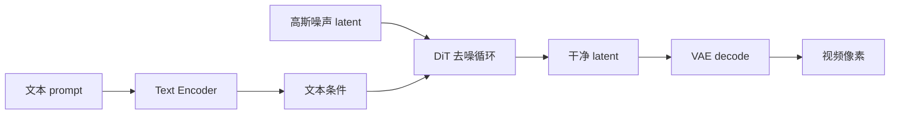

# 视频扩散基础

> 知识点扩展：diffusion / latent diffusion / text-to-video / video latent / timestep / denoising，并回扣 FastVideo 源码。

## 1. Diffusion Model 是什么

扩散模型学习"从噪声还原数据"的过程：
- **前向过程（forward / diffusion）**：给数据 `x_0` 逐步加噪声，直到变成纯高斯噪声 `x_T`。
- **反向过程（reverse / denoising）**：训练一个网络，从噪声一步步去噪回 `x_0`。

生成时：采样纯噪声 → 网络反复去噪 → 得到数据。

### 1.1 DDPM 的数学（经典基础）

**前向过程**是一个固定的马尔可夫链，每步加一点高斯噪声：
```
q(x_t | x_{t-1}) = N(x_t; √(1-β_t)·x_{t-1}, β_t·I)
```
`β_t` 是噪声调度（noise schedule，随 t 增大）。通过重参数化可一步到位：
```
x_t = √(ᾱ_t)·x_0 + √(1-ᾱ_t)·ε,    ε ~ N(0, I),   ᾱ_t = ∏(1-β_s)
```
即任意 t 时刻的带噪样本可直接从 `x_0` 和一个高斯噪声 `ε` 算出——训练时不需要真的一步步加噪。

**反向过程**由网络 `ε_θ` 预测噪声，训练目标是简单的 MSE：
```
L = E[ ‖ε - ε_θ(x_t, t)‖² ]
```

**三种预测参数化**（读源码时会遇到）：
- **ε-prediction**：网络预测噪声 `ε`（DDPM 原始）。
- **x0-prediction**：网络直接预测干净样本 `x_0`。
- **v-prediction**：预测 `v = √(ᾱ_t)·ε - √(1-ᾱ_t)·x_0`（数值更稳，视频常用）。
- **flow matching 的 velocity**：`v = ε - x_0`（FastVideo 采用，见第 6 节）。

`models/utils.py:pred_noise_to_pred_video`(L142) 就是在做"预测量 → x_0"的换算。

### 1.2 为什么扩散比 GAN 好

- 训练稳定（纯回归 loss，无对抗博弈）。
- 覆盖模式全（不易 mode collapse）。
- 可控性强（条件注入、CFG、可插拔采样器）。
代价是采样慢（多步），这正是 FastVideo 用蒸馏+稀疏加速要解决的（见 [`10_distillation_dmd_sparse_distill.md`](10_distillation_dmd_sparse_distill.md)）。

## 2. Latent Diffusion

直接在像素空间扩散太贵（视频有上亿像素）。Latent Diffusion 先用 VAE 把数据压到低维 latent，在 latent 空间扩散，最后 VAE decode 回像素。

FastVideo 全程 latent diffusion：
- VAE 压缩：`[B,3,T,H,W]` → `[B,16,T/4,H/8,W/8]`（Wan，压缩 ~48 倍）。
- DiT 在 latent 空间去噪（`stages/denoising.py`）。
- 最后 `stages/decoding.py` VAE decode。

## 3. Text-to-Video (T2V) / Image-to-Video (I2V)

- **T2V**：只有文本条件。text encoder 编码 prompt → cross attention 注入 DiT。
- **I2V**：额外有图像条件。图像经 VAE encode 成 `image_latent`（`ImageVAEEncodingStage`）+ CLIP encode 成 `image_embeds`（`ImageEncodingStage`），拼接/注入 DiT。

FastVideo 用 `workload_type`（T2V/I2V/T2I/I2I）区分，pipeline 也分 `wan_pipeline.py`（T2V）/`wan_i2v_pipeline.py`（I2V）。

## 4. Video Latent

视频 latent 是 5D 张量 `[B, C, T, H, W]`：
- `C=16`：latent 通道（VAE 决定）。
- `T`：latent 时间帧数 = `(num_frames-1)/4+1`（时间压缩 4×）。
- `H, W`：latent 空间尺寸 = 像素 / 8（空间压缩 8×）。

在 FastVideo：`LatentPreparationStage` 初始化噪声 latent，`ForwardBatch.latents` 存储。

## 5. Timestep / Noise / Denoising

- **timestep t**：表示噪声水平（0=干净，1000=纯噪声）。
- **noise ε**：加入的高斯噪声。
- **denoising**：反复调用网络预测噪声/速度，用 scheduler 更新 latent。

FastVideo（flow matching）：
```python
# 加噪（训练）：x_t = (1-σ)·x_0 + σ·ε
# 去噪（推理）：latents = scheduler.step(v_pred, t, latents)  循环 N 步
```

## 6. Flow Matching（FastVideo 的选择）

FastVideo 用 flow matching 而非经典 DDPM：
- 学习"直线"速度场 `v = ε - x_0`。
- 更少步数达到好质量，适合视频。

见 [`04_scheduler_sampling_solver.md`](04_scheduler_sampling_solver.md)。

### 6.1 flow matching 的直觉

Flow matching / Rectified Flow 定义数据到噪声的**直线插值路径**：
```
x_t = (1 - t)·x_0 + t·ε,    t ∈ [0, 1]
```
沿这条直线，速度是常数 `dx/dt = ε - x_0`。网络学这个速度场 `v_θ(x_t, t)`，采样时沿速度场积分（ODE）：
```
x_{t-Δt} = x_t - Δt · v_θ(x_t, t)
```
因为路径是直线，理论上更少步数就能积分准确——这是它比 DDPM 曲线路径省步数的原因。

### 6.2 与 DDPM 的记号对应

FastVideo scheduler 里 `sigma`（记 σ）对应上面的 `t`：σ=1 是纯噪声，σ=0 是干净。`scale_noise` 实现 `x_t = (1-σ)·x_0 + σ·ε`，`step` 实现 Euler 积分。详见 `scheduling_flow_match_euler_discrete.py`。

## 7. 视频扩散相比图像扩散的独特挑战

FastVideo 专门为视频优化，理解这些挑战才懂为什么它这么设计：

| 挑战 | 后果 | FastVideo 应对 |
|------|------|---------------|
| **时序一致性** | 帧间抖动、闪烁 | 3D attention / 3D VAE / 时间维 RoPE |
| **序列极长** | attention O(L²) 爆炸（数万 token） | 序列并行 + 稀疏 attention（VSA） |
| **显存巨大** | 单卡放不下激活 | FSDP + SP + activation checkpointing + VAE tiling |
| **推理慢** | 生成一个视频几分钟 | 蒸馏（步数 50→1-4）+ 量化 + torch.compile |
| **数据处理重** | 视频解码/编码慢 | 预处理成 Parquet latent |

## 8. Classifier-Free Guidance（CFG）

条件生成的关键技巧。同时训练"有条件"和"无条件"（drop 掉 prompt）两种模式，采样时外推：
```
ε = ε_uncond + guidance_scale · (ε_cond - ε_uncond)
```
- `guidance_scale=1`：纯条件，无 guidance。
- `guidance_scale>1`：放大条件影响，prompt 遵循度更高，但过大会过饱和/失真。
- 代价：每步跑两次 DiT（cond + uncond），推理翻倍。

训练时的 CFG dropout：dataloader 以 `cfg_rate` 概率把 text embedding 置零（`LatentDataset`），让模型学会无条件生成。

FastVideo 里 `ForwardBatch.do_classifier_free_guidance` 由 `guidance_scale>1` 自动触发，CFG 组合在 `stages/denoising.py:554`。

## 9. 完整心智模型



## 9.5 简单代码示例（教学用，非 FastVideo 源码）

下面用几十行说清 flow matching 的**训练**和**采样**，帮你把公式和代码对上。真实 FastVideo 分散在 `scheduling_flow_match_euler_discrete.py` + `train/methods/fine_tuning/finetune.py`，本质就是这些。

```python
import torch, torch.nn as nn

# 一个玩具"DiT"：输入带噪 latent + timestep，预测速度 v
class ToyVelocityNet(nn.Module):
    def __init__(self, dim):
        super().__init__()
        self.net = nn.Sequential(nn.Linear(dim + 1, 256), nn.SiLU(), nn.Linear(256, dim))
    def forward(self, x_t, t):                       # x_t: [B, dim], t: [B, 1]
        return self.net(torch.cat([x_t, t], dim=-1)) # 预测 v = ε - x0

# ---------- 训练一步（flow matching）----------
def train_step(model, x0, opt):                      # x0: 干净数据 [B, dim]
    B = x0.shape[0]
    t = torch.rand(B, 1)                             # σ ~ U(0,1)，噪声水平
    eps = torch.randn_like(x0)                       # 高斯噪声
    x_t = (1 - t) * x0 + t * eps                     # 直线插值加噪 x_t
    target_v = eps - x0                              # 目标速度（常数）
    pred_v = model(x_t, t)
    loss = ((pred_v - target_v) ** 2).mean()         # MSE flow matching loss
    opt.zero_grad(); loss.backward(); opt.step()
    return loss.item()

# ---------- 采样（Euler 积分，从噪声到数据）----------
@torch.no_grad()
def sample(model, dim, steps=50, B=4):
    x = torch.randn(B, dim)                          # 从纯噪声开始（σ=1）
    ts = torch.linspace(1.0, 0.0, steps + 1)         # σ: 1 → 0
    for i in range(steps):
        t = ts[i].expand(B, 1)
        v = model(x, t)                              # 预测速度
        dt = ts[i + 1] - ts[i]                       # < 0
        x = x + dt * v                               # Euler 一步：x_{t-1} = x_t + dt·v
    return x                                          # 干净样本
```

对应关系：
- `x_t = (1-t)*x0 + t*eps` ↔ `scheduler.scale_noise`（加噪）。
- `x = x + dt*v` ↔ `scheduler.step`（去噪一步）。
- `model(x_t, t)` ↔ DiT forward（真实里还有 text/image 条件 + patchify）。

加上 CFG 只需两次前向再外推：
```python
v = v_uncond + guidance_scale * (v_cond - v_uncond)
```


## 10. 回扣源码
| 概念 | 源码 |
|------|------|
| latent diffusion | `stages/denoising.py` + `stages/decoding.py` |
| video latent 形状 | `stages/latent_preparation.py` |
| timestep | `stages/timestep_preparation.py` |
| text condition | `stages/text_encoding.py` + DiT cross attention |
| VAE 压缩 | `models/vaes/wanvae.py` |
| CFG 组合 | `stages/denoising.py:554` |
| 预测量→x0 换算 | `models/utils.py:pred_noise_to_pred_video` |

## 11. 术语速查

| 术语 | 含义 |
|------|------|
| `x_0` | 干净数据（latent） |
| `x_t` / `x_T` | t 时刻带噪 / 纯噪声 |
| `ε` (epsilon) | 高斯噪声 |
| `v` (velocity) | flow matching 速度 `ε - x_0` |
| `σ` (sigma) | 噪声水平（flow matching 的 t） |
| `β_t`, `ᾱ_t` | DDPM 噪声调度 |
| CFG | classifier-free guidance |
| DiT | Diffusion Transformer |
| VAE | Variational Autoencoder |

## 12. 延伸阅读
- DiT：[`01_dit_transformer_for_video.md`](01_dit_transformer_for_video.md)
- VAE：[`03_vae_for_video.md`](03_vae_for_video.md)
- scheduler：[`04_scheduler_sampling_solver.md`](04_scheduler_sampling_solver.md)
- 蒸馏加速：[`10_distillation_dmd_sparse_distill.md`](10_distillation_dmd_sparse_distill.md)
