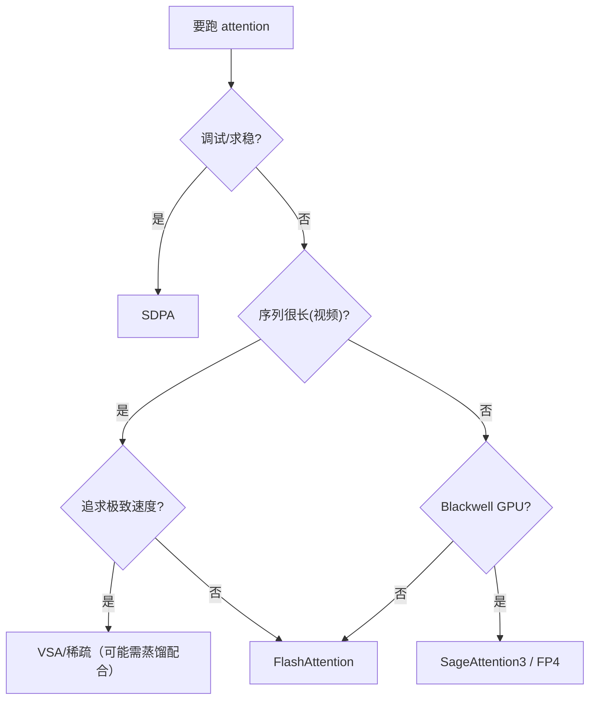

# Attention 加速

> 知识点扩展：标准 attention 复杂度、FlashAttention、SageAttention、KV cache，回扣 FastVideo attention 后端。

## 1. 标准 Attention 的复杂度问题

```
Attention(Q,K,V) = softmax(QKᵀ/√d)·V
```
- 时间/内存复杂度 O(L²)（L=序列长度）。
- 视频 DiT 的 L 可达数万（Wan 32760），O(L²) 的中间矩阵 `QKᵀ` 是 32760² ≈ 10 亿元素，显存爆炸。

这是视频生成必须加速 attention 的根本原因。

### 1.1 复杂度拆解

设序列长 L，头维 d，头数 h：
- `QKᵀ`：`L×d @ d×L = O(L²·d)` 计算，`O(L²)` 显存。
- `softmax`：`O(L²)`。
- `·V`：`O(L²·d)`。

视频序列 L 是图像的几十倍（多了时间维），所以 attention 是视频 DiT 里绝对的性能瓶颈——一个 block 里 attention 常占 70%+ 的时间和显存。加速手段分两类：**exact（精确）** 和 **approximate（近似/稀疏）**。

## 2. FlashAttention

核心：**tiling + online softmax**，不显式物化 `QKᵀ` 矩阵。
- 分块加载 Q/K/V 到 SRAM。
- 在线累积 softmax（无需存全矩阵）。
- I/O 最优的 exact attention（结果精确，不是近似）。

FastVideo（`backends/flash_attn.py`）支持 FA2/FA3/FA4：
- FA4（CuTe DSL, sm90+）：`FASTVIDEO_FA4=1` 启用。
- 默认优先级 FA3 > FA2。
- FP4 NVFP4 路径（Blackwell）：`_forward_nvfp4`。

### 2.1 为什么快：I/O 感知

标准 attention 慢**不是因为算力**，而是因为**显存带宽**：`QKᵀ` 这个 L×L 大矩阵要写回 HBM（显存）再读回来做 softmax，来回搬运耗时。

FlashAttention 的洞察：GPU 的 SRAM（片上，快）比 HBM（显存，慢）小但快 ~10×。它把 Q/K/V 分成小块（tile），每块在 SRAM 内算完 `局部QKᵀ → 局部softmax → 局部·V`，用 **online softmax** 增量合并各块结果，**永不把完整 L×L 写回 HBM**。

### 2.2 Online Softmax（核心算法）

难点：softmax 需要全局最大值和求和归一化，但分块处理时看不到全局。解法是维护 running 统计量：
```
对每个新块，更新:
  m_new = max(m_old, block_max)          # running 最大值
  l_new = exp(m_old - m_new)·l_old + Σexp(block - m_new)   # running 归一化和
  o_new = exp(m_old - m_new)·o_old + exp(block - m_new)·V_block  # running 输出
```
`m`（最大值，防溢出）、`l`（归一化分母）、`o`（累积输出）。处理完所有块后 `o/l` 就是精确结果。这就是 FastVideo kernel（`st_attn_h100.cu` / `block_sparse_h100.cu`）里 `exp2 + rescale` 的逻辑。

**简单代码示例（教学用，纯 PyTorch 演示 online softmax，非真实 kernel）**：
```python
import torch

def flash_attention_toy(q, k, v, block=128):
    # q,k,v: [L, d]，演示"分块 + online softmax"，结果与标准 attention 一致
    L, d = q.shape
    scale = d ** -0.5
    o = torch.zeros_like(q)                    # 累积输出
    m = torch.full((L, 1), float("-inf"))      # running 最大值
    l = torch.zeros((L, 1))                    # running 归一化和
    for j in range(0, L, block):               # 遍历 K/V 的每个块（不物化完整 L×L）
        kj, vj = k[j:j+block], v[j:j+block]
        s = (q @ kj.T) * scale                 # 局部分数 [L, block]
        m_new = torch.maximum(m, s.max(dim=1, keepdim=True).values)
        p = torch.exp(s - m_new)               # 局部 softmax 分子
        alpha = torch.exp(m - m_new)           # 旧统计量的 rescale 因子
        l = alpha * l + p.sum(dim=1, keepdim=True)
        o = alpha * o + p @ vj                 # 增量累积输出
        m = m_new
    return o / l                               # 最终归一化

# 验证与标准 attention 等价
q, k, v = [torch.randn(512, 64) for _ in range(3)]
std = torch.softmax(q @ k.T * 64**-0.5, dim=-1) @ v
assert torch.allclose(flash_attention_toy(q, k, v), std, atol=1e-4)  # ✓
```
真实 kernel 把这段搬到 SRAM 用 CUDA 写，`block` 是 tile 大小，`alpha` 就是 rescale。理解这段就理解了 FlashAttention 的精髓。

### 2.3 FA 版本差异

| 版本 | 硬件 | 关键技术 |
|------|------|---------|
| FA1 | Ampere | tiling + online softmax |
| FA2 | Ampere/Hopper | 更好的并行划分（over seq） |
| FA3 | Hopper | TMA 异步加载 + wgmma + warp specialization |
| FA4 | Hopper+ (CuTe) | 更激进的流水线，支持 FP4 |

## 3. SageAttention

核心：**INT8/FP8 量化 Q/K**，在保持精度下加速。
- `backends/sage_attn.py`（v1，INT8）：`sageattn(q, k, v, tensor_layout="NHD")`。
- `backends/sage_attn3.py`（v3，Blackwell）：`sageattn3_blackwell`。

量化让 attention 计算用更低精度，配合硬件 tensor core 加速。

### 3.1 量化 attention 的关键：smoothing

直接把 Q/K 量化成 INT8 会掉精度（异常值 outlier 会撑大量化范围）。SageAttention 的技巧：
- **smooth Q/K**：减去通道均值，把分布压平，再量化，减少 outlier 影响。
- **INT8 QKᵀ + FP16 累积**：矩阵乘用 INT8 tensor core（快），累积用高精度。
- v3 进一步用 FP8/FP4（Blackwell 硬件支持）。

精度损失通常 <1% 质量下降，但速度提升可观。属于"近似但几乎无损"的 exact-ish 方法。

## 4. SDPA（fallback）

`backends/sdpa.py`：调 `F.scaled_dot_product_attention`，torch 自动选 FlashAttention/MemEfficient/Math 后端。是通用 fallback，任何 GPU 可用。

调试时首选 SDPA（最稳、跨硬件），确认逻辑正确后再换加速后端。它内部三个 kernel：
- **flash**：调 FlashAttention（若可用）。
- **mem-efficient**：xFormers 风格，省显存。
- **math**：纯 PyTorch 实现，最慢但一定可用。

## 5. 稀疏 attention（见专文）

- VSA、BSA、SLA、VMoBA：把 O(L²) 降到近似 O(L·k)，只算 top-k 相关 block。
- 详见 [`06_sparse_attention.md`](06_sparse_attention.md)。

## 6. KV Cache

视频扩散中，同一个 prompt 的文本 K/V 在所有去噪步不变。Wan 的 `WanT2VCrossAttention`（`wanvideo.py:153`）缓存文本 K/V（`crossattn_cache`），避免每步重算。

因果/流式模型（Self-Forcing）用 KV cache 传播上下文帧，`predict_noise_streaming(store_kv=True)`。

### 6.1 视频扩散 vs LLM 的 KV cache 区别

| | LLM | 视频扩散 |
|--|-----|---------|
| 缓存对象 | 已生成 token 的 K/V | 文本 cross-attn 的 K/V / 因果历史帧 |
| 缓存原因 | 自回归逐 token 生成 | 同 prompt 各去噪步 K/V 不变 |
| 增长方式 | 序列递增 | cross-attn 固定；因果流式递增 |

注意：双向（非因果）视频 DiT 的 **self-attention 不能** KV cache（每步 latent 都变），只有 **cross-attention（文本）** 可缓存。因果模型的历史帧才能像 LLM 那样缓存。

## 7. GQA / MQA（分组查询注意力）

减少 K/V 头数以省显存/带宽：
- **MHA**：Q/K/V 头数相同。
- **GQA**：K/V 头数 < Q 头数，多个 Q 头共享一组 K/V（`repeat_interleave` 扩展）。
- **MQA**：所有 Q 头共享一组 K/V（极端 GQA）。

Cosmos（`CosmosSelfAttention`）、Llama encoder 用 GQA。`QKVParallelLinear`（`layers/linear.py:674`）支持 GQA 的 TP 切分。

## 8. 后端选择（selector.py）

```
优先级：global_force > FASTVIDEO_ATTENTION_BACKEND 环境变量 > 平台默认 > SDPA fallback
```

## 9. torch.compile 兼容

FlashAttention 默认不可追踪，会导致 graph break。FastVideo 用 `torch.library.custom_op` 包装（`flash_attn.py:65`）。推理走可追踪 op，训练走原始 autograd。

## 10. 各后端对比

| 后端 | 精度 | 复杂度 | 适用 |
|------|------|--------|------|
| flash_attn | exact | O(L²) | 通用最优 |
| sage_attn | INT8 近似 | O(L²) | 加速 |
| sdpa | exact | O(L²) | fallback |
| VSA/BSA/SLA/VMoBA | 稀疏近似 | ~O(L·k) | 长序列视频 |

## 11. 选型决策树



## 12. 回扣源码
| 概念 | 源码 |
|------|------|
| 后端选择 | `attention/selector.py` |
| FlashAttention | `attention/backends/flash_attn.py` |
| SageAttention | `attention/backends/sage_attn.py` |
| KV cache | `models/dits/wanvideo.py:WanT2VCrossAttention` |
| SP + attention | `attention/layer.py:DistributedAttention` |

## 13. 延伸
- 稀疏注意力：[`06_sparse_attention.md`](06_sparse_attention.md)
- kernel 层：[`12_flashattention_sageattention_flashinfer.md`](12_flashattention_sageattention_flashinfer.md)
- 后端调用链：[`../03_core_flows/07_attention_backend_flow.md`](../03_core_flows/07_attention_backend_flow.md)
