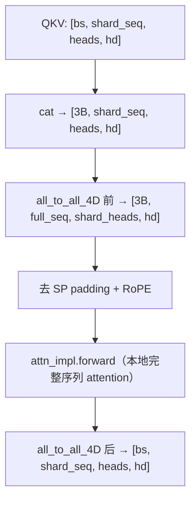

# 序列并行（Sequence Parallelism）

> 知识点扩展：SP 原理、与 TP 的区别、all-to-all 通信，回扣 FastVideo 实现。

## 1. 为什么需要 SP

视频 DiT 序列长度数万，单卡：
- attention 激活内存吃不消。
- 单卡算力不足。

SP 把**序列维度（token）**切分到多个 GPU，每卡只处理部分 token，大幅降低单卡激活内存。这是视频生成分布式推理的主力（不是 TP）。

## 2. SP vs TP vs DP

| 并行 | 切分对象 | 通信 |
|------|---------|------|
| **TP**（张量并行） | 权重矩阵（列/行） | all-reduce（每层） |
| **SP**（序列并行） | 序列维度（token） | all-to-all（attention 前后） |
| **DP/FSDP**（数据并行） | batch / 参数分片 | all-gather/reduce-scatter |

SP 的关键：非 attention 层（FFN/norm）每个 token 独立，天然可并行；只有 attention 需要跨 token 通信。

### 2.1 为什么视频用 SP 而非 TP

| | TP | SP |
|--|----|----|
| 切什么 | 权重（head 维） | 激活（序列维） |
| 瓶颈缓解 | 权重大 | 激活大（长序列） |
| 通信量 | 每层 all-reduce（大） | attention 前后 all-to-all |
| 适合 | 大权重 LLM | 长序列视频 |

视频 DiT 的痛点是**激活巨大**（数万 token 的中间张量），不是权重特别大。SP 直接切激活的序列维，正中要害。TP 主要留给大 text encoder。两者可叠加。

### 2.2 SP 与 Ulysses / Ring Attention

FastVideo 的 SP 是 **Ulysses 式**（DeepSpeed-Ulysses）：用 all-to-all 在"序列切分"和"head 切分"间转换。另一种是 **Ring Attention**（P2P 传 K/V 环形流转）。区别：
- Ulysses：通信量小，但 head 数必须能被 sp_size 整除（`wanvideo.py:584` 的 assert）。
- Ring：无 head 整除限制，但通信更复杂。
FastVideo 用 Ulysses（`all_to_all_4D`）。

## 3. 核心机制：all-to-all_4D

```
源码：distributed/device_communicators/base_device_communicator.py:AllToAll4D (L123)
```

问题：attention 需要每个 token 看到所有 token，但 SP 下每卡只有部分 token。

解法：在 attention 前后各做一次 all-to-all，把"序列切分"临时转成"head 切分"：

```
attention 前（scatter_dim=2, gather_dim=1）:
  [bs, shard_seq, hn, hd] → [bs, full_seq, shard_hn, hd]
  # 每卡拿到完整序列，但只有部分 head → 能独立算 attention
attention 后（scatter_dim=1, gather_dim=2）:
  [bs, full_seq, shard_hn, hd] → [bs, shard_seq, hn, hd]
  # 恢复序列切分
```

**简单代码示例（教学用，单机模拟 all-to-all 的效果）**：
```python
import torch

# 模拟 SP：2 个 rank，每个持有一半序列、全部 head
# all-to-all 后：每个 rank 持有全部序列、一半 head
def simulate_sp_alltoall(qkv_rank0, qkv_rank1):
    # 输入：每 rank [full_seq/2, heads, hd]（持有部分序列、全部 head）
    # 输出：每 rank [full_seq, heads/2, hd]（持有全部序列、部分 head）
    seq_half, heads, hd = qkv_rank0.shape
    # 拼接完整序列
    full = torch.cat([qkv_rank0, qkv_rank1], dim=0)      # [full_seq, heads, hd]
    # 各 rank 取自己的 head 子集
    r0 = full[:, :heads // 2]                            # rank0: 前一半 head
    r1 = full[:, heads // 2:]                            # rank1: 后一半 head
    return r0, r1   # 现在每 rank 有完整序列 → 可独立算 attention

# 真实里由 NCCL all_to_all_single 一步完成（无需显式 cat），
# 且是 autograd 函数（backward 交换 scatter/gather 维度）
q0 = torch.randn(256, 8, 64)   # rank0: 256 token, 8 head
q1 = torch.randn(256, 8, 64)   # rank1: 256 token, 8 head
r0, r1 = simulate_sp_alltoall(q0, q1)
print(r0.shape, r1.shape)      # [512, 4, 64] [512, 4, 64] → 全序列、半 head
```
关键约束：`heads` 必须能被 `sp_size` 整除（`wanvideo.py:584` 的 assert 就是查这个）。

## 4. 在 DiT 中的完整流程

```
源码：attention/layer.py:DistributedAttention.forward (L38)
```



DiT 里序列在进入 blocks 前 `sequence_model_parallel_shard`（`wanvideo.py`），切分到各 SP rank。

## 5. shard 与 padding

```
源码：distributed/communication_op.py:sequence_model_parallel_shard (L64)
```
```python
padded_seq_len, padding = compute_padding_for_sp(seq_len, sp_world_size)  # 对齐
input_ = pad_sequence_tensor(input_, padded_seq_len)
input_ = get_sp_group().shard(input_, dim=1)   # forward=slice, backward=all-gather
```
序列长度需能被 sp_size 整除，不够则 padding。

## 6. autograd 支持

`AllToAll4D` 是 autograd 函数，backward 时交换 scatter/gather 维度递归调用自己。这让 SP 在训练时也可用。

## 7. 通信组管理

```
源码：distributed/parallel_state.py
```
SP 组 `_SP` 独立于 FSDP 的 DeviceMesh。SP 组内做序列通信，FSDP 做参数通信，两者正交叠加。

## 8. 配置

- 推理默认 `sp_size = num_gpus`（全部 GPU 做 SP）。
- 训练 YAML 显式指定（大模型可能 `sp_size=2` + FSDP shard）。

## 9. 通信开销

all-to-all 每层 attention 前后各一次，是 SP 的主要开销。序列越长、GPU 越多，通信占比越高。这是 SP scale 的瓶颈。

## 10. 回扣源码
| 概念 | 源码 |
|------|------|
| all-to-all | `base_device_communicator.py:AllToAll4D` |
| SP attention | `attention/layer.py:DistributedAttention` |
| shard | `communication_op.py:sequence_model_parallel_shard` |
| SP 组 | `parallel_state.py:_SP` |
| DiT 切分 | `models/dits/wanvideo.py:sequence_model_parallel_shard` |

## 11. 延伸
- 分布式架构：[`../01_architecture/03_distributed_architecture.md`](../01_architecture/03_distributed_architecture.md)
- FSDP：[`08_fsdp_and_distributed_training.md`](08_fsdp_and_distributed_training.md)
