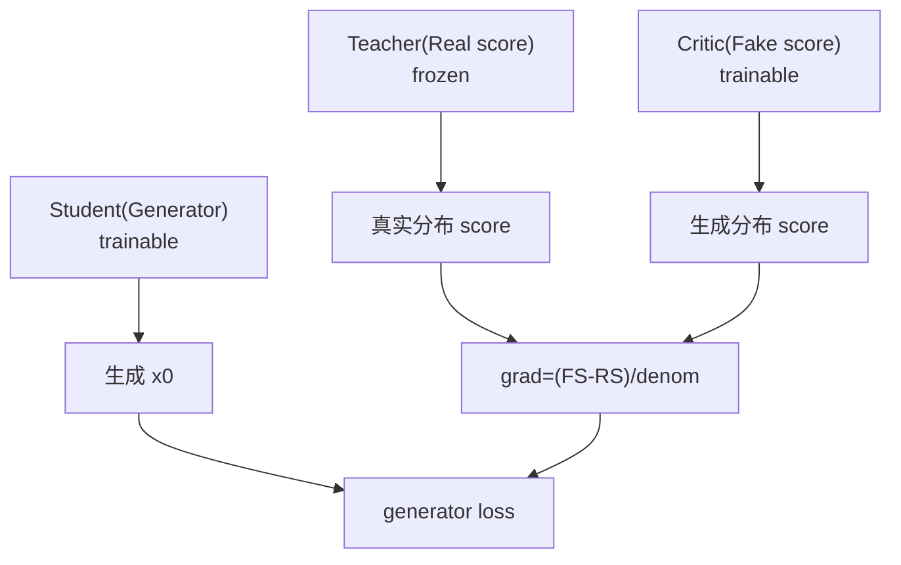

# 蒸馏：DMD / Sparse Distillation

> 知识点扩展：diffusion distillation、DMD/DMD2、sparse distillation、consistency/score matching，回扣 FastVideo。

## 1. 为什么蒸馏扩散模型

扩散需 50 步去噪，慢。蒸馏训练一个 student 用 1-4 步达到接近 teacher（多步）的质量。FastVideo（FastWan）靠蒸馏实现"5s 视频 1.8s 生成"。

### 1.1 蒸馏 vs 少步采样器

都想减步数，区别：
- **少步采样器**（DPM-Solver/UniPC）：不改模型权重，靠更好的数值积分，极限约 10-15 步，再少质量崩。
- **蒸馏**：改模型权重（重新训练 student），能压到 1-4 步。代价是要训练。

FastVideo 两者都用：默认推理用高阶采样器（20-50 步），追求极速时用蒸馏模型（FastWan，1-4 步）。

## 2. 蒸馏范式分类

| 范式 | 思想 | FastVideo |
|------|------|-----------|
| **轨迹蒸馏（KD）** | student 学 teacher 的 ODE 轨迹 | `KDMethod` |
| **一致性蒸馏** | student 满足自一致性（consistency models） | `RCMScheduler` 相关 |
| **分布匹配（DMD）** | student 分布逼近 teacher 分布 | `DMD2Method` |
| **因果蒸馏** | 流式/自回归蒸馏 | `SelfForcingMethod` |

### 2.1 三种范式的本质差异

- **轨迹蒸馏**：监督"过程"。student 在每个中间点都要匹配 teacher 走过的轨迹点。简单但受限于 teacher 轨迹质量。
- **一致性蒸馏**：监督"自一致"。要求 student 从轨迹任意点都能一步跳到终点，且不同点跳到的终点一致。
- **分布匹配（DMD）**：监督"分布"。不管单条轨迹，只要 student 生成的**整体分布**接近真实分布。质量最高，是当前 SOTA，也最复杂（三网络）。

## 3. DMD / DMD2（Distribution Matching Distillation）

核心：不逐点匹配，而是让 student 生成的**分布**逼近 teacher 分布。用三个网络：
- **Generator（student）**：少步生成 x0。
- **Real score（teacher）**：冻结，估计真实数据分布 score。
- **Fake score（critic）**：可训练，估计 student 生成分布 score。

分布匹配梯度：
```python
# train/methods/distribution_matching/dmd2.py:_dmd_loss (L600)
grad = (fake_score_x0 - real_cfg_x0) / denom
loss = 0.5 * MSE(gen_x0, (gen_x0 - grad).detach())
```

直觉：梯度指向"真实分布 - 生成分布"的方向，推 student 向真实分布靠拢。critic 同时被训练来跟踪 student 的当前分布（`_critic_flow_matching_loss`）。

### 3.1 为什么需要 critic（fake score）

KL 散度的梯度需要两个 score：真实分布的 `∇log p_real`（teacher 提供）和生成分布的 `∇log p_fake`（critic 提供）。student 的生成分布随训练不断变化，所以 critic 必须**同步训练**去跟踪当前 student 分布——这是一个类似 GAN 的"生成器 vs 判别器"交替优化，但用 score 而非二分类。

### 3.2 DMD vs DMD2 的改进

- **DMD**：需要一个回归 loss 项辅助稳定（要预生成 teacher 样本对）。
- **DMD2**：去掉回归项，加 GAN loss + two-time-scale 更新（critic 更新更频繁），去掉了预生成数据的需求，更简洁高效。FastVideo 的 `DMD2Method` 有 `generator_update_interval`（student 更新频率低于 critic）体现 two-time-scale。

### 3.3 训练稳定性要点（读代码会看到）

- critic 和 student 独立 optimizer、独立学习率（`fake_score_learning_rate`）。
- `generator_update_interval`：critic 每步更新，student 每 N 步更新（让 critic 先追上分布）。
- teacher 用 CFG（`real_score_guidance_scale`）增强真实 score 信号。

## 4. Score Matching 思想

score = `∇log p(x)`（对数概率梯度，指向数据密度上升方向）。扩散模型本质学 score（denoiser 与 score 等价：`score ≈ -(x_t - √ᾱ·x̂_0)/(1-ᾱ)`）。DMD 用两个 score 网络（real/fake）的差作为分布匹配信号，是 score matching 的应用。

**简单代码示例（教学用，DMD2 训练一步的简化版）**：
```python
import torch, torch.nn as nn

# 三个网络，真实里都是完整的 DiT
student = nn.Sequential(nn.Linear(256, 128), nn.GELU(), nn.Linear(128, 256))  # generator，可训练
teacher = nn.Sequential(nn.Linear(256, 128), nn.GELU(), nn.Linear(128, 256))  # real score，冻结（不做 backward）
critic  = nn.Sequential(nn.Linear(256, 128), nn.GELU(), nn.Linear(128, 256))  # fake score，可训练

# 训练一步（简化，略去 rollout 和两步更新细节）
def dmd2_train_step(noise, clean_x0, student_opt, critic_opt, gen_update=True):
    B = noise.shape[0]
    t = torch.rand(B, 1)                         # 随机 σ
    x_t = (1 - t) * clean_x0 + t * noise         # 加噪

    with torch.no_grad():
        # teacher 做 CFG x0（真实分布 score 的方向）
        real_cond = teacher(torch.cat([x_t, torch.ones(B, 1)], -1))   # 简化：多拼一个条件标记
        real_uncond = teacher(torch.cat([x_t, torch.zeros(B, 1)], -1))
        real_cfg = real_uncond + 3.5 * (real_cond - real_uncond)       # CFG 组合

    # --- 更新 critic（fake score，始终训练）---
    gen_x0_no_grad = student(x_t).detach()
    critic_pred = critic(torch.cat([x_t, torch.ones(B, 1)], -1))
    critic_loss = ((critic_pred - (noise - gen_x0_no_grad)) ** 2).mean()   # flow matching
    critic_opt.zero_grad(); critic_loss.backward(); critic_opt.step()

    gen_loss = torch.tensor(0.0)
    if gen_update:
        # --- 更新 student（generator）---
        gen_x0 = student(x_t)
        faker_x0 = critic(torch.cat([x_t, torch.ones(B, 1)], -1)).detach()  # critic 评 student 分布
        grad = (faker_x0 - real_cfg) / 1e-3                                  # 分布匹配梯度方向
        gen_loss = 0.5 * ((gen_x0 - (gen_x0 - grad).detach()) ** 2).mean()   # 推 student 向真实分布
        student_opt.zero_grad(); gen_loss.backward(); student_opt.step()
    return {"critic_loss": critic_loss.item(), "gen_loss": gen_loss.item()}
```
对应 FastVideo 源码 `train/methods/distribution_matching/dmd2.py`：`single_train_step` → `_dmd_loss`(L600) + `_critic_flow_matching_loss`。

## 5. Consistency 思想

Consistency models 要求"同一轨迹上任意点都映射到同一起点"。FastVideo 有 `RCMScheduler`（`scheduling_rcm.py`）和相关 consistency finetune（`examples/training/consistency_finetune/`）。

## 6. Sparse Distillation（FastVideo 特色）

结合稀疏 attention（VSA）+ 蒸馏，实现 >50× 去噪加速：
- 稀疏 attention（VSA）降低每步计算。
- 蒸馏降低步数（50→3）。
- 两者叠加：既少步又每步快。

见 blog "fastvideo_post_training"。VSA 在训练时也用（`VSA_sparsity` 传入 `TrainingConfig`）。

## 7. Self-Forcing（因果蒸馏）

```
源码：train/methods/distribution_matching/self_forcing.py，继承 DMD2Method
```
用于因果/流式模型（CausalWan）。逐块 rollout，KV cache 传播上下文，实现自回归生成的蒸馏。

## 8. KD（知识蒸馏，轨迹缓存）

```
源码：train/methods/knowledge_distillation/kd.py
```
两阶段：teacher 跑 48 步 ODE 存磁盘 → 释放 teacher → student 读缓存学习。省显存。

## 9. loss 汇总

| 方法 | loss |
|------|------|
| KD | `0.5·MSE(pred_x0, real)` |
| DMD2 generator | `0.5·MSE(gen_x0, (gen_x0-grad).detach())` |
| DMD2 critic | `MSE(critic_pred, noise-gen_x0)` |

## 10. teacher/student/critic 角色



## 11. 回扣源码
| 概念 | 源码 |
|------|------|
| DMD2 | `train/methods/distribution_matching/dmd2.py` |
| KD | `train/methods/knowledge_distillation/kd.py` |
| Self-Forcing | `train/methods/distribution_matching/self_forcing.py` |
| 旧栈蒸馏 | `training/distillation_pipeline.py` |
| 稀疏 | `attention/backends/video_sparse_attn.py` |

## 12. 延伸
- 蒸馏流程：[`../03_core_flows/09_distillation_flow.md`](../03_core_flows/09_distillation_flow.md)
- 稀疏注意力：[`06_sparse_attention.md`](06_sparse_attention.md)
