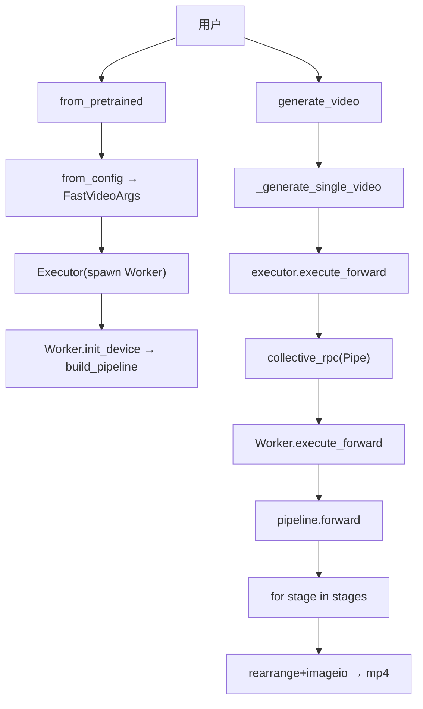
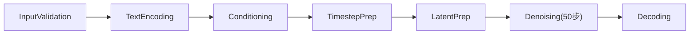
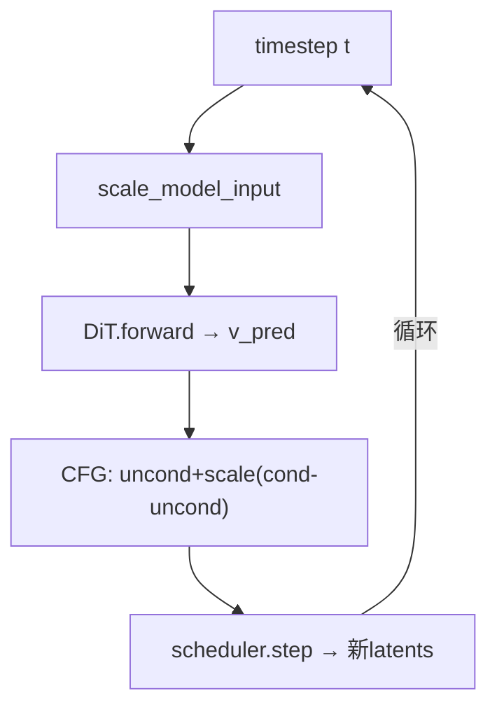
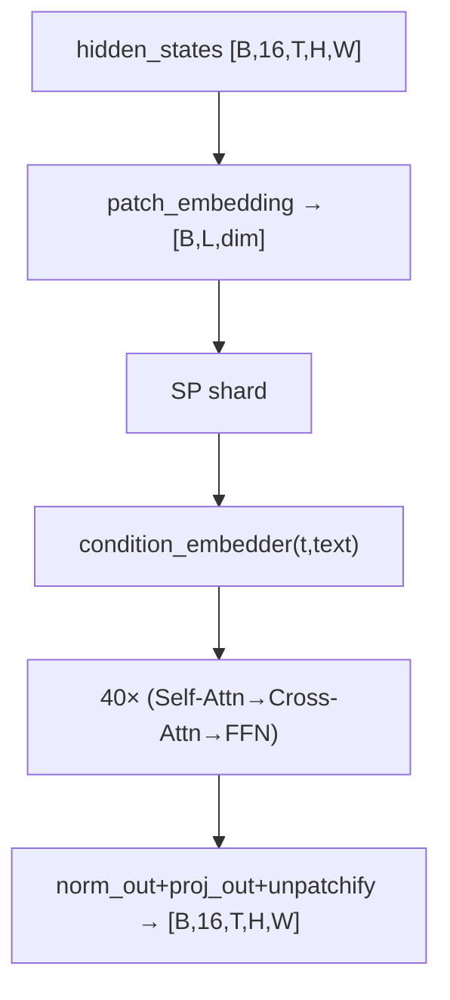
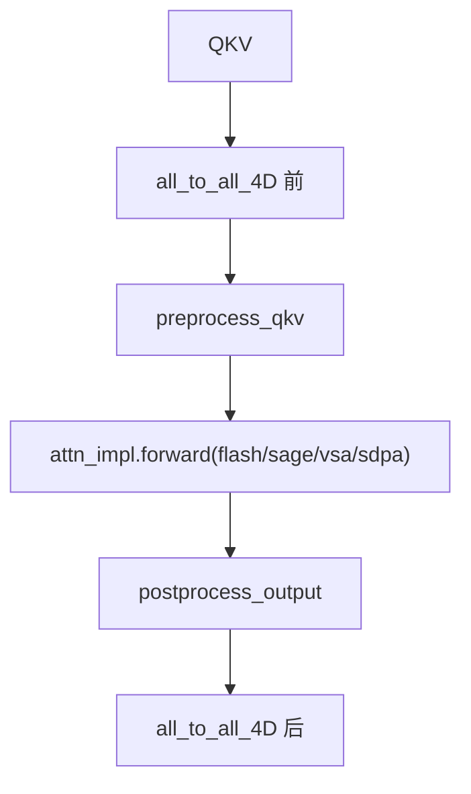
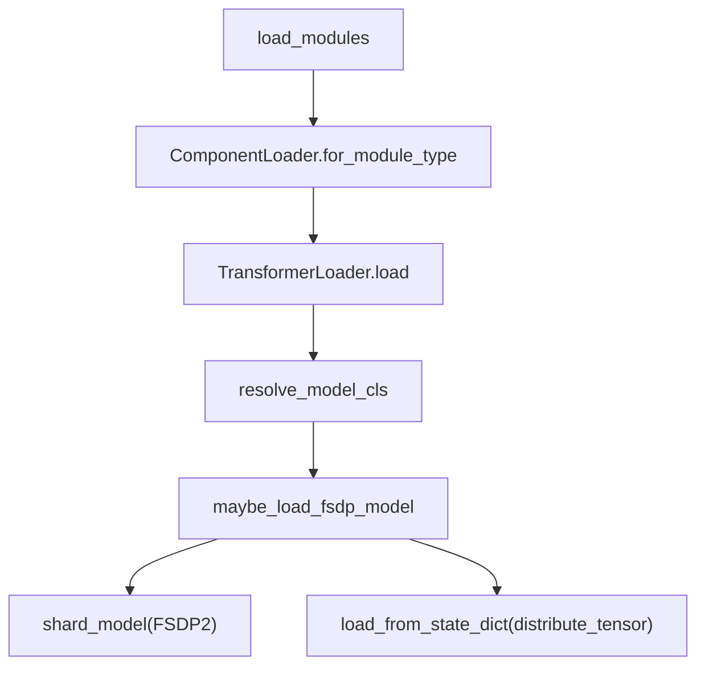
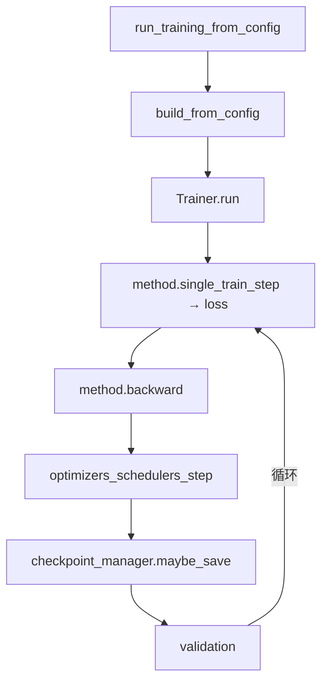
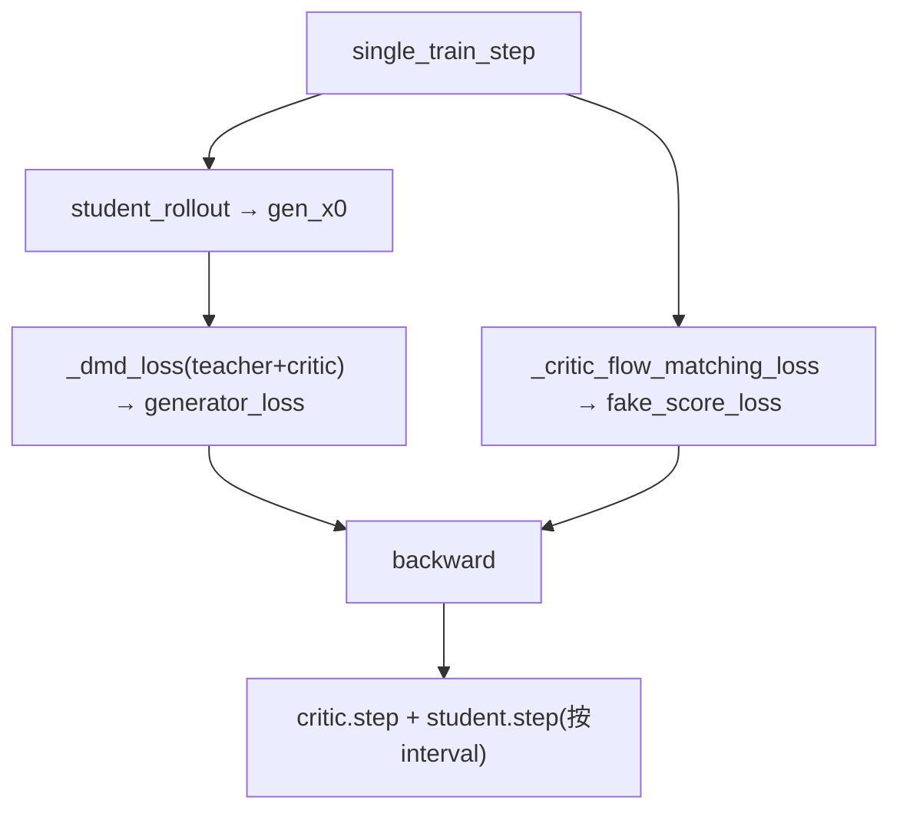
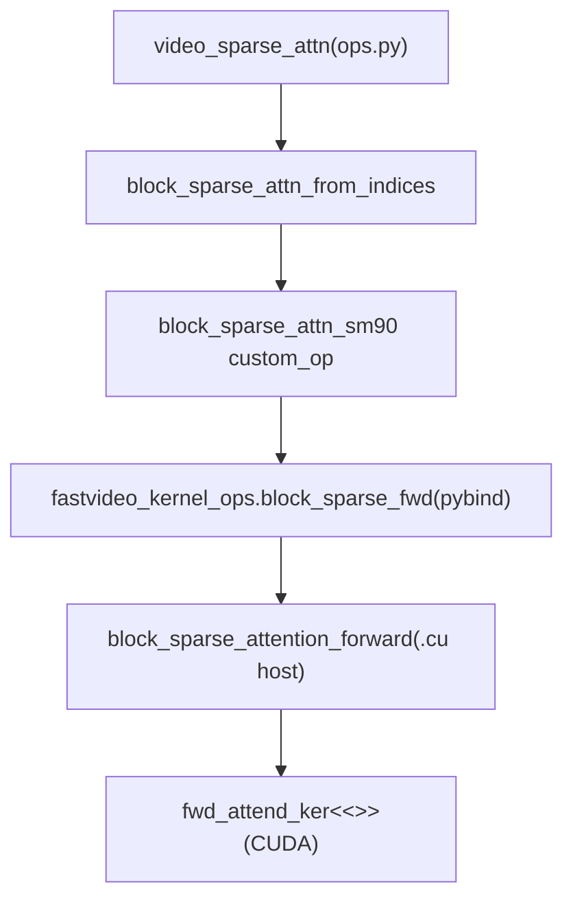
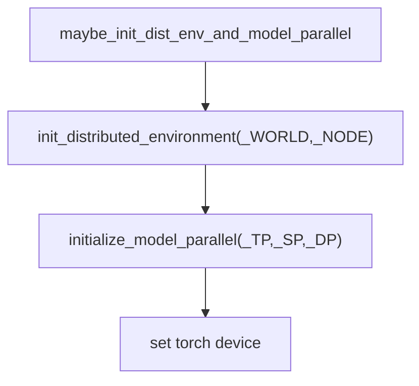

# 调用图集

> 汇总各主要流程的调用图，方便速查。详细版见 `03_core_flows/`。

## 1. 推理主链路

## 2. Pipeline stages

## 3. 去噪循环

## 4. DiT forward（Wan）

## 5. Attention（SP + 后端）

## 6. 模型加载

## 7. 训练主循环（新栈）

## 8. DMD2 蒸馏

## 9. Python → CUDA kernel（VSA）

## 10. 分布式初始化

## 相关
- 各流程详解见 `03_core_flows/`。
