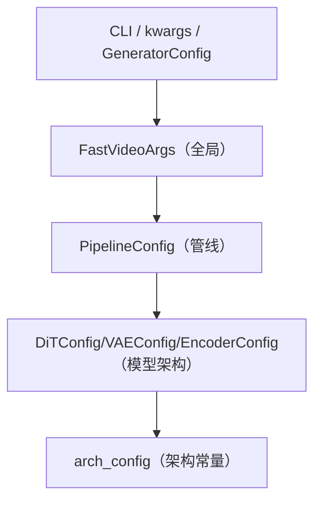
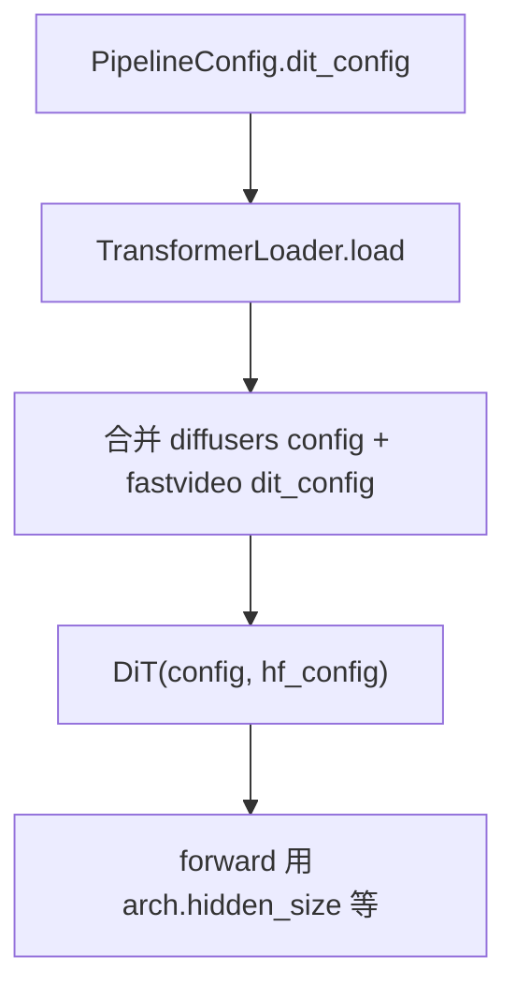

# 配置系统

> FastVideo 的配置层次复杂。本文理清 CLI/kwargs → FastVideoArgs → PipelineConfig → 模型 的完整传递。

## 1. 配置的三个层次



| 层 | 类 | 内容 | 何时固定 |
|----|-----|------|---------|
| 全局 | `FastVideoArgs` | 并行、offload、compile、mode | 加载时 |
| 管线 | `PipelineConfig` | 子模块配置、精度、flow_shift | 加载时 |
| 模型 | `DiTConfig` 等 | hidden_size、num_heads、压缩比 | 加载时（从 config.json） |
| 运行时 | `SamplingParam` | prompt、分辨率、步数 | 每次生成可变 |

## 2. FastVideoArgs（fastvideo_args.py L82）

全局参数根。关键分组：
- 模式：`mode`, `workload_type`, `inference_mode`。
- 并行：`num_gpus`, `tp_size`, `sp_size`, `hsdp_replicate_dim`, `hsdp_shard_dim`。
- offload：`dit_cpu_offload` 等。
- compile：`enable_torch_compile`, `torch_compile_kwargs`。
- 内嵌：`pipeline_config: PipelineConfig`。

构建方法：`from_cli_args`(L663) / `from_kwargs`(L714)。校验：`check_fastvideo_args`(L731)。

## 3. PipelineConfig（configs/pipelines/base.py L28）

```python
model_path: str
embedded_cfg_scale: float = 6.0
flow_shift: float | None = None
dit_config: DiTConfig
vae_config: VAEConfig
text_encoder_configs: tuple[EncoderConfig, ...]
text_encoder_precisions: tuple[str, ...]
```

`from_kwargs`（L219）流程：
```
1. get_pipeline_config_cls_from_name(model_path)   # registry 匹配 → WanT2V480PConfig
2. pipeline_config_cls()（__post_init__ 覆盖默认）
3. load_from_json 可选覆盖
4. update_config_from_dict(kwargs)（CLI 前缀 setattr，递归子 config）
```

## 4. ModelConfig 的 __getattr__ 代理（configs/models/base.py）

```python
class ModelConfig:
    def __getattr__(self, name):
        return getattr(self.arch_config, name)   # 代理到 arch_config
```
所以 `dit_config.hidden_size` 实际读 `dit_config.arch_config.hidden_size`。arch_config 存架构常量（从 diffusers config.json 加载）。

- `update_model_arch`（L44）：从 config.json 加载架构常量。
- `update_model_config`（L55）：更新 ModelConfig 自身字段。

## 5. 配置注册（registry.py L132）

```python
register_configs(
    pipeline_config_cls=WanT2V480PConfig,
    workload_types=(WorkloadType.T2V,),
    hf_model_paths=["Wan-AI/Wan2.1-T2V-1.3B-Diffusers"],
    model_detectors=[lambda p: "wanpipeline" in p.lower()],
    default_preset="wan_t2v_1_3b")
```
匹配策略：exact → partial name → detector 函数。

## 6. CLI override（新训练栈）

新训练栈用虚线 key override：
```bash
bash run.sh x.yaml --request.sampling.seed 42 --generator.engine.num_gpus 2
```
`train/utils/config.py:_parse_cli_overrides`（L415）解析。

## 7. 配置如何到模型



## 8. 配置传递给 worker

`FastVideoArgs`（含 `PipelineConfig`）被序列化，通过 executor 传给每个 worker 子进程。worker 用它 `build_pipeline`。

## 9. 常见困惑

- **PipelineConfig vs SamplingParam**：前者加载时（模型/精度），后者运行时（prompt/分辨率）。
- **ModelConfig vs ArchConfig**：ModelConfig 是外壳，ArchConfig 存架构常量，通过 `__getattr__` 打通。
- **两套训练配置**：新栈 `TrainingConfig`（YAML dataclass），旧栈 `TrainingArgs`（argparse）。

## 10. 回扣源码
| 概念 | 源码 |
|------|------|
| 全局参数 | `fastvideo_args.py:FastVideoArgs` |
| 管线配置 | `configs/pipelines/base.py:PipelineConfig` |
| 模型配置 | `configs/models/base.py:ModelConfig` |
| 注册 | `registry.py:register_configs` |
| CLI override | `train/utils/config.py` |
