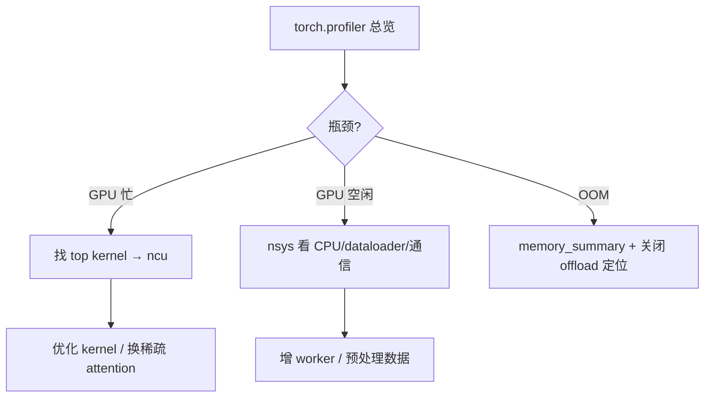

# 如何做性能分析

> 定位 FastVideo 推理/训练的性能瓶颈：torch.profiler、nsys、ncu、显存、attention、dataloader、kernel。

## 1. torch.profiler（首选，Python 层）

```python
from torch.profiler import profile, ProfilerActivity, schedule

with profile(
    activities=[ProfilerActivity.CPU, ProfilerActivity.CUDA],
    schedule=schedule(wait=1, warmup=1, active=3),
    on_trace_ready=torch.profiler.tensorboard_trace_handler("./prof"),
    record_shapes=True, profile_memory=True, with_stack=True,
) as prof:
    for step in range(5):
        generator.generate_video(prompt="test", num_frames=17, height=256, width=256)
        prof.step()
print(prof.key_averages().table(sort_by="cuda_time_total", row_limit=20))
```
用 TensorBoard 看 trace：`tensorboard --logdir ./prof`。看哪些 op 占 CUDA 时间。

FastVideo 内置 `fastvideo/profiler.py`，可能有封装（**待确认具体 API**）。

## 2. nsys（系统级，时间线）

```bash
nsys profile -o report --trace=cuda,nvtx,osrt \
    python examples/inference/basic/basic.py
nsys stats report.nsys-rep
```
看 GPU 利用率、kernel 时间线、CPU-GPU 同步、NCCL 通信。适合定位"GPU 空闲等 CPU"或"通信占比高"。

## 3. ncu（单 kernel 深度分析）

```bash
ncu --set full -k "fwd_attend_ker" -o kernel_report \
    python -c "..."   # 触发特定 kernel
```
分析单个 CUDA kernel 的占用率、访存效率、warp 效率。用于优化 fastvideo-kernel 里的 kernel。

## 4. 定位显存瓶颈

```python
torch.cuda.reset_peak_memory_stats()
generator.generate_video(...)
print(torch.cuda.max_memory_allocated() / 1e9, "GB")
```
- `generate_video` 返回的 `peak_memory_mb`。
- `torch.cuda.memory_summary()` 看碎片。
- 逐个关闭 offload 定位哪个模块吃显存。
- VAE decode 通常是峰值——试 VAE tiling。

## 5. 定位 attention 耗时

```bash
FASTVIDEO_ATTENTION_BACKEND=SDPA python ...   # 基线
FASTVIDEO_ATTENTION_BACKEND=FLASH_ATTN python ...  # 对比
```
在 profiler 里看 attention op 占比。视频 DiT 中 attention 常是最大头。稀疏后端（VSA）可大幅降低。

## 6. 定位 dataloader 瓶颈

```bash
python fastvideo/dataset/benchmarks/benchmark_parquet_dataset_iterable_style.py
```
测 `samples/sec`。若 GPU 利用率低（nsys 看到 GPU 空闲），可能 dataloader 慢：
- 增加 `dataloader_num_workers`。
- 确认数据已预处理成 latent（不在训练时解码）。

## 7. 定位 CUDA kernel 耗时

torch.profiler 表格里按 `cuda_time_total` 排序，找 top kernel。若是 fastvideo-kernel 的 kernel（block_sparse/sta），用 ncu 深入。

## 8. 查看 tensor shape

```python
# 在 stage 循环或 DiT forward 打印
print(batch.latents.shape, batch.prompt_embeds[0].shape)
```
或 profiler `record_shapes=True` 后表格带 shape。

## 9. 各 stage 耗时（内置）

`ForwardBatch.logging_info` 记录每个 stage 耗时（`PipelineStage.__call__` 自动记）。检查哪个 stage 慢。

## 10. torch.compile 加速

```python
VideoGenerator.from_pretrained(model, enable_torch_compile=True,
    torch_compile_kwargs={"mode": "max-autotune-no-cudagraphs"})
```
编译 DiT，首次慢（编译）后续快。注意 attention 默认禁 compile（`layer.py`）。

## 11. 分析流程建议



## 12. 参考
- `fastvideo/profiler.py`（内置）。
- `fastvideo/tests/performance/`（性能基准）。
- `apps/performance_dashboard/`（性能追踪可视化）。
- 显存优化：[`../04_knowledge_expansion/13_memory_optimization.md`](../04_knowledge_expansion/13_memory_optimization.md)
