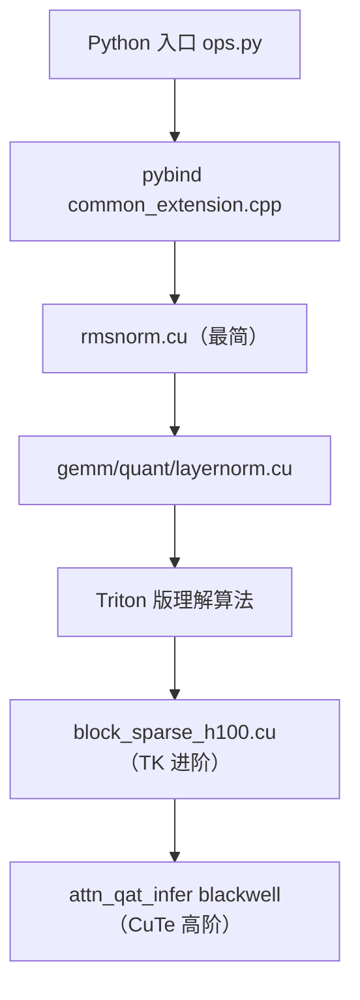

# 如何读 CUDA Kernel

> fastvideo-kernel 的 kernel 用了 ThunderKittens/CuTe DSL，直接读很难。本文给循序渐进的读法。

## 1. 先建立 Python → CUDA 的映射

不要一上来读 `.cu`。先顺着 Python 找到入口：
```
attention/backends/video_sparse_attn.py:video_sparse_attn
  → fastvideo_kernel/ops.py:video_sparse_attn
    → block_sparse_attn.py:block_sparse_attn_from_indices
      → pybind: fastvideo_kernel_ops.block_sparse_fwd
        → csrc/attention/block_sparse_h100.cu:block_sparse_attention_forward (host)
          → fwd_attend_ker<D><<<grid>>> (device kernel)
```
理解每层的输入输出（tensor 形状），再看 CUDA。

## 2. 从最简单的 kernel 入门

读 `csrc/turbodiffusion/norm/rmsnorm.cu`（80 行）：
```
RMSNorm: y = w * x / sqrt(mean(x²) + eps)
```
- 每个 CTA（block）处理一行。
- warp shuffle reduction 求 `mean(x²)`。
- 这是标准 CUDA 模式，没有 TK/CuTe，适合入门。

然后读 `layernorm.cu` / `quant.cu` / `gemm.cu`（都在 turbodiffusion，通用架构）。

## 3. 理解 pybind 注册

`csrc/common_extension.cpp`：
```cpp
m.def("rms_norm_cuda", &rms_norm);   // Python 名 → C++ 函数
```
Python 侧 `fastvideo_kernel_ops.rms_norm_cuda` 对应这里。

## 4. host 函数 vs device kernel

`.cu` 文件里：
- **host 函数**（如 `sta_forward`）：CPU 上跑，验证输入、分配输出、算 grid/block、launch kernel。
- **device kernel**（如 `fwd_attend_ker`，带 `__global__` 或 TK 模板）：GPU 上跑。

先读 host 函数理解数据流，再看 device kernel 的计算。

## 5. 读 ThunderKittens kernel（进阶）

`csrc/attention/block_sparse_h100.cu` 用 TK DSL。关键概念：
- **TMA**：`tma::load_async` 异步加载 tile 到 shared memory。
- **wgmma**：warpgroup 矩阵乘（`wgmma::ABt` = QKᵀ，`wgmma::AB` = PV）。
- **online softmax**：`exp2` + rescale，不存全矩阵。
- **warp specialization**：producer warp（TMA 加载）+ consumer warp（wgmma 计算）分工，用 named barrier 同步。

读法：
1. 找 kernel 模板参数（编译期常量：head dim、窗口大小）。
2. 找 producer/consumer 分工。
3. 跟 online softmax 的累积逻辑。

## 6. 读 CuTe DSL kernel（Blackwell）

`attn_qat_infer/blackwell/` 用 CUTLASS CuTe。更抽象，涉及 layout algebra、tiled copy/mma。建议对 CUTLASS 有基础再读。

## 7. Triton fallback（易读替代）

如果 CUDA 太难，读对应的 Triton 版本（`python/fastvideo_kernel/triton_kernels/`）。Triton 是 Python DSL，逻辑一致但可读性高。例如 `block_sparse_attn_triton.py` 对应 `block_sparse_h100.cu`。

## 8. 验证理解：跑测试

```bash
cd fastvideo-kernel
python tests/test_turbodiffusion.py   # INT8/norm
python tests/test_vsa_correctness.py  # VSA
```
测试对比 kernel 输出与参考实现，帮你确认对 kernel 语义的理解。

## 9. 读 kernel 的心态

- 不必逐行懂 TK/CuTe 的每个 API——先懂**算法**（online softmax、block sparse），再懂**优化**（TMA/wgmma/warp spec）。
- host 函数比 device kernel 好懂，先读它。
- Triton 版是理解 CUDA 版的捷径。

## 10. 阅读路线



## 11. 参考
- kernel 目录：[`../02_source_by_directory/11_fastvideo_kernel.md`](../02_source_by_directory/11_fastvideo_kernel.md)
- extension 知识：[`../04_knowledge_expansion/11_cuda_kernel_and_pytorch_extension.md`](../04_knowledge_expansion/11_cuda_kernel_and_pytorch_extension.md)
