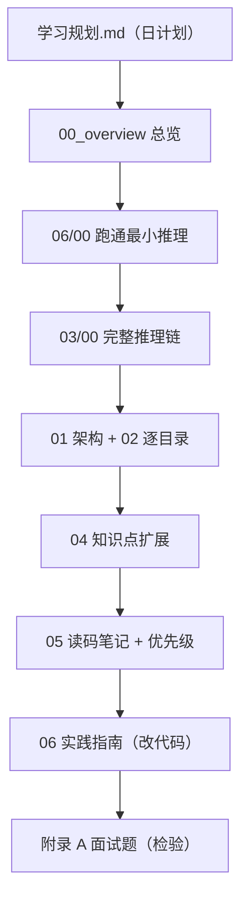

# FastVideo 源码学习笔记 · 总索引

> 本笔记基于对 `/home/hpc/ghr_code/code/FastVideo` 的源码级解析（861 个 Python 文件 + 71 个 kernel 文件）。
> 目标：从"能跑通"到"读懂源码实现"。所有结论尽量绑定到具体源码文件/类/函数。
> 未完全确认处标注"待确认"，不臆造。

---

## 快速开始

- **跟计划学**：[`学习规划.md`](学习规划.md) — 每天 45 分钟 × 31 天，带重要性评级、配套笔记、面试题、工业实践。
- **刚接触**：先读 [`00_overview/00_project_overview.md`](00_overview/00_project_overview.md)。
- **想跑通**：[`00_overview/01_install_and_env.md`](00_overview/01_install_and_env.md) + [`06_practical_guides/00_minimal_inference_example.md`](06_practical_guides/00_minimal_inference_example.md)。
- **读源码**：按 [`05_code_reading_notes/00_reading_order.md`](05_code_reading_notes/00_reading_order.md) 的文件优先级。
- **复习面试**：[`学习规划.md` 附录 A](学习规划.md) — 19 道面试题 + 评分表。

---

## 全部笔记清单

### 00_overview —— 总览
| 文件 | 内容 |
|------|------|
| [00_project_overview.md](00_overview/00_project_overview.md) | 项目定位、核心接口、目录地图、设计哲学 |
| [01_install_and_env.md](00_overview/01_install_and_env.md) | 安装、依赖、kernel 编译、环境变量 |
| [02_learning_map.md](00_overview/02_learning_map.md) | 三阶段学习路线 |

### 01_architecture —— 架构
| 文件 | 内容 |
|------|------|
| [00_global_architecture.md](01_architecture/00_global_architecture.md) | 五层架构、Facade/Executor/Worker、Stage 组合 |
| [01_inference_pipeline.md](01_architecture/01_inference_pipeline.md) | 推理流水线、7 个 stage |
| [02_training_pipeline.md](01_architecture/02_training_pipeline.md) | 训练双栈、主循环、flow matching loss |
| [03_distributed_architecture.md](01_architecture/03_distributed_architecture.md) | TP/SP/FSDP、通信组 |
| [04_kernel_architecture.md](01_architecture/04_kernel_architecture.md) | CUDA 扩展、Python→CUDA 链 |

### 02_source_by_directory —— 逐目录解析
| 文件 | 内容 |
|------|------|
| [00_directory_tree.md](02_source_by_directory/00_directory_tree.md) | 完整目录树 |
| [01_fastvideo_package.md](02_source_by_directory/01_fastvideo_package.md) | 包总览、__init__、FastVideoArgs |
| [02_entrypoints.md](02_source_by_directory/02_entrypoints.md) | VideoGenerator、CLI、OpenAI API、streaming |
| [03_pipelines.md](02_source_by_directory/03_pipelines.md) | ComposedPipeline、stages、ForwardBatch |
| [04_models.md](02_source_by_directory/04_models.md) | DiT/VAE/Encoder/Scheduler、注册、加载（总览） |
| [04a_dit_wanvideo.md](02_source_by_directory/04a_dit_wanvideo.md) | **Wan DiT 层级精读**（推荐先读） |
| [04b_dit_hunyuanvideo.md](02_source_by_directory/04b_dit_hunyuanvideo.md) | **Hunyuan MMDiT 层级精读** |
| [04c_dit_cosmos.md](02_source_by_directory/04c_dit_cosmos.md) | **Cosmos DiT 层级精读**（AdaLN-Zero） |
| [04d_dit_ltx2.md](02_source_by_directory/04d_dit_ltx2.md) | **LTX-2 双模态 DiT 层级精读** |
| [04e_vae_detailed.md](02_source_by_directory/04e_vae_detailed.md) | **VAE encode/decode 内部精读** |
| [04f_other_models_overview.md](02_source_by_directory/04f_other_models_overview.md) | 其余模型族概览（SD3/Flux2/Causal/GEN3C...） |
| [05_attention.md](02_source_by_directory/05_attention.md) | 后端选择、各 attention 后端 |
| [06_dataset.md](02_source_by_directory/06_dataset.md) | 数据集、Parquet、dataloader |
| [07_distributed.md](02_source_by_directory/07_distributed.md) | GroupCoordinator、SP、FSDP、TP 层 |
| [08_training.md](02_source_by_directory/08_training.md) | 训练双栈、method、LoRA、蒸馏、checkpoint |
| [09_eval.md](02_source_by_directory/09_eval.md) | 评测指标、注册、异步解码 |
| [10_configs.md](02_source_by_directory/10_configs.md) | 配置层次、layers 基础层 |
| [11_fastvideo_kernel.md](02_source_by_directory/11_fastvideo_kernel.md) | CUDA 扩展、pybind、编译 |
| [12_apps_dreamverse.md](02_source_by_directory/12_apps_dreamverse.md) | 实时视频应用 |
| [13_examples_and_scripts.md](02_source_by_directory/13_examples_and_scripts.md) | 示例与脚本 |

### 03_core_flows —— 核心调用链
| 文件 | 内容 |
|------|------|
| [00_video_generation_flow.md](03_core_flows/00_video_generation_flow.md) | 完整推理链（最重要） |
| [01_from_pretrained_flow.md](03_core_flows/01_from_pretrained_flow.md) | 加载 → spawn worker |
| [02_generate_video_flow.md](03_core_flows/02_generate_video_flow.md) | 生成 → mp4 |
| [03_model_loading_flow.md](03_core_flows/03_model_loading_flow.md) | 模型/权重加载、FSDP |
| [04_prompt_to_video_tensor_flow.md](03_core_flows/04_prompt_to_video_tensor_flow.md) | 张量形状全链路 |
| [05_scheduler_and_sampling_flow.md](03_core_flows/05_scheduler_and_sampling_flow.md) | flow matching 采样 |
| [06_vae_decode_flow.md](03_core_flows/06_vae_decode_flow.md) | VAE decode |
| [07_attention_backend_flow.md](03_core_flows/07_attention_backend_flow.md) | attention → kernel |
| [08_lora_finetune_flow.md](03_core_flows/08_lora_finetune_flow.md) | LoRA 注入与训练 |
| [09_distillation_flow.md](03_core_flows/09_distillation_flow.md) | DMD2/KD/Self-Forcing |
| [10_data_input_flow_and_shapes.md](03_core_flows/10_data_input_flow_and_shapes.md) | **数据输入→模型流动→输出 完整张量流**（T2V/I2V/V2V） |

### 04_knowledge_expansion —— 知识点扩展
| 文件 | 内容 |
|------|------|
| [00_video_diffusion_basics.md](04_knowledge_expansion/00_video_diffusion_basics.md) | 扩散/latent diffusion/T2V |
| [01_dit_transformer_for_video.md](04_knowledge_expansion/01_dit_transformer_for_video.md) | DiT/MMDiT/3D patch/AdaLN |
| [02_text_encoder_and_prompt_encoding.md](04_knowledge_expansion/02_text_encoder_and_prompt_encoding.md) | text encoder |
| [03_vae_for_video.md](04_knowledge_expansion/03_vae_for_video.md) | VAE/latent space/tiling |
| [04_scheduler_sampling_solver.md](04_knowledge_expansion/04_scheduler_sampling_solver.md) | DDPM/DDIM/DPM/Flow Matching |
| [05_attention_acceleration.md](04_knowledge_expansion/05_attention_acceleration.md) | FlashAttention/SageAttention/KV cache |
| [06_sparse_attention.md](04_knowledge_expansion/06_sparse_attention.md) | VSA/BSA/SLA/VMoBA/STA |
| [07_sequence_parallelism.md](04_knowledge_expansion/07_sequence_parallelism.md) | SP/all-to-all |
| [08_fsdp_and_distributed_training.md](04_knowledge_expansion/08_fsdp_and_distributed_training.md) | FSDP2/AC/mixed precision/offload |
| [09_lora_finetuning.md](04_knowledge_expansion/09_lora_finetuning.md) | LoRA 原理 |
| [10_distillation_dmd_sparse_distill.md](04_knowledge_expansion/10_distillation_dmd_sparse_distill.md) | DMD/sparse distill/consistency |
| [11_cuda_kernel_and_pytorch_extension.md](04_knowledge_expansion/11_cuda_kernel_and_pytorch_extension.md) | CUDA/extension/kernel 注册 |
| [12_flashattention_sageattention_flashinfer.md](04_knowledge_expansion/12_flashattention_sageattention_flashinfer.md) | 三大加速库 |
| [13_memory_optimization.md](04_knowledge_expansion/13_memory_optimization.md) | 显存优化手段 |
| [14_video_dataset_and_preprocessing.md](04_knowledge_expansion/14_video_dataset_and_preprocessing.md) | 数据处理 |
| [15_evaluation_metrics.md](04_knowledge_expansion/15_evaluation_metrics.md) | PSNR/SSIM/LPIPS/FVD/VBench |

### 05_code_reading_notes —— 读码笔记
| 文件 | 内容 |
|------|------|
| [00_reading_order.md](05_code_reading_notes/00_reading_order.md) | 分阶段阅读顺序 |
| [01_key_classes.md](05_code_reading_notes/01_key_classes.md) | 关键类索引表（含优先级） |
| [02_key_functions.md](05_code_reading_notes/02_key_functions.md) | 关键函数索引 |
| [03_call_graphs.md](05_code_reading_notes/03_call_graphs.md) | 调用图集 |
| [04_config_system.md](05_code_reading_notes/04_config_system.md) | 配置系统 |
| [05_common_design_patterns.md](05_code_reading_notes/05_common_design_patterns.md) | 常见设计模式 |
| [06_debugging_tips.md](05_code_reading_notes/06_debugging_tips.md) | 调试技巧 |

### 06_practical_guides —— 实践指南
| 文件 | 内容 |
|------|------|
| [00_minimal_inference_example.md](06_practical_guides/00_minimal_inference_example.md) | 最小推理示例 |
| [01_how_to_add_new_model.md](06_practical_guides/01_how_to_add_new_model.md) | 添加新模型 |
| [02_how_to_add_new_pipeline.md](06_practical_guides/02_how_to_add_new_pipeline.md) | 添加新 pipeline |
| [03_how_to_add_attention_backend.md](06_practical_guides/03_how_to_add_attention_backend.md) | 添加 attention 后端 |
| [04_how_to_add_dataset.md](06_practical_guides/04_how_to_add_dataset.md) | 添加数据集 |
| [05_how_to_train_lora.md](06_practical_guides/05_how_to_train_lora.md) | 训练 LoRA |
| [06_how_to_profile_performance.md](06_practical_guides/06_how_to_profile_performance.md) | 性能分析 |
| [07_how_to_read_cuda_kernel.md](06_practical_guides/07_how_to_read_cuda_kernel.md) | 读 CUDA kernel |

---

## 建议阅读顺序（一图流）

## 知识领域速查

| 想学的内容 | 优先看 |
|-----------|--------|
| 推理 Pipeline / 生成视频 | `03_core_flows/00-02`, `01_architecture/01`, 学习规划 Day 1-5 |
| DiT Transformer 内部 | `02_source_by_directory/04a-04f`, `04_knowledge_expansion/01`, 学习规划 Day 6-7 |
| VAE / Scheduler / TextEncoder | `03_core_flows/05-06`, `04_knowledge_expansion/02-04`, 学习规划 Day 7-8 |
| 训练 / LoRA / 蒸馏 | `01_architecture/02`, `03_core_flows/08-09`, 学习规划 Day 11-16 |
| 分布式推理 (SP/TP) | `01_architecture/03`, `02_source_by_directory/07`, 学习规划 Day 16b-20 |
| Attention 后端 / CUDA Kernel | `02_source_by_directory/05+11`, `03_core_flows/07`, 学习规划 Day 9, 21-23 |
| 量化 (FP8/FP4/INT8) | `layers/quantization/` 源码, `02_source_by_directory/11`, 学习规划 Day 23b |
| 评估指标 | `02_source_by_directory/09`, `04_knowledge_expansion/15`, 学习规划 Day 19 |
| 生产部署 / Dreamverse | `02_source_by_directory/12-13`, 学习规划 Day 28 |

## 源码阅读路线（三条主线）

1. **推理线**：`__init__` → `video_generator` → `composed_pipeline_base` → `stages/denoising` → `dits/wanvideo` → `vaes/wanvae`。
2. **分布式线**：`worker/multiproc_executor` → `distributed/parallel_state` → `device_communicators/AllToAll4D` → `loader/fsdp_load` → `layers/linear`。
3. **训练/kernel 线**：`train/trainer` → `train/methods` → `attention/backends/video_sparse_attn` → `fastvideo-kernel/csrc`。

## 下一步实践任务

1. 跑通 `examples/inference/basic/basic.py`，在 `ComposedPipelineBase.forward` 打印每个 stage 后的张量形状。
2. 换不同 attention 后端（`FASTVIDEO_ATTENTION_BACKEND`），用 profiler 对比耗时。
3. 用 `examples/train/configs/fine_tuning/wan/t2v.yaml` 跑一次 LoRA 微调（小数据）。
4. 读 `fastvideo-kernel/csrc/turbodiffusion/norm/rmsnorm.cu`，跑 `tests/test_turbodiffusion.py` 验证理解。
5. 尝试给一个已有模型加一个 stage 变体（如自定义去噪）。

---

## 关于本笔记

- 所有源码路径基于 `/home/hpc/ghr_code/code/FastVideo`。行号为解析时的近似位置，可能随版本变化，请以实际文件为准。
- 标注"待确认"的地方需结合官方文档（`hao-ai-lab.github.io/FastVideo`）或进一步读源码确认。
- 笔记结构可长期维护：新读懂一处就补充对应 `.md`。
- **学习计划**：[`学习规划.md`](学习规划.md) — 31 天 × 45 分钟，含配套笔记交叉引用、19 道面试题、工业落地 checklist、评分标准。
