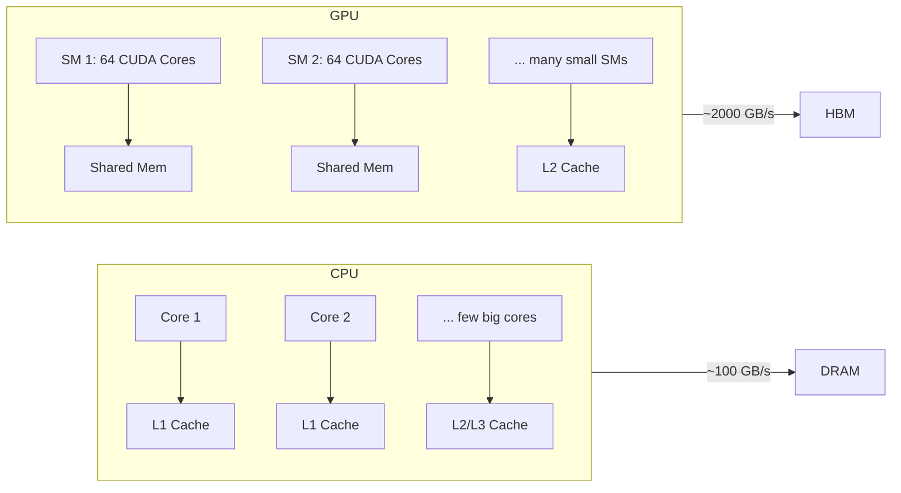
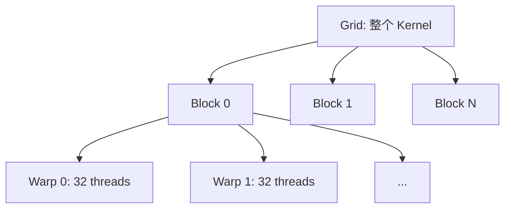
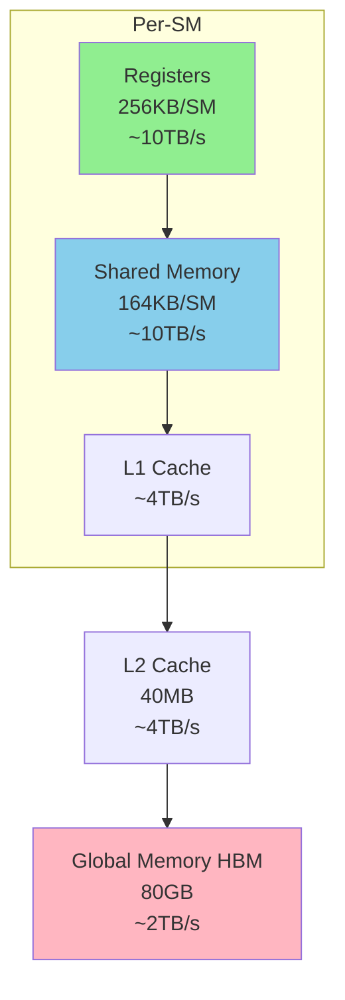
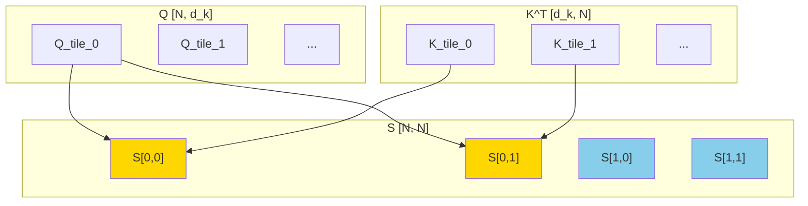
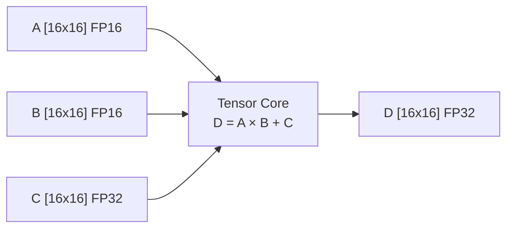
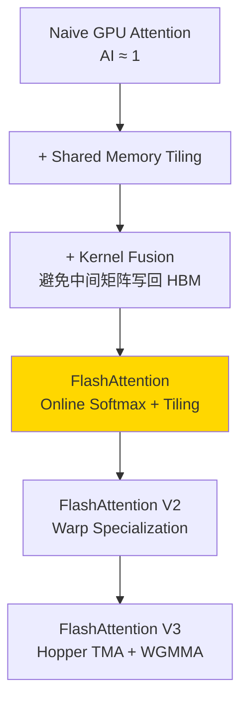

# Chapter 02: Attention 的 GPU 实现

## 1. 为什么要在 GPU 上实现 Attention？

### 1.1 CPU vs GPU 架构差异



**关键区别**：
- CPU：少量大核，优化延迟
- GPU：大量小核，优化吞吐量
- GPU HBM 带宽是 CPU DRAM 的 **20 倍**

Attention 的 O(N²) 操作是**高度并行的**（每个 (i,j) 对独立），非常适合 GPU。

### 1.2 GPU 的线程层次



| 层级 | 大小 | 同步方式 | 内存 |
|------|------|---------|------|
| Thread | 1 | 无 | Register |
| Warp | 32 threads | SIMT 自动 | Register |
| Block | 1024 threads max | `__syncthreads()` | Shared Memory |
| Grid | 无限制 | 仅 Kernel 结束 | Global Memory |

### 1.3 内存层次



**规则**：越靠近计算单元，容量越小，速度越快。
优化目标：**尽量在快速内存中完成计算，减少对 HBM 的访问。**

## 2. GPU 上的矩阵乘法（GEMM）

### 2.1 Attention 的本质是 GEMM

Attention 的三步都是矩阵乘法：

```
Step 1: S = Q @ K^T    → GEMM: [N, d_k] × [d_k, N] → [N, N]
Step 2: P = softmax(S)  → Element-wise (row-wise)
Step 3: O = P @ V       → GEMM: [N, N] × [N, d_v] → [N, d_v]
```

### 2.2 GEMM 的分块策略（Tiling）

直接让一个 thread 计算一个输出元素是低效的，因为每个 thread 需要读取所有输入。

**Tiling 思想**：将矩阵分成小块（tile），每次加载一个 tile 到 Shared Memory，一个 Block 内的所有 thread 共享这个 tile。



计算 S[0,0] 时：
1. 加载 Q_tile_0 和 K_tile_0 到 Shared Memory
2. 做局部矩阵乘法
3. 加载下一个 tile，累加

这样每个数据元素只从 HBM 读取 **一次**，被 Block 内所有 thread 共享。

### 2.3 Tensor Core



Tensor Core 在一个时钟周期内完成 16×16×16 的矩阵乘加（512 次乘加）。

| 精度 | A100 Tensor Core TFLOPS | 相比 FP32 CUDA Core |
|------|------------------------|-------------------|
| FP64 | 19.5 | - |
| FP32 | 19.5 | 1× |
| TF32 | 156 | 8× |
| FP16 | 312 | 16× |
| INT8 | 624 | 32× |

**关键洞察**：FP16 用 Tensor Core 比 FP32 用 CUDA Core 快 **16 倍**！

## 3. Naive GPU Attention 的性能分析

### 3.1 为什么 Naive GPU 实现仍然慢？

我们的第一个 CUDA kernel（`naive_attention_kernel`）中，每个 thread 独立计算一个输出元素 `O[i][j]`。

**问题**：
1. 每个 thread 都要读取**完整的 K 矩阵**（N × d_k 个 float）
2. 每个 thread 独立计算 softmax（需要遍历所有 N 个 score）
3. N 个 thread 各自读取 K，共读取 **N × N × d_k** 个 float（远大于矩阵本身）

```
K 矩阵总大小：N × d_k × 4 bytes
实际读取量：N × N × d_k × 4 bytes  ← N 倍冗余！
```

这叫做 **广播读取**（broadcast read）——每个 thread 都从 HBM 读取相同的 K 数据。

### 3.2 Roofline 分析

$$\text{Arithmetic Intensity for naive GPU kernel} = \frac{4N^2 d \text{ FLOPs}}{4N^2 d \text{ bytes}} = 1 \text{ FLOP/Byte}$$

对于 d_k=64 的情况，原始 AI = 64/2 = 32（每个 S 元素只读 K 一次）。
但在 naive kernel 中，每个 thread 都读整个 K，导致 AI 只有 **1**！

| 实现 | d=64 时 AI | A100 上位置 |
|------|-----------|------------|
| 理想（只读一次） | 32 | Memory-bound |
| Naive GPU（重复读） | ~1 | 严重 Memory-bound |

**结论**：Naive GPU kernel 的实际 AI 远低于理论值，瓶颈完全是内存带宽。

## 4. 进一步优化方向



Chapter 04 将开始 FlashAttention 的实现。
