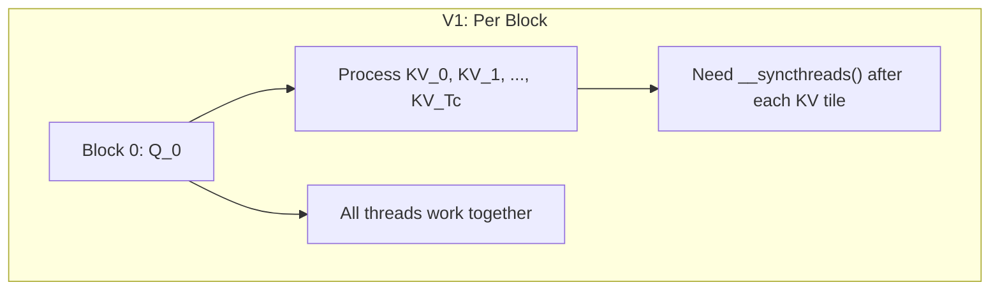
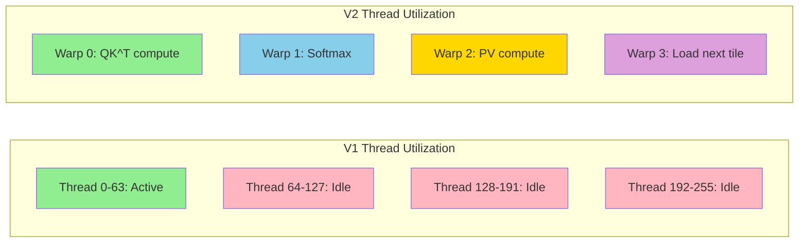
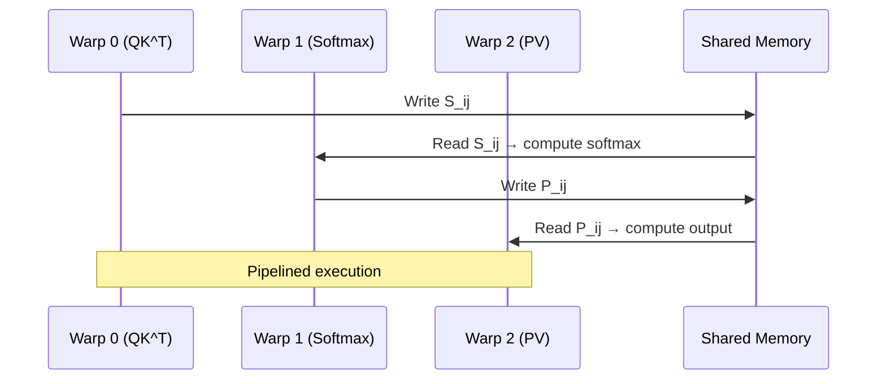

# Chapter 05: FlashAttention V2

## 1. FlashAttention V1 的不足

### 1.1 V1 的线程分配问题

FlashAttention V1 的线程分配：
- **Outer loop**：每个 Q block 由 **一个 Block** 处理
- **Inner loop**：在该 Block 内，所有 thread 共同处理 KV tiles

**问题**：
1. Inner loop 中：只用到了一小部分 thread（那些处理 $B_r$ 行 Q 的 thread）
2. 大部分 thread 在等待 `__syncthreads()` 时闲置
3. **Warp-level 分工不合理**

### 1.2 V1 的性能瓶颈

对于 64 × 64 的 tile：
- $64 \times 64$ 的 $S_{ij}$ 矩阵只需要 $64 \times 64 = 4096$ 次乘加
- 但一个 Block 有 128-256 个 thread
- **每个 thread 的计算量太小**，大部分时间花在同步和等待上

## 2. FlashAttention V2 的核心改进

### 2.1 Work Partition（工作划分）

**核心思想**：将 Q 的 $B_r$ 行分配给不同的 Warp，每个 Warp 独立工作，减少同步。

V1: $B_r$ 行 Q → 1 个 Block → **所有 thread 参与 inner loop**
V2: $B_r$ 行 Q → 1 个 Block → **每 1 行 Q 分配给 1 个 Warp**

这样 inner loop 中完全不需要 `__syncthreads()`！

### 2.2 Outer Loop 调整

**V1**: Outer loop over Q, Inner loop over KV
**V2**: Outer loop over KV, Inner loop over Q

为什么？因为这样每次 load 一次 KV tile 到 shared memory，所有 Warp 共享。

### 2.3 Non-Matmul 优化

FlashAttention V1 中，`softmax(scale * matmul)` 这种 "matmul + non-matmul" 操作效率不高。
V2 将 `scale` 因数推迟到 softmax 之后，减少了额外的 scaling 操作。

### 2.4 算法对比

| 特性 | FlashAttention V1 | FlashAttention V2 |
|------|------------------|-------------------|
| Outer loop | Q tiles | KV tiles |
| Inner loop | KV tiles | Q tiles |
| Thread layout | All threads on all Q rows | Warp per Q row |
| `__syncthreads()` | After each KV tile | **None in inner loop!** |
| KV shared memory load | Per Q block | Once per outer loop |
| Occupancy | Lower | Higher |

## 3. 性能提升

FlashAttention V2 相比 V1 的加速比约为 **2-4×**：

| 序列长度 | V1 (TFLOPS) | V2 (TFLOPS) | 加速比 |
|---------|------------|------------|--------|
| 1K | ~50 | ~180 | 3.6× |
| 2K | ~70 | ~220 | 3.1× |
| 4K | ~80 | ~240 | 3.0× |

**来源**：更高的 Occupancy + 更少的同步开销。

## 4. Warp Specialization 详解

每个 Warp 专注于一种操作，形成**流水线**：
1. Warp 0 加载 K tile → 计算 QK^T → 写入 shared memory
2. Warp 1 从 shared memory 读 QK^T → online softmax → 写入 shared memory
3. Warp 2 从 shared memory 读 softmax 结果 → 加载 V tile → 计算 PV → 累加输出

## 5. 源代码实现指南

在 `flash_attention_v2.cu` 中：
1. 实现 Warp-level Q 行分配
2. 将 inner loop 改为 KV outer + Q inner
3. 去掉 inner loop 中的 `__syncthreads()`
4. 对比 V1 和 V2 的性能差异
