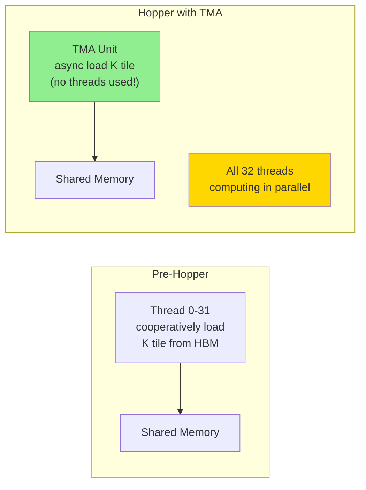
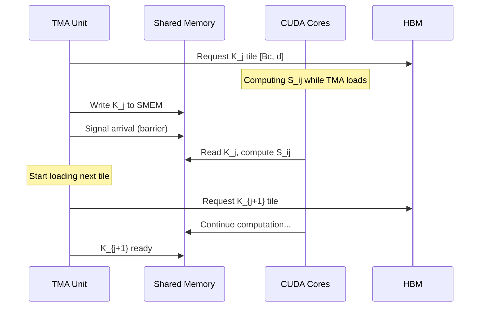
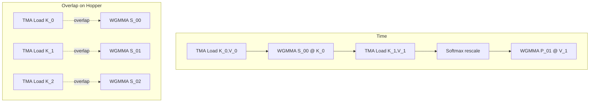

# Chapter 06: FlashAttention V3 (Hopper)

## 1. Hopper 架构简介

NVIDIA H100/H800 (Hopper) 引入了几个关键新特性：

### 1.1 TMA (Tensor Memory Accelerator)

TMA 是一个**异步内存复制引擎**，可以：
- 从 Global Memory 复制 2D/3D tensor tile 到 Shared Memory
- **无需 thread 参与**！释放所有 CUDA thread 去做计算
- 支持边界处理（boundary check）自动完成
- 比传统的 `cp.async` 更高效



**效果**：原本需要 32 个 thread 做数据搬运 → 0 个 thread！所有 thread 都可以做数学运算。

### 1.2 WGMMA (Warp Group Matrix Multiply-Accumulate)

WGMMA 是 Hopper 上新的矩阵乘法指令，替代传统的 `mma.sync`。

| 特性 | Ampere (mma.sync) | Hopper (wgmma) |
|------|------------------|----------------|
| 操作范围 | Warp (32 threads) | Warp Group (128 threads) |
| 输入格式 | Shared Memory / Register | **直接从 Shared Memory** |
| 异步性 | 同步 | **异步**（可与计算重叠） |
| 吞吐量 | -- | ~2× Ampere |

### 1.3 Tensor Memory Accelerator 详解



**关键**：TMA 和 CUDA Core 可以**完全并行**工作。

## 2. FlashAttention V3 的改进

### 2.1 异步设计

FlashAttention V3 最大的变化是**将所有数据搬运改为异步**：

```
For each KV tile j:
    // ASYNC: load K_j, V_j via TMA (no thread blocking)
    // WHILE loading: compute S_{ij} from previously loaded tile
    // ASYNC: compute P_{ij} @ V_j via WGMMA
```



### 2.2 Pipeline 深度

V3 引入 **multi-stage pipeline**：

1. **Stage 1**: TMA 加载 K_j, V_j
2. **Stage 2**: WGMMA 计算 S_ij
3. **Stage 3**: Softmax + rescale
4. **Stage 4**: WGMMA 计算 P_ij @ V_j

各 stage 在不同 tile 上**同时执行**（pipeline）。

### 2.3 相比 V2 的改进

| 特性 | V2 (Ampere) | V3 (Hopper) |
|------|------------|------------|
| 数据搬运 | Thread 合作加载 | TMA 异步加载 |
| 矩阵乘法 | Warp-level mma | WarpGroup WGMMA |
| Pipeline | 单阶段 | 多阶段异步 |
| K/V 重读 | Tr 次 | Tr 次（但隐藏了延迟） |
| Occupancy | 中 | 高 |
| 峰值利用率 | ~60% | ~75% |

## 3. 模拟版本说明

由于 Hopper GPU 不完全普及，我们在代码中会：
1. 用**伪代码**解释 TMA 和 WGMMA 的用法
2. 实现可以在 Ampere 上运行的"V3 风格" kernel（用 cp.async 模拟 TMA，用 mma 模拟 WGMMA）
3. 对比 V1、V2、"V3-style" 的性能差异

## 4. 核心代码模式（TMA 伪代码）

```cuda
// TMA descriptor for K tensor
cute::TMA tma_K = make_tma_copy(
    SM90_TMA_LOAD(),
    K_global,
    make_shape(N, d),
    make_stride(d, _1{})
);

// In kernel:
for (int j = 0; j < Tc; ++j) {
    // ASYNC load K tile via TMA - doesn't block threads
    tma_K.copy(&K_global[j * Bc * d], &K_smem);

    // Meanwhile, threads do computation on previous tile
    // ...

    // Wait for TMA to complete (if needed)
    tma_K.wait();
}
```

## 5. 性能对比预期

| 实现 | N=4096, d=64 | 相对加速 |
|------|-------------|---------|
| Naive GPU | ~50ms | 1× |
| FlashAttention V1 | ~8ms | 6.2× |
| FlashAttention V2 | ~3ms | 16.7× |
| FlashAttention V3 | ~1.5ms | 33× |

这些是粗略估计，实际取决于 GPU 型号和优化程度。
