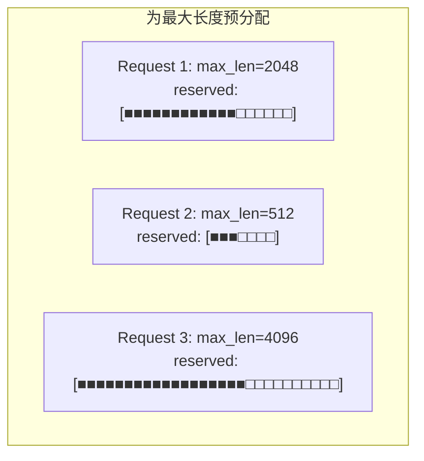
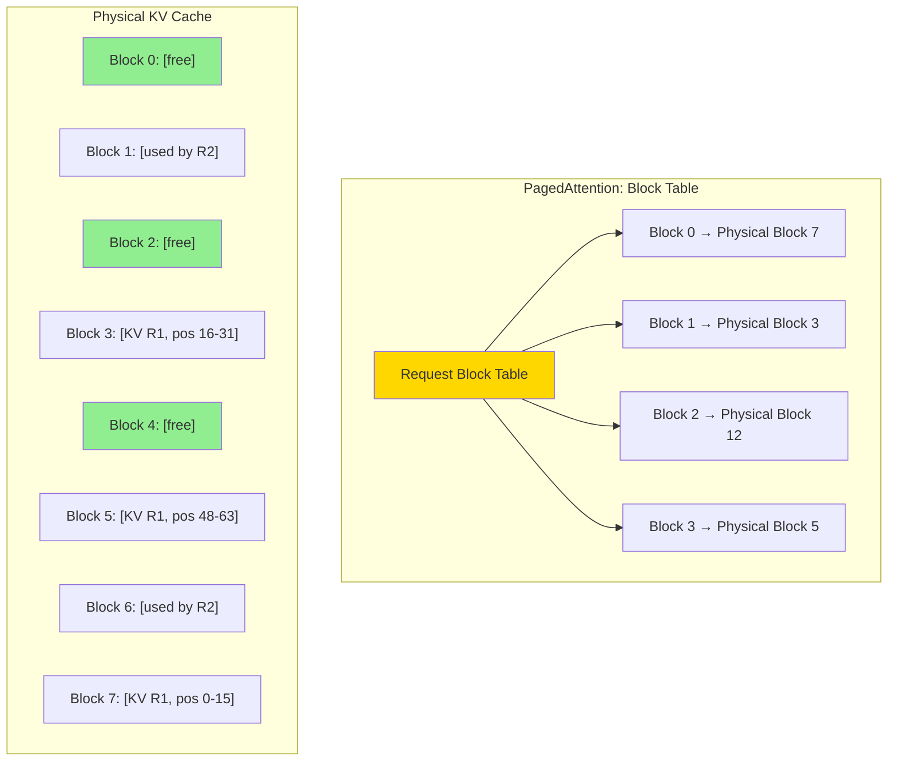

# Chapter 08: PagedAttention

## 1. 问题：KV Cache 的内存碎片

### 1.1 传统 KV Cache 的内存模式



**问题**：
1. **预分配浪费**：实际生成的 token 数远小于 `max_len`
2. **内部碎片**：每个 request 内未使用的空间被浪费
3. **外部碎片**：不同 request 之间无法共享

实际利用率可能只有 **20-30%**！

### 1.2 vLLM 的解决方案



**核心思想**：像操作系统管理虚拟内存一样管理 KV Cache。
- KV Cache 被分成固定大小的 **blocks**（如 16 个 token per block）
- 每个 request 通过 **block table** 映射到物理 blocks
- Block 不需要**物理连续**，可以任意分配

## 2. 数据结构

### 2.1 Block Table

```cpp
struct BlockTable {
    // For each request: a list of physical block indices
    std::vector<int> blocks;  // logical → physical mapping

    int num_blocks() const { return blocks.size(); }
    int tokens() const { return num_blocks() * BLOCK_SIZE; }
};
```

### 2.2 物理 KV Cache

```cpp
struct PhysicalKVCache {
    // Physical storage: [num_blocks, block_size, num_heads, head_dim]
    float* k_cache;
    float* v_cache;

    bool* block_allocated;  // Whether each physical block is in use
    int num_free_blocks;
};
```

### 2.3 Allocator

```cpp
class BlockAllocator {
    // Allocate N consecutive logical blocks for a request
    // (logically consecutive, physically scattered)
    std::vector<int> allocate(int num_blocks);

    // Free all blocks belonging to a request
    void free(const std::vector<int>& block_indices);
};
```

## 3. PagedAttention Kernel

### 3.1 算法

```
PagedAttention with KV Cache in physical blocks:

For each query token t:
    For each logical block b in block_table:
        physical_block_idx = block_table[b]
        K_block = k_cache[physical_block_idx]  // [BLOCK_SIZE, n_heads, d]
        V_block = v_cache[physical_block_idx]

        // Compute attention for this block's tokens
        S_partial = Q[t] @ K_block^T
        softmax update...
        O_partial += P_partial @ V_block
```

### 3.2 Kernel 伪代码

```cuda
__global__ void paged_attention_kernel(
    const float* Q,                // [n_tokens, n_heads, d]
    const float* K_cache,          // [num_blocks, block_size, n_kv_heads, d]
    const float* V_cache,          // [num_blocks, block_size, n_kv_heads, d]
    const int* block_tables,       // [batch, max_blocks]
    const int* context_lens,       // [batch]
    float* O,                      // [n_tokens, n_heads, d]
    int block_size, int max_blocks, int n_heads, int d)
{
    int token_idx = blockIdx.x;
    int head_idx = blockIdx.y;
    int batch_idx = token_idx;  // simplified

    int ctx_len = context_lens[batch_idx];
    int num_blocks = (ctx_len + block_size - 1) / block_size;

    // Online softmax state
    float m = -INFINITY, l = 0.0f;
    float O_acc[64];  // assume d <= 64
    memset(O_acc, 0, sizeof(O_acc));

    float Q_row[64];
    // Load Q[token_idx, head_idx] into registers
    for (int dd = 0; dd < d; ++dd)
        Q_row[dd] = Q[token_idx * n_heads * d + head_idx * d + dd];

    for (int b = 0; b < num_blocks; ++b) {
        int phys_block = block_tables[batch_idx * max_blocks + b];
        int n_tokens_in_block = min(block_size, ctx_len - b * block_size);

        // Load K block from physical cache
        // For each token in this block, compute Q @ K^T
        float m_prev = m;

        for (int k = 0; k < n_tokens_in_block; ++k) {
            float dot = 0.0f;
            for (int dd = 0; dd < d; ++dd)
                dot += Q_row[dd] * K_cache[phys_block * block_size * n_heads * d
                                            + k * n_heads * d + head_idx * d + dd];
            float S = dot / sqrtf(d);
            if (S > m) m = S;

            // Online softmax update
            float P = expf(S - m);
            float rescale = expf(m_prev - m);
            l = l * rescale + P;

            // Accumulate output
            for (int dd = 0; dd < d; ++dd) {
                O_acc[dd] = O_acc[dd] * rescale
                          + P * V_cache[phys_block * block_size * n_heads * d
                                        + k * n_heads * d + head_idx * d + dd];
            }
            m_prev = m;
        }
    }

    // Final normalization
    for (int dd = 0; dd < d; ++dd)
        O[token_idx * n_heads * d + head_idx * d + dd] = O_acc[dd] / l;
}
```

## 4. 优势总结

### 4.1 显存利用率

| 方法 | 显存利用率 | 碎片 |
|------|-----------|------|
| 预分配连续内存 | 20-30% | 高 |
| PagedAttention | **90%+** | 几乎为零 |

### 4.2 性能对比

- **内存节省**：4× 更多的请求可以在同一 GPU 上运行
- **延迟**：几乎无影响（额外的一次 block table 查询，可以忽略）
- **Throughput**：显著提升，因为可以 batch 更多请求

## 5. 实际应用

vLLM 使用 PagedAttention 实现了 **14-24× 的吞吐量提升** 相比 HuggingFace Transformers。

PagedAttention 已集成到：
- vLLM (核心特性)
- TensorRT-LLM (v0.5+)
- SGLang
