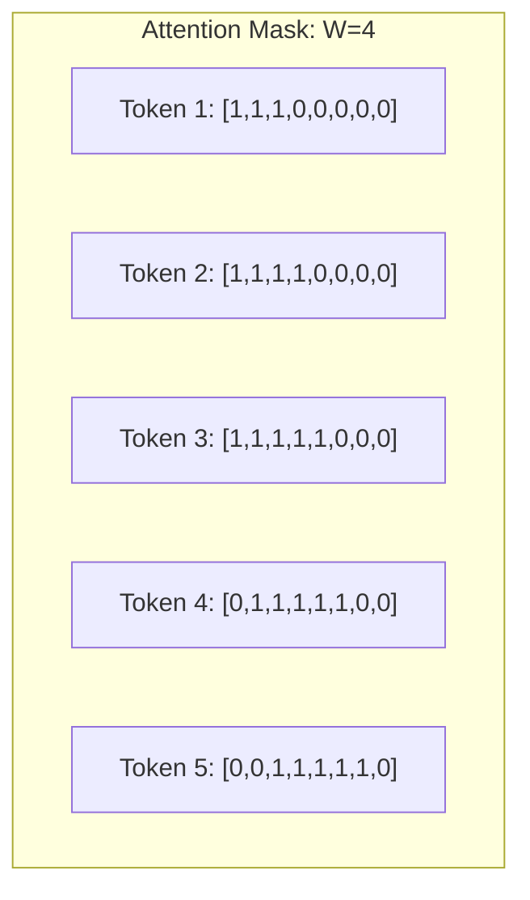
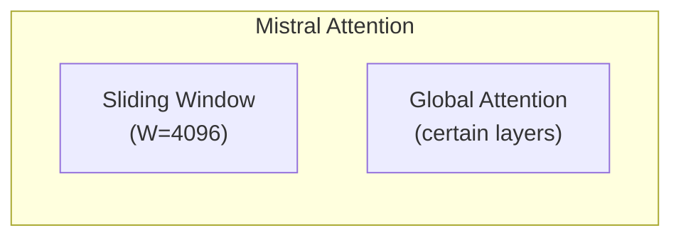

# Chapter 10: Sliding Window Attention

## 1. 动机：长序列的代价

标准 Attention 的 $O(N^2)$ 复杂度使得处理超长序列（如 32K, 128K tokens）代价极高。

**Sliding Window Attention 的核心思想**：每个 token 只关注它附近的 K 个 token，而不是所有 token。

## 2. 数学定义

对于窗口大小 $W$：

$$\text{Attention}(Q, K, V)_{ij} = \begin{cases}
\text{softmax}\left(\frac{Q_i K_j^T}{\sqrt{d}}\right) V_j & \text{if } |i - j| \leq W/2 \\
0 & \text{otherwise}
\end{cases}$$



## 3. 时间复杂度

| 类型 | 计算复杂度 | 显存复杂度 |
|------|-----------|-----------|
| Full Attention | $O(N^2)$ | $O(N^2)$ |
| Sliding Window | $O(N \cdot W)$ | $O(N \cdot W)$ |

当 $W \ll N$ 时（如 W=4096, N=32768），计算量减少 **8 倍**。

## 4. 实现

### 4.1 Mask 生成

```cuda
// Sliding window mask: only attend if |i-j| <= W/2
int window_size = W / 2;
if (abs(i - j) > window_size) {
    attention_score = -INFINITY;  // Effectively masked out
}
```

### 4.2 CUDA 实现优化

Sliding Window Attention 可以**跳过无关的 K 和 V**：

```cuda
for (int j = max(0, i - W/2); j < min(N, i + W/2 + 1); ++j) {
    // Only compute attention within the window
    float dot = Q[i] @ K[j] / sqrt(d);
    // ...
}
```

### 4.3 与 FlashAttention 结合

可以将 Sliding Window 的 mask 融入 FlashAttention 的 tiling 策略中：
- 每个 Q tile 只需要加载 W 范围内的 K/V tiles
- 进一步减少 HBM 访问

## 5. 工业界使用

### 5.1 Mistral



Mistral 使用滑动窗口作为默认，但在某些 layer 使用全局 attention。

### 5.2 Longformer

Longformer 使用多种 attention 模式组合：
- Sliding window
- Dilated sliding window
- Global attention on special tokens (CLS, SEP)

## 6. 优缺点

| 优点 | 缺点 |
|------|------|
| 线性复杂度 $O(NW)$ | 无法建模长距离依赖 |
| 显存大幅减少 | 需要显式的全局 attention head |
| 易于实现 | 窗口大小是超参数 |
| 可与其他优化组合 | 某些任务需要全局 attention |

## 7. 源码实现

`sliding_window_attention.cpp` 将实现：
1. 带窗口 mask 的 naive attention
2. 优化的 CUDA kernel（仅遍历窗口内的 K,V）
3. 与 FlashAttention 结合
4. 不同窗口大小的性能对比
