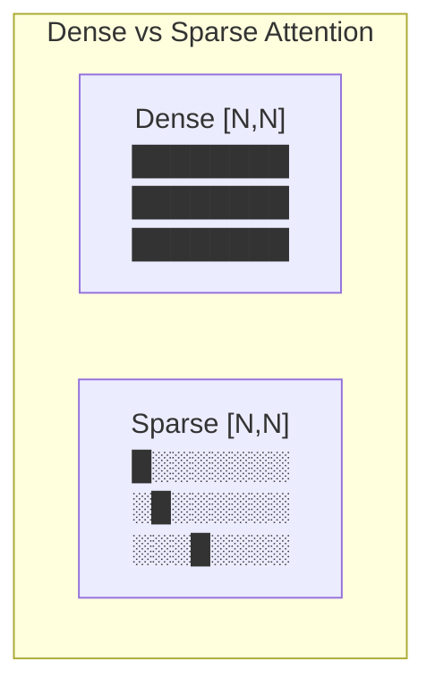
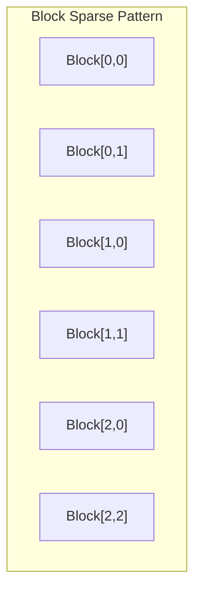

# Chapter 11: Sparse Attention

## 1. Attention 矩阵的稀疏性

研究表明，Attention 矩阵本质上是**稀疏的**：
- 大多数 token 对之间的 attention weight 接近 0
- 只有少数 token 对真正需要关注



## 2. 稀疏 Attention 的主要类型

### 2.1 Block Sparse Attention

将 attention 矩阵分成 block，只计算某些 block。



### 2.2 BigBird Pattern

```
Global tokens: attend to everything
Local (sliding window): attend to neighbors
Random: attend to random tokens
```

$$O(N \cdot (G + W + R)) \text{ complexity, where } G,W,R \ll N$$

### 2.3 Longformer Pattern

- Sliding window + Dilated window + Global tokens

## 3. Block Sparse 实现

```cuda
// Block sparse attention: only compute specified blocks
for (int bi = 0; bi < num_blocks; ++bi) {
    for (int bj : sparse_pattern[bi]) {  // Only specified blocks
        load_tile(Q[bi], K[bj]);
        compute_attention_tile();
    }
}
```

## 4. 性能分析

| Pattern | Complexity | Quality |
|---------|-----------|---------|
| Full | $O(N^2)$ | Best |
| Block Sparse | $O(N^2 \cdot S)$ | Very Good |
| BigBird | $O(N \cdot G \cdot W \cdot R)$ | Good |
| Sliding Window | $O(NW)$ | Good |

## 5. 源码实现

`block_sparse_attention.cpp` 将实现：
1. 稀疏 mask 的生成
2. Block sparse kernel
3. 与 Dense Attention 对比
