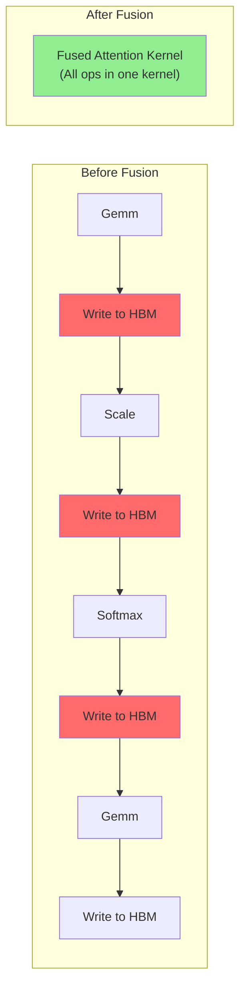

# Chapter 14: TensorRT-LLM Attention

## 1. TensorRT-LLM 简介

TensorRT-LLM 是 NVIDIA 的 LLM 推理优化框架，提供：

- **Fused Attention Kernels**: 将多个操作融合为一个 GPU kernel
- **Plugin 机制**: 自定义 kernel 的模块化集成
- **Graph Optimization**: 计算图级别的优化
- **Multi-GPU**: 张量并行 + 流水线并行

## 2. Fused Attention

### 2.1 为什么需要 Kernel Fusion

标准 PyTorch 实现中，一个 Attention 操作会被分解为多个 CUDA kernel：

```
Q @ K^T     → cublasGemmEx    (kernel 1)
Scale       → element_wise     (kernel 2)
Softmax     → softmax_kernel   (kernel 3)
P @ V       → cublasGemmEx    (kernel 4)
```

每次 kernel launch 有开销，且中间结果要写回 HBM。

### 2.2 TensorRT-LLM 的 Fusion

将整个 Attention 融合为一个 kernel：



## 3. Plugin 机制

### 3.1 架构

```
TensorRT Graph
├── Plugin: GPTAttention
│   ├── QKV Projection (fused GEMM)
│   ├── FlashAttention (custom CUDA kernel)
│   ├── KV Cache append
│   └── Output projection
├── Plugin: LayerNorm
└── Plugin: GELU Activation
```

### 3.2 Plugin 接口

```cpp
class GPTAttentionPlugin : public IPluginV2DynamicExt {
    // Required interfaces:
    int getNbOutputs() const override;
    DimsExprs getOutputDimensions(...) override;
    int enqueue(const PluginTensorDesc* inputs,
                const PluginTensorDesc* outputs,
                const void* const* buffers,
                void* const* output_buffers,
                cudaStream_t stream) override;
    // ...
};
```

## 4. Mini TensorRT-LLM 实现

`mini_trt_attention/` 目录包含：
1. Fused Attention kernel
2. Plugin 接口简化实现
3. Llama-style attention 集成

## 5. 关键优化

| 优化 | 效果 |
|------|------|
| QKV Fusion | 1 GEMM 代替 3 个 GEMM |
| FP8 GEMM | 2× 带宽减少 |
| FlashAttention | 消除 O(N²) 中间矩阵 |
| KV Cache in INT8 | 2× KV Cache 减少 |
| Multi-stream | 重叠计算和通信 |
