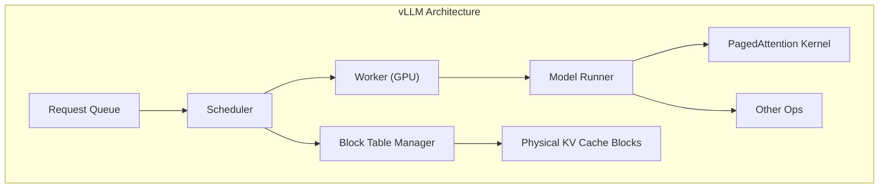
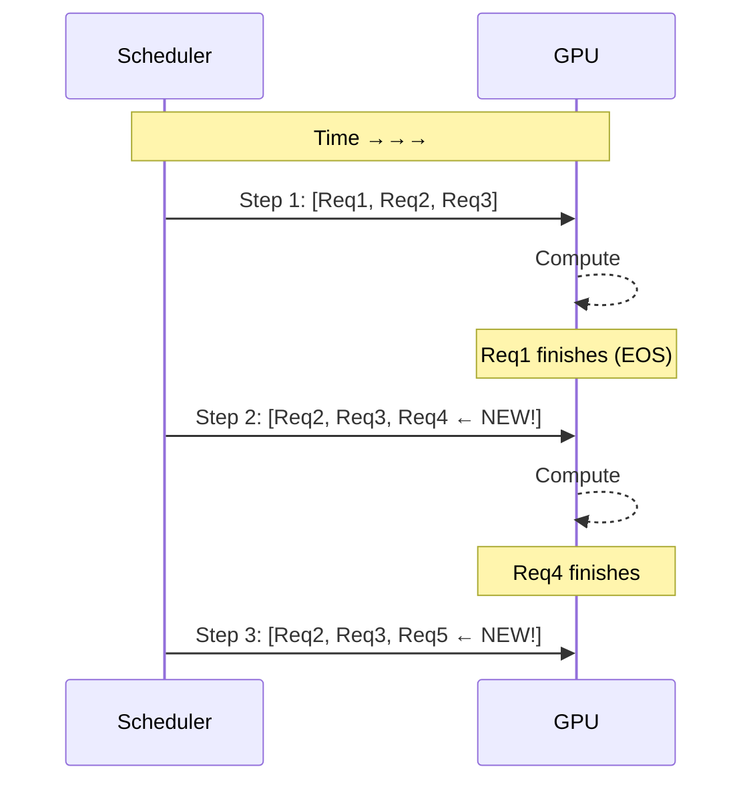

# Chapter 16: vLLM 源码解析

## 1. vLLM 简介

vLLM 是 UC Berkeley 开源的高吞吐量 LLM 推理引擎。

**核心创新**：PagedAttention + Continuous Batching

## 2. 系统架构



## 3. PagedAttention 实现

### 3.1 关键数据结构

```python
# vLLM core data structures (simplified)

class BlockTable:
    block_ids: List[int]  # logical → physical block mapping

class CacheEngine:
    gpu_cache: torch.Tensor  # [num_blocks, block_size, num_heads, head_size]
    cpu_cache: torch.Tensor  # CPU swap space

    def allocate_blocks(num_blocks):
        # Find free blocks from free list
        ...

    def free_blocks(block_ids):
        # Return blocks to free list
        ...
```

### 3.2 PagedAttention Kernel (vLLM v1)

```cuda
// vLLM v1 kernel: single_query_cached_kv_attention
// Located in: csrc/attention/attention_kernels.cu

__global__ void single_query_cached_kv_attention_kernel(
    scalar_t* __restrict__ out,           // [num_tokens, num_heads, head_size]
    const scalar_t* __restrict__ q,       // [num_tokens, num_heads, head_size]
    const scalar_t* __restrict__ k_cache, // [num_blocks, num_kv_heads, head_size, block_size]
    const scalar_t* __restrict__ v_cache,
    const int* __restrict__ block_tables, // [num_seqs, max_num_blocks_per_seq]
    const int* __restrict__ context_lens, // [num_seqs]
    ...)
```

### 3.3 FlashAttention Backend (vLLM v2)

vLLM v2 使用 FlashAttention 作为 backend：

```python
# Dispatch to best available backend
from vllm.attention.backends.flash_attn import FlashAttentionBackend

class FlashAttentionBackend(AttentionBackend):
    def forward(self, query, key, value, kv_cache, ...):
        if kv_cache:
            # With KV cache: PagedAttention + FlashAttention
            return flash_attn_with_kvcache(query, key, value,
                                           kv_cache, block_table, ...)
        else:
            # Prefill: FlashAttention
            return flash_attn_func(query, key, value, ...)
```

## 4. Continuous Batching

### 4.1 传统 Static Batching

```
Batch: [Req1, Req2, Req3]  → 等待所有 request 完成 → 下一个 batch
问题: Req1 生成 10 tokens, Req3 生成 100 tokens
      → 大部分 GPU 时间在等待 Req3
```

### 4.2 Continuous Batching



当某个 request 结束时，立即调度新 request 进入 batch。

### 4.3 实现要点

```python
class Scheduler:
    waiting: Deque[Request]      # Requests waiting to be scheduled
    running: List[Request]       # Currently running requests
    swapped: List[Request]       # Requests swapped to CPU

    def schedule(self):
        # 1. Add new requests from waiting queue
        while can_allocate_blocks(new_req):
            running.append(waiting.popleft())

        # 2. Remove finished requests
        running = [r for r in running if not r.finished]

        # 3. Preempt if OOM (swap to CPU)
        while is_oom():
            victim = select_victim()
            swapped.append(victim)
            running.remove(victim)

        return running
```

## 5. 性能对比

| 实现 | Throughput (tok/s) | Latency (ms/tok) |
|------|-------------------|-----------------|
| HuggingFace | 1× | 基准 |
| vLLM (PagedAttention) | **14-24×** | 接近（略好） |

## 6. 源码阅读指南

推荐阅读顺序：
1. `vllm/worker/worker.py` - 理解推理循环
2. `vllm/core/scheduler.py` - 理解 continuous batching
3. `vllm/attention/` - 理解 PagedAttention kernel
4. `vllm/core/block_manager.py` - 理解 block 管理

详细源码注释在 `src/chapter_16/source_reading_notes.md`。
