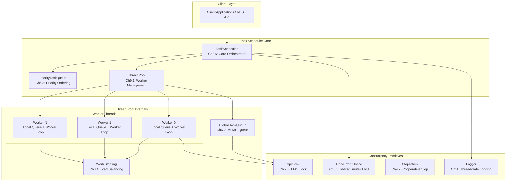
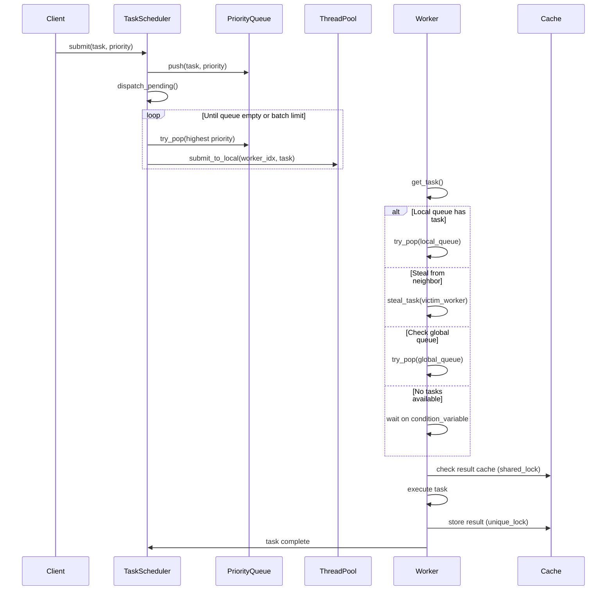
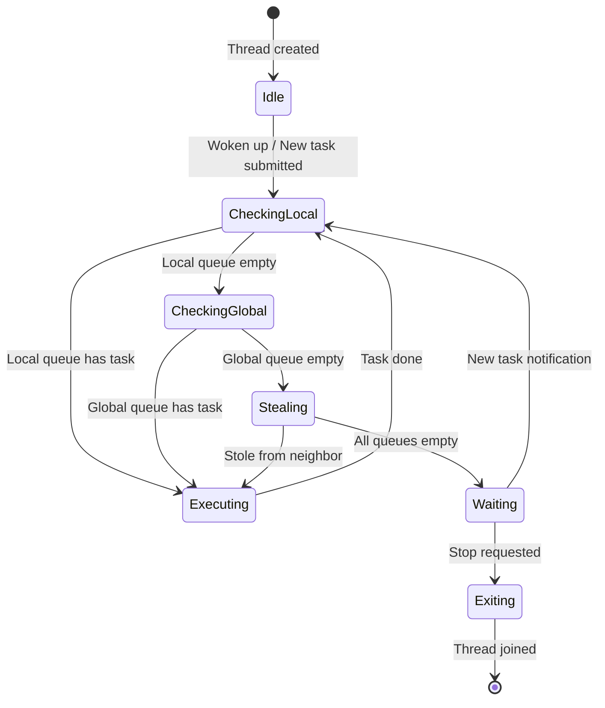

# Architecture Document

## AI/ML Operator Inference Task Scheduling System

---

## 1. System Architecture

## 2. Task Scheduling Flow

## 3. Thread Pool Workflow

## 4. Module-to-Chapter Correspondence

| Module | Ch2 | Ch3 | Ch4 | Ch5 | Ch6 | Ch7 | Ch8 | Ch9 | Ch10 | Ch11 |
|--------|:---:|:---:|:---:|:---:|:---:|:---:|:---:|:---:|:----:|:----:|
| `spinlock.hpp` | | | | X | | | | | | |
| `stop_token.hpp` | | | | X | | | | X | | |
| `task_queue.hpp` | | X | X | | X | | | | | |
| `priority_task_queue.hpp` | | X | X | | X | | | | | |
| `concurrent_cache.hpp` | | X | | | | | | | | |
| `thread_pool.hpp` | | X | X | | | | X | X | | |
| `task_scheduler.hpp` | X | | X | | | | X | X | | |
| `logger.hpp` | | X | | X | | | | | | X |
| `main.cpp` | X | | | | | | | | | |
| `test_*.cpp` | | | | | | | | | X | |

## 5. Performance Considerations

### 5.1 Lock Contention Hierarchy

| Contention Level | Component | Strategy |
|-----------------|-----------|----------|
| Very High | Spinlock | TTAS with exponential backoff (Ch5.3.3) |
| High | Task Queue (global) | Single mutex, bulk operations (Ch6.2.5) |
| Moderate | Priority Queue | Single mutex, O(log n) heap ops |
| Low | Logger | Atomic fast-path check (Ch11.3) |
| Very Low | Cache (reads) | shared_mutex for read concurrency (Ch3.3.2) |

### 5.2 Design Trade-offs

1. **Simplicity vs. Performance**: Lock-based queues chosen over lock-free (Ch7)
   for correctness guarantees and maintainability
2. **Work Stealing Overhead**: Random victim selection (O(1)) vs sequential
   (O(n)). Random trades fairness for lower contention
3. **Priority Inversion**: Single-mutex priority queue avoids priority inversion
   but serializes dequeue. Acceptable for moderate queue depths
4. **Cache Coherence**: TTAS spinlock polls read-only first (L1 cache shared state),
   only attempting atomic write when lock appears free

## 6. Extension Directions

1. **Lock-free Queues** (Ch7): Replace lock-based queues with Michael-Scott queue
2. **NUMA-Aware Scheduling**: Pin workers to NUMA nodes (Ch11)
3. **GPU Task Offloading**: Extend ThreadPool with CUDA stream management
4. **Distributed Scheduling**: Multi-node task distribution via gRPC
5. **Dynamic Batching**: Auto-batching of small inference requests
6. **Profiling Integration**: Per-task timing with nanosecond precision
7. **A/B Model Deployment**: Hot-swap model versions in inference pipeline
