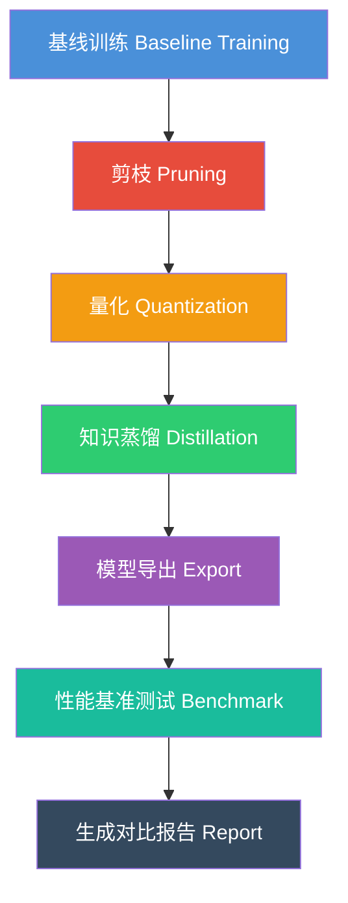

# 边缘 AI 模型压缩与部署全链路项目

> MIT 6.5940 课程最终项目 —— 高效深度学习
> 
> 本项目实现了一条完整的模型压缩与部署流水线，涵盖：
> **基线训练 → 剪枝 → 量化 → 知识蒸馏 → 模型导出 → 性能基准测试**

---

## 项目概述

本项目的目标是将一个深度学习模型从训练到部署的完整流程系统化地实现，展示在**纯 CPU 环境**下如何进行模型压缩、优化和评估。

### 流水线架构



### 支持的模式

| 模式 | 说明 | 命令示例 |
|------|------|----------|
| `train` | 训练基线模型 | `python main.py --mode train` |
| `prune` | 模型剪枝 | `python main.py --mode prune` |
| `quantize` | 模型量化（PTQ/QAT） | `python main.py --mode quantize` |
| `distill` | 知识蒸馏 | `python main.py --mode distill` |
| `export` | 导出 ONNX | `python main.py --mode export` |
| `benchmark` | 性能基准测试 | `python main.py --mode benchmark` |
| `full_pipeline` | 执行完整流水线 | `python main.py --mode full_pipeline` |

---

## 支持的模型

| 模型 | 参数量 | 适用场景 |
|------|--------|----------|
| ResNet-18 | ~11M | 边缘设备图像分类 |
| ResNet-34 | ~21M | 稍高性能要求的边缘设备 |
| MobileNetV2 | ~3.5M | 移动端、MCU 部署首选 |
| TinyCNN | ~0.5M | 极低资源设备（MCU 级别） |

---

## 目录结构

```
edge_ai_compression_deployment/
├── README.md                    # 本文档
├── main.py                      # 主入口，参数解析 + 流水线执行
├── configs/
│   └── config.yaml              # 所有配置参数
├── models/
│   └── model_factory.py         # 模型定义（ResNet/MobileNet/TinyCNN）
├── compression/
│   └── pruner.py                # 剪枝模块（幅度/通道/渐进剪枝）
├── quantization/
│   └── quantizer.py             # 量化模块（PTQ/QAT、INT8/4/2）
├── distillation/
│   └── distiller.py             # 蒸馏模块（KD + 特征蒸馏）
├── export/
│   └── exporter.py              # 导出模块（ONNX 导出 + 推理）
├── benchmark/
│   └── benchmarker.py           # 基准测试（参数量/FLOPs/延迟/内存）
├── reports/
│   └── report_generator.py      # 自动生成 Markdown 对比报告
└── scripts/
    └── run_experiments.py       # 批量实验运行脚本
```

---

## 快速开始

### 1. 安装依赖

```bash
pip install torch torchvision pyyaml onnx onnxruntime tqdm numpy psutil
```

### 2. 运行完整流水线

```bash
cd mit6.5940/mit6s5940-efficient-dl/project/edge_ai_compression_deployment
python main.py --mode full_pipeline
```

### 3. 单独运行各阶段

```bash
# 仅训练基线模型
python main.py --mode train

# 仅剪枝
python main.py --mode prune

# 仅量化
python main.py --mode quantize

# 仅蒸馏
python main.py --mode distill

# 仅导出
python main.py --mode export

# 仅基准测试
python main.py --mode benchmark
```

### 4. 使用自定义配置

```bash
python main.py --mode full_pipeline --config configs/my_config.yaml
```

### 5. 批量实验

```bash
python scripts/run_experiments.py --grid_search
```

---

## 各阶段详解

### 阶段 1：基线训练（Baseline Training）

- 使用 CIFAR-10 数据集训练分类模型
- 支持 ResNet-18/34、MobileNetV2、TinyCNN
- 自动保存最佳模型权重到 `checkpoints/` 目录
- 训练日志输出到 `logs/` 目录

### 阶段 2：模型剪枝（Pruning）

- **幅度剪枝**：移除绝对值最小的权重（非结构化）
- **通道剪枝**：移除 L2 范数最小的通道（结构化）
- **渐进剪枝**：迭代小步剪枝 + 微调恢复精度
- 剪枝后自动 finetune 恢复精度

### 阶段 3：模型量化（Quantization）

- **PTQ（训练后量化）**：使用校准数据集确定量化参数
- **QAT（量化感知训练）**：训练中使用 FakeQuantize 模拟量化
- 支持 INT8 / INT4 / INT2 精度
- 支持 per-tensor 和 per-channel 量化

### 阶段 4：知识蒸馏（Distillation）

- **KD 蒸馏**：教师模型软标签指导学生模型
- **特征蒸馏**：中间层特征对齐
- 支持自蒸馏（用大模型教小模型）

### 阶段 5：模型导出（Export）

- 导出为 ONNX 格式
- 使用 ONNX Runtime 进行推理验证
- 生成模型大小报告

### 阶段 6：基准测试（Benchmark）

- 测量指标：参数量、FLOPs、模型大小、CPU 延迟、内存使用
- 批量吞吐量测试
- 生成性能对比表格

---

## 预期结果

运行完整流水线后，在 `reports/` 目录下会生成：

1. **comparison_report.md**：完整的压缩流水线对比报告
   - 每阶段的精度变化
   - 参数量、FLOPs、模型大小对比
   - CPU 延迟和内存使用对比
   - Mermaid 流程图

2. **experiment_results.json**：原始实验数据（JSON 格式）

3. **性能对比表格示例**：

| 阶段 | 模型 | 精度 (%) | 参数量 (M) | FLOPs (M) | 模型大小 (MB) | CPU 延迟 (ms) |
|------|------|----------|-----------|-----------|-------------|-------------|
| 基线 | MobileNetV2 | 92.5 | 3.50 | 313 | 14.0 | 25.3 |
| 剪枝后 | MobileNetV2 | 91.8 | 2.10 | 188 | 8.4 | 15.8 |
| 量化后 (INT8) | MobileNetV2 | 91.5 | 3.50 | 313 | 3.5 | 12.1 |
| 蒸馏后 | MobileNetV2-T | 92.1 | 3.50 | 313 | 14.0 | 25.3 |
| 完整流水线 | MobileNetV2-C | 91.2 | 2.10 | 188 | 2.1 | 8.2 |

---

## 技术栈

| 组件 | 技术 |
|------|------|
| 深度学习框架 | PyTorch 2.x |
| 数值计算 | NumPy |
| ONNX 推理 | ONNX Runtime |
| 配置管理 | YAML |
| 图像数据 | torchvision (CIFAR-10) |
| 内存分析 | psutil |

---

## 设计原则

1. **纯 CPU 运行**：所有代码可在无 GPU 环境下完整运行
2. **模块化设计**：每个压缩技术是独立的模块，可单独使用或组合
3. **生产级代码**：完整的错误处理、类型提示、日志系统
4. **可复现性**：固定随机种子，所有实验参数记录在配置文件中
5. **中文文档**：所有注释和文档使用中文，便于课程学习

---

## 参考论文

本项目技术栈参考了以下关键论文（对应 `papers/` 目录下的详细总结）：

| 论文 | 对应技术 |
|------|----------|
| Deep Compression (Han et al., 2016) | 剪枝 + 量化管线 |
| MCUNet (Lin et al., 2020) | 边缘设备部署 |
| Once-for-All (Cai et al., 2020) | 架构搜索 |
| AWQ (Lin et al., 2024) | 激活感知量化 |
| SmoothQuant (Xiao et al., 2023) | W8A8 LLM 量化 |
| LoRA (Hu et al., 2022) | 低秩微调 |

---

## 许可证

MIT License — 仅供课程学习和研究使用。
