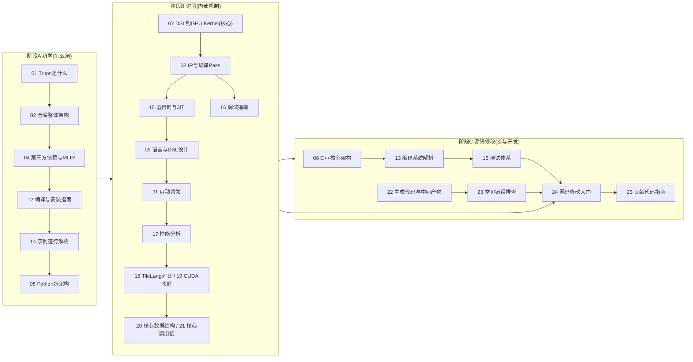

# 00 学习导航

> 本文是所有文档的索引与学习地图。先读这篇，知道自己要学什么、按什么顺序学、每篇解决什么问题。

## 1. 本文目标

- 列出全部文档的索引与作用。
- 给出推荐的阅读顺序与三个阶段（初学/进阶/源码修改）。
- 用 Mermaid 画出完整学习路线图。
- 给出 30 天周期的周目标与学习完成度检查表。

## 2. 前置知识

无。本文是导航页。

## 3. 文档索引与解决的问题

| 编号 | 文档 | 解决什么问题 | 依赖 |
| --- | --- | --- | --- |
| 00 | 学习导航 | 怎么学、按什么顺序学 | - |
| 01 | Triton 是什么 | 项目存在的原因、与 CUDA/TVM/TileLang/PyTorch 的关系 | 00 |
| 02 | 仓库整体架构 | 仓库目录怎么组织、前后端分层、谁是谁的依赖 | 01 |
| 03 | 源码阅读顺序 | 三条阅读路线：从前端追底层、从示例追底层、从后端反推 | 02 |
| 04 | 第三方依赖与 MLIR | LLVM/MLIR/PTXAS/CUDA 等依赖的作用与边界 | 02 |
| 05 | Python 包架构 | `import triton` 后有哪些 API，包内部怎么组织 | 02, 04 |
| 06 | C++ 核心架构 | `lib/`、`include/` 的 C++ 代码组织、MLIR dialect、FFI 绑定 | 04, 05 |
| 07 | 从 Python DSL 到 GPU Kernel | **最核心**：端到端编译链路全追踪 | 05, 06 |
| 08 | IR 与编译 Pass | TTGIR/LLVM IR 层级、Pass 流水线、如何打印 IR、如何新增 Pass | 06, 07 |
| 09 | 语言与 DSL 设计 | `tl.load/tl.store/tl.dot/tl.arange` 等语法语义 | 05, 07 |
| 10 | 运行时与 JIT 机制 | JIT 何时编译、缓存键、缓存目录、加载与 launch | 05, 07 |
| 11 | 自动调优机制 | autotuner 的入口、Config、搜索、benchmark、缓存 | 07, 10 |
| 12 | 编译与安装指南 | 从源码编译的完整命令与检查清单 | 02, 04 |
| 13 | 编译系统解析 | CMakeLists / pyproject / Makefile / editable 的细节 | 04, 12 |
| 14 | 示例代码研读 | VectorAdd/GEMM/Attention 等示例逐行解释 | 07, 09 |
| 15 | 测试体系说明 | 如何跑单个/全部测试、lit/pytest、如何加测试 | 12 |
| 16 | 调试指南 | triton-opt/triton-reduce/`TRITON_*` 环境变量/MLIR dump 等 | 07, 08 |
| 17 | 性能分析指南 | 正确计时、Nsight Systems/Compute、Roofline | 07, 14 |
| 18 | Triton 与 TileLang 对比 | 两种实现（torch/triton/tilelang）对照 | 07, 14 |
| 19 | Triton 与 CUDA 映射关系 | Tile/Block/Program/Warp/Shared 的映射表 | 07, 09 |
| 20 | 核心数据结构 | ASTSource/CompiledKernel/ttgir/Type/Constexpr 等 | 05, 06, 07 |
| 21 | 核心调用链 | 定义、编译、首调、命中缓存、调优、profiler 等调用链 | 07, 10 |
| 22 | 生成代码与中间产物 | 如何导出 .ttir/.ttgir/.llir/.ptx/.cubin、缓存产物 | 07, 10 |
| 23 | 常见错误与排查 | 编译失败/性能差/缓存失效等格式化解法 | 12, 16 |
| 24 | 源码修改入门 | 五个由易到难的改造任务与验收标准 | 08, 15, 17 |
| 25 | 贡献代码指南 | 仓库的 PR/commit/style/CI 规范 | 24 |
| 26 | 术语表 | DSL/IR/Pass/Codegen/Layout 等术语通俗解释 | 全部 |
| 27 | 学习清单 | 可逐项打勾的能力清单 | 全部 |
| 28 | 30 天学习计划 | 每天读什么、做什么、产出什么、怎么自测 | 全部 |
| 29 | 面试与自测题 | 按类别整理的面试题与源码位置 | 全部 |
| 30 | 最终总结 | 完整架构回顾与下一步贡献建议 | 全部 |
| 31 | 架构设计与工程权衡 | 为什么这么设计、好处、设计模型、可复用模式 | 18 |
| 32 | 工程落地设计 | 缓存/布局/流水线/driver 的不变量分析、每个分支的存在理由、边界处理 | 08, 10, 20 |
| 33 | 工程落地·并发与线程安全 | 原子写、后端发现、device 缓存隔离、异步编译 | 32 |
| 34 | 工程落地·生命周期与状态机 | CompiledKernel 卸载、driver 懒加载、版本窗口、时钟 | 32 |
| 35 | 工程落地·错误处理与 fail-fast | CompilationError、PTXAS 归因、reproducer、显式降级 | 32 |
| 36 | 工程落地·同步与内存序 | Membar、TMA mbarrier、归约、无锁读 | 32 |
| 37 | 工程落地·内存分配与复用 | shared 分配、TMEM hoist、多缓冲、swizzle | 32 |
| 38 | 工程落地·编译并行与超时 | 异步编译 Future、ptxas 超时、benchmark 并行 | 32 |
| 39 | 工程落地·类型系统与精度 | signature 推导、supportMMA、TF32、fp8 门控 | 32 |
| 40 | 工程落地·pass 编排与依赖 | make_ttgir 顺序、架构分支、lit、阶段链 | 32 |

## 4. 学习阶段划分

### 阶段 A：初学（掌握"怎么用"）
- 文档：01 → 02 → 04 → 12 → 14（快速版）→ 05
- 能力目标：
  - 知道 Triton 定位、能看懂目录结构
  - 能独立编译安装
  - 能跑通一个 GEMM kernel
  - 能看懂并修改一个简单 elementwise kernel
- 时间：约 5-7 天

### 阶段 B：进阶（掌握"内部机制"）
- 文档：07 → 08 → 10 → 09 → 11 → 16 → 17 → 18 → 19 → 20 → 21
- 能力目标：
  - 能说清 Python DSL → ttir → ttgir → llir → ptx → cubin → launch 全链路
  - 能打印中间 IR、定位任意 API 的实现
  - 能跑自动调优与性能分析（Nsight）
  - 能用 Triton/TileLang 写同一算子的多种实现并对比
- 时间：约 2-3 周

### 阶段 C：源码修改（参与开发）
- 文档：06 → 13 → 15 → 22 → 23 → 24 → 25
- 能力目标：
  - 能改一个 C++ Pass 并验证（lit 测试）
  - 能加一个 Python API
  - 能加一个测试
  - 能提出一个合格的 PR
- 时间：约 1-2 周（可与阶段 B 并行）

## 5. 学习路线图（Mermaid）

## 6. 建议学习周期（30 天）

| 周 | 阶段 | 周目标 | 验收 |
| --- | --- | --- | --- |
| 第 1 周 | 阶段 A | 编译成功、跑通一个 kernel、看懂 01/02/04/05 | 能向别人解释"Triton 是什么" |
| 第 2 周 | 阶段 B | 完成 07/08/10，能打印 IR、导出 PTX/CUBIN | 画出 DSL→Kernel 时序图 |
| 第 3 周 | 阶段 B | 完成 09/11/17/18/19，跑 autotune 与 Nsight | 多实现对比报告 |
| 第 4 周 | 阶段 C | 完成 24 的"增加日志"与"改一个 Pass"任务 | 提交一个本地改造 + 一个测试 |

详见 `28_30天学习计划.md`（含每天的具体内容）。

## 7. 学习完成度检查表

- [ ] 能解释 Triton 的核心目标
- [ ] 能找到 Python API 的入口（`@triton.jit`）
- [ ] 能解释一个 Kernel 的完整编译流程（DSL → ttir → ttgir → llir → ptx → cubin → launch）
- [ ] 能打印中间 IR
- [ ] 能找到生成 CUDA 的位置（`third_party/nvidia/` 与 `lib/Target/LLVMIR`）
- [ ] 能独立从源码编译并 editable 安装
- [ ] 能运行 lit/pytest 测试并新增一个测试
- [ ] 能分析一个 Kernel 的性能（profiler + Nsight）
- [ ] 能修改一个简单 Pass 并验证行为变化
- [ ] 能说出 Triton/TileLang/CUDA 三者的核心区别

完整版见 `27_学习清单.md`。

## 8. 常见问题

- **Q：先从哪篇读起？** A：01 → 02，然后直接去 12 把环境编译好，编译期间回头读 04。
- **Q：07 太难怎么办？** A：先读 05 和 06 建立 Python/C++ 分层概念，再读 07 的时序图。
- **Q：需要先把 MLIR 学完吗？** A：不需要。第一阶段把 MLIR 当作"黑盒依赖"，第二阶段只读 Triton 直接调用的 MLIR 接口。
- **Q：行号会变吗？** A：会。本套文档给出的行号基于 commit `be81991971`，定位时优先用"文件 + 类名 + 函数名"。

## 9. 自测题

1. 三篇文档分别对应哪三个阶段？
2. 07 与 08 的关系是什么？
3. 想修改编译行为应该看哪几篇？
4. 想提交 PR 前必须完成哪两篇的任务？

## 10. 下一步

读完本文后，进入 `01_Triton是什么.md`。
