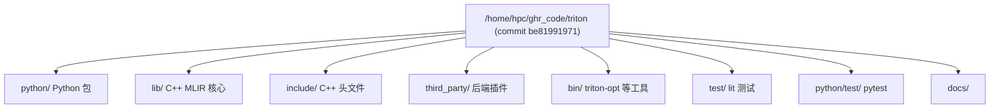
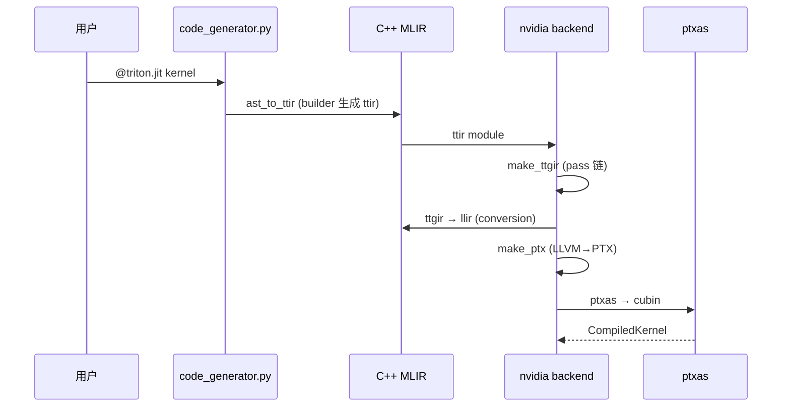

# 02 仓库整体架构（深度版）

> 本文目标：从目录清单升级为源码地图，理解 C++（MLIR 核心）与 Python（前端/驱动）的分工。

## 1. 顶层目录全景



## 2. C++ 核心：lib/

| 目录 | 职责 | 关键文件 |
| --- | --- | --- |
| `lib/Dialect/Triton/` | ttir（无布局块级 IR） | `IR/` `Transforms/`（LICM/LoopUnroll） |
| `lib/Dialect/TritonGPU/` | ttgir（布局+线程） | `IR/`（layout 属性）`Transforms/`（Coalesce/AccelerateMatmul/RemoveLayoutConversions/Pipeliner） |
| `lib/Dialect/TritonNvidiaGPU/` | ttgir 的 NVIDIA 版（tmems） | `IR/` `Transforms/` |
| `lib/Dialect/Gluon/` | 新前端（实验） | |
| `lib/Conversion/TritonToTritonGPU/` | ttir→ttgir | |
| `lib/Conversion/TritonGPUToLLVM/` | ttgir→llir | `DotOpToLLVM/` `MemoryOpToLLVM.cpp` 等 |
| `lib/Target/LLVMIR/` | llir→LLVM IR | |
| `lib/Analysis/` | AxisInfo/Alias/Allocation/Membar | `AxisInfo.cpp` |
| `lib/Tools/` | LinearLayout/LayoutUtils | `LinearLayout.cpp` |

## 3. 关键目录深入

### lib/Dialect/TritonGPU/Transforms/
| 文件 | 作用 |
| --- | --- |
| `Coalesce.cpp` | 访存合并（AxisInfo 驱动） |
| `AccelerateMatmul.cpp` | mma 布局选择 |
| `OptimizeDotOperands.cpp` | dot 操作数优化 |
| `RemoveLayoutConversions.cpp` | 布局转换消除 |
| `Pipeliner/SoftwarePipeliner.cpp` | 软件流水线 |
| `Pipeliner/LowerLoops.cpp` | load→cp.async |
| `WarpSpecialization/` | warp 特化 |
| `F32DotTC.cpp` | TF32 dot |

## 4. 第三方后端：third_party/nvidia/

```
third_party/nvidia/
├── backend/
│   ├── compiler.py     # CUDAOptions + make_* 五阶段 + add_stages
│   ├── driver.py       # CudaDriver（torch 或 C 模块）
│   ├── driver.c        # CUDA driver API 封装（C 扩展）
│   └── lib/libdevice.10.bc  # 数学库
├── lib/
│   ├── Dialect/TritonNvidiaGPU/
│   ├── NVGPUToLLVM/
│   └── TritonNVIDIAGPUToLLVM/   # MMAv2/WGMMA/MMAv5 降级
├── include/
├── language/           # libdevice Python 绑定
└── tools/
```

## 5. 工具：bin/

- `triton-opt`：单跑 MLIR pass（lit 测试的核心）。
- `triton-reduce`：崩溃 IR 最小化。
- `triton-lsp`：语言服务器。
- `triton-llvm-opt`。

## 6. 测试与示例

- `test/`：lit（`.mlir` + FileCheck），无需 GPU。
- `python/test/unit/`：pytest，需 GPU。
- `python/tutorials/`：官方教程（01-vector-add 等）。

## 7. 数据流：一次编译的跨层流动



## 8. 深入自测

1. ttir/ttgir/ttnvgpu 各在哪定义？
2. `AccelerateMatmul.cpp` 做什么？
3. NVIDIA 后端 Python 与 C++ 各在哪？
4. `triton-opt` 的用途？
5. 数据如何从 AST 流到 cubin？

## 9. 下一步

进入 `03_源码阅读顺序.md`（深度版）。
