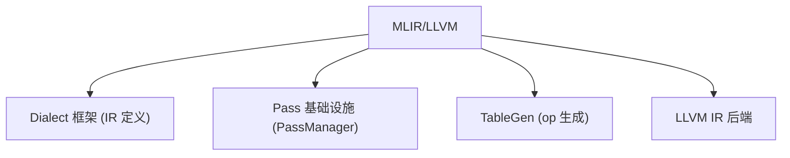

# 04 第三方依赖与 MLIR（深度版）

> 本文目标：深入 MLIR 在 Triton 中的具体角色，以及 LLVM/TableGen/CUDA 的依赖关系。

## 1. MLIR 的三层贡献



## 2. Triton 自研 Dialect（深度）

| Dialect | 前缀 | 语义 | 位置 |
| --- | --- | --- | --- |
| `ttir` | `tt` | 块级计算（无布局） | `lib/Dialect/Triton/` |
| `ttgir` | `ttg` | 布局+线程 | `lib/Dialect/TritonGPU/` |
| `ttnvgpu` | `ttng` | tmems/wgmma | `third_party/nvidia/lib/` |
| `gluon` | `ttg` | 新前端 | `lib/Dialect/Gluon/` |

**定义方式（深度）**：TableGen（`.td` 文件）定义 op/attr，如 `TritonGPUAttrDefs.td:818-828` 定义 `BlockedEncodingAttr`：
```td
def TTG_BlockedEncodingAttr : ... {
  let parameters = (ins
    ArrayRefParameter<"unsigned">:$sizePerThread,
    ArrayRefParameter<"unsigned">:$threadsPerWarp,
    ArrayRefParameter<"unsigned">:$warpsPerCTA,
    ArrayRefParameter<"unsigned">:$order,
    "CGAEncodingAttr":$CGALayout);
}
```

## 3. 布局系统（核心难点，深度）

`LinearLayout`（`lib/Tools/LinearLayout.cpp`）是 **GF(2) 线性映射**：
- 只存基向量（`bases`），`apply` 用 xor 求值（:885-901）。
- 支持 `operator*`（直和）、`invertAndCompose`（伪逆，:1042）。
- 所有 EncodingAttr 通过 `toLinearLayout` 统一成矩阵表示（`LinearLayoutConversions.cpp:1218-1314`）。

**为什么重要**：布局转换 = 矩阵运算。`convert_layout` 代价 = `minimalCvtLayout` = `dstLayout.invertAndCompose(srcLayout)`。

## 4. LLVM 依赖

- 构建时锁定特定 commit（当前对应 `Build LLVM at b010a18d`）。
- `TRITON_OFFLINE_BUILD` 控制离线构建。
- LLVM 提供：MLIR 框架 + NVPTX 后端（生成 PTX）。

## 5. CUDA 依赖

- `driver.c`：封装 cuModuleLoad/cuLaunchKernelEx（`dlopen("libcuda.so.1")` + dlsym 动态解析）。
- `make_cubin`（nvidia compiler.py:513）：外部调 ptxas。
- `libdevice.10.bc`：数学函数链接。

## 6. 构建依赖（pyproject.toml）

```toml
requires = ["setuptools>=40.8.0", "cmake>=3.20,<4.0", "ninja>=1.11.1", "nanobind==2.10.2"]
```
- **nanobind**：Python↔C++ 绑定（`triton._C`），pybind11 的轻量替代。

## 7. 深入自测

1. MLIR 提供哪四类能力？
2. 三个自研 dialect 各管什么？
3. BlockedEncodingAttr 的 5 个字段？
4. LinearLayout 的数学本质？
5. nanobind 的作用？

## 8. 下一步

进入 `05_Python包架构.md`（深度版）。
