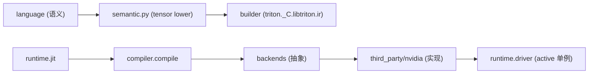

# 05 Python 包架构（深度版）

> 本文目标：深入 Python 包的分层、与 `triton._C` 的交互、以及 knobs 环境变量系统。

## 1. 包结构

```
python/triton/
├── __init__.py          # 顶层 API（version 3.8.0）
├── language/            # DSL 语义（core.py/semantic.py/math.py）
├── runtime/             # jit/autotuner/cache/driver
├── compiler/            # code_generator/compiler/make_launcher
├── backends/            # 抽象基类（compiler.py/driver.py）
├── _C/                  # C++ 扩展（triton._C）
├── knobs.py             # TRITON_* 环境变量系统
├── tools/  errors.py  testing.py
```

## 2. 分层依赖



## 3. `triton._C` 的生成（深度）

- 由 CMake 编译 `python/src/*.cc`（nanobind）生成。
- 暴露子模块：`ir`、`passes`、`interpreter`、`llvm`、`gluon_ir`、`linear_layout`（`python/src/main.cc:60-72`）。
- 加载 NVIDIA 后端：`INIT_BACKEND(nvidia)`（:35-39）。
- code_generator 通过 `from .._C.libtriton import ir` 访问（`code_generator.py:15`）。

## 4. 各子包职责（深度）

### compiler/code_generator.py
`CodeGenerator(ast.NodeVisitor)`（:294）：
- `visit_FunctionDef`(:638)：创建 `tt.func`。
- `visit_For`(:1257)：`scf.for` + `tt.num_stages` 属性。
- `visit_If`(:1026)：scf.if 或 cf 分支。
- `visit_Call`(:1509)：函数分派。
- `ast_to_ttir`(:1712)：总入口。

### runtime/jit.py
`JITFunction`（:629）：`@triton.jit` 实现，`run`（:727）触发编译。

### runtime/cache.py
`CacheManager`（:14）：磁盘缓存。

### backends/compiler.py
`BaseBackend`（:23）：抽象接口（add_stages/parse_options/hash 等）。

## 5. knobs.py 环境变量系统（深度）

描述符类（`env_str`/`env_bool`/`env_int` 等，:102-232）把环境变量映射为属性：
- 底层用 `triton._C.libtriton.getenv`（:15）。
- `base_knobs.scope()`（:296）：上下文管理器临时改配置。

**关键变量分组**：
| 组 | 变量 |
| --- | --- |
| cache | `TRITON_CACHE_DIR`/`TRITON_HOME`/`TRITON_DUMP_DIR`/`TRITON_OVERRIDE_DIR` |
| compilation | `TRITON_ALWAYS_COMPILE`/`TRITON_KERNEL_DUMP`/`TRITON_INSTRUMENTATION_MODE` |
| runtime | `TRITON_INTERPRET`/`TRITON_OVERRIDE_ARCH`/`TRITON_DEBUG` |
| nvidia | `TRITON_PTXAS_PATH`/`PTXAS_OPTIONS`/`DISABLE_MMA_V3`/`NVPTX_ENABLE_DUMP` |
| language | `TRITON_F32_DEFAULT`/`TRITON_DEFAULT_FP_FUSION` |
| autotuning | `TRITON_CACHE_AUTOTUNING`/`TRITON_PRINT_AUTOTUNING` |

## 6. driver.active 单例（深度）

`python/triton/runtime/driver.py`：
```python
def _create_driver() -> DriverBase:
    selected = os.environ.get("TRITON_DEFAULT_BACKEND", None)
    ...
    active_drivers = [x.driver for x in backends.values() if x.driver.is_active()]
    if len(active_drivers) != 1: raise RuntimeError(...)
    return active_drivers[0]()
```
- `DriverConfig.active`（:36）懒加载。
- CUDA `is_active()` 用 `ctypes.CDLL("libcuda.so.1")` + `cuInit` 探测。

## 7. 深入自测

1. `triton._C` 如何生成？暴露哪些子模块？
2. CodeGenerator 四个 visit 方法各做什么？
3. knobs.py 如何把环境变量变属性？
4. driver.active 如何初始化？
5. 分层的依赖关系？

## 8. 下一步

进入 `06_C++核心架构.md`（深度版）。
