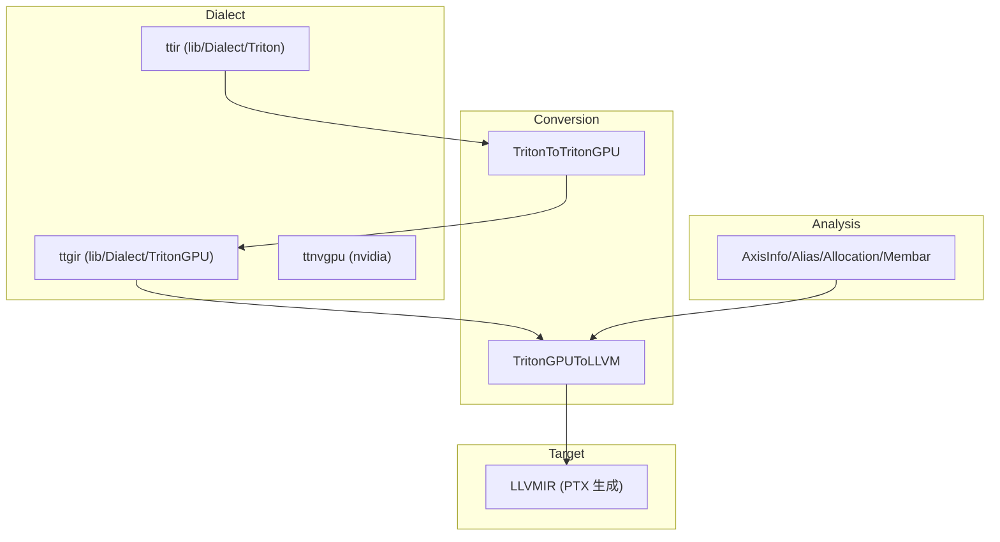

# 06 C++ 核心架构（深度版）

> 本文目标：深入 lib/ 的四个子系统——Dialect、Conversion、Target、Analysis，以及它们如何协同产生"从 tile 语义到 LLVM IR"的变换。

## 1. 四子系统总览

## 2. Dialect 深度

### ttir（lib/Dialect/Triton）
- `TT_DotOp`（`TritonOps.td:681`）：`d = a*b + c`，TTGIR 里 dot 仍是 `tt.dot`（非独立 ttg.dot）。
- `Transforms/`：LICM、LoopUnroll、Combine。

### ttgir（lib/Dialect/TritonGPU）
- **布局属性**（`TritonGPUAttrDefs.td`）：
  - `BlockedEncodingAttr`（:818）：sizePerThread/threadsPerWarp/warpsPerCTA/order。
  - `NvidiaMmaEncodingAttr`（:1272）：versionMajor/warpsPerCTA/instrShape。
  - `DotOperandEncodingAttr`（:1431）：opIdx/parent/kWidth。
  - `SwizzledSharedEncodingAttr`（:10）：共享内存 swizzle。
- **Transforms/**（核心优化）：
  - `Coalesce.cpp`：访存合并。
  - `AccelerateMatmul.cpp`：mma 布局。
  - `RemoveLayoutConversions.cpp`：布局转换消除。
  - `Pipeliner/`：流水线。
  - `WarpSpecialization/`：warp 特化。

### ttnvgpu（third_party/nvidia）
- tmems、wgmma、tcgen05。

## 3. Conversion 深度

### TritonGPUToLLVM
关键文件（`lib/Conversion/TritonGPUToLLVM/`）：
| 文件 | 职责 |
| --- | --- |
| `MemoryOpToLLVM.cpp` | local_load/local_store → shared/global |
| `DotOpToLLVM/` | tt.dot → FMA/mma |
| `ConvertLayoutOpToLLVM.cpp` | 布局转换（shuffle/shared） |
| `ReduceOpToLLVM.cpp`/`ScanOpToLLVM.cpp` | 归约/扫描 |
| `AllocateSharedMemory.cpp` | 共享内存分配 |
| `TypeConverter.cpp` | 类型转换 |

## 4. Analysis 深度

| 分析 | 职责 | 关键点 |
| --- | --- | --- |
| `AxisInfo.cpp` | 每维 contiguity/divisibility/constancy | Coalesce 用它选布局 |
| `Alias.cpp` | 指针别名 | |
| `Allocation.cpp` | 共享内存分配 | |
| `Membar.cpp` | 内存屏障（`__syncthreads`） | |
| `BufferRegion.cpp` | buffer 区域 | |

## 5. Target 深度

`lib/Target/LLVMIR/`：把 LLVM Dialect → LLVM IR（`LLVMIRGen`），为 PTX 准备。

## 6. LinearLayout（C++ 核心数学）

`lib/Tools/LinearLayout.cpp`（深度）：
- `bases`：每输入维每位的基向量。
- `apply`（:885）：xor 求值。
- `operator*`（:704）：直和。
- `invertAndCompose`（:1042）：布局转换核心。
- `getMatrixRank`（:207）：高斯消元算秩（满射性判断）。

## 7. NVIDIA 专属（third_party/nvidia/lib/）

- `TritonNVIDIAGPUToLLVM/DotOpToLLVM/`：
  - `MMAv2.cpp`：mma.sync 降级。
  - `WGMMA.cpp`：Hopper wgmma。
  - `MMAv5.cpp`：Blackwell tcgen05。
- `NVGPUToLLVM/`：NVVM 指令。

## 8. 深入自测

1. ttir/ttgir 的核心区别？
2. `tt.dot` 在 TTGIR 里是哪个 op？
3. 布局属性有哪些？各管什么？
4. AxisInfo 分析什么？谁用它？
5. LinearLayout 的核心运算？

## 9. 下一步

进入 `07_从Python_DSL到GPU_Kernel.md`（深度版）。
